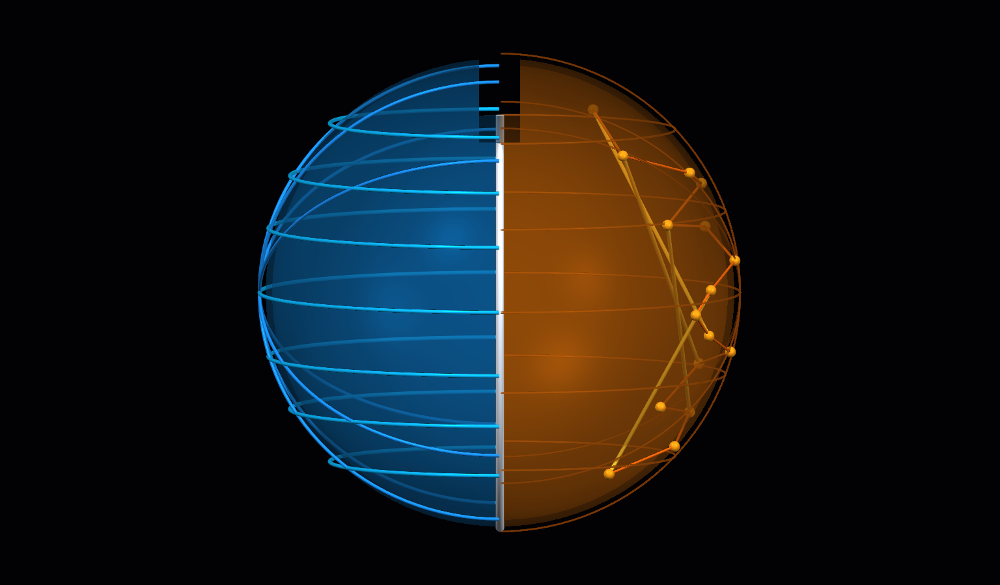

# Min-max quadratic form of ±1 coefficients

MathOverflow [413935](https://mathoverflow.net/questions/413935) /
[X challenge](https://x.com/PI010101/status/2081070728422752329):

```
m_n = min_{a_ij = ±1}  max_{x_j = ±1}  | Σ_{1≤i<j≤n} a_ij · x_i · x_j |

α_n = m_n / n^(3/2)
```

## About

Machine-assisted attack on a 2022 MathOverflow problem: whether the normalized
min-max ±1 quadratic form converges. The limit **L is OPEN**. This repo is a
proof ledger with 664 source-backed computational proposition modules through
15.749 plus reviewed analytic arguments in `solution.md`. Machine gates use
explicit `True`/`False` predicates, and soft-closing is banned by test
(`tests/test_main_chain_docs.py`); Propositions 6.3--6.4 are proved in prose,
not represented as computational predicates.

## Status

**Goal:** settle the limit (see **`LONG_HORIZON_GOAL.md`**). Not done until L is proved or disproved.

**Main claim:** L = lim_n α_n is **OPEN** (2026-09-01).

### Current audit (2026-09-01; through Proposition 15.749 and Propositions 6.3--6.4)

- **Original-question correction and new direct gate.** MathOverflow 413935
  asks whether the limit exists; identifying its value is optional.  With
  `H(n)=m_n^(2/3)`, Proposition 6.3 proves that it is enough to establish
  Dini-summable amplification only at multipliers 2 and 3; even
  `O(n/(log n)^(1+epsilon))` errors in `H` suffice.  The semigroup
  `{2^a 3^b}` has multiplicative gaps tending to one, so monotonicity fills
  every other order.  The all-prime, gap-2 Paley gate below is therefore one
  stronger value-specific route, not the acceptance gate for the original
  problem.

- **Multiplier-two correction and exact state.**  The old Section 10
  `C>=0.282` inference mixed a lower bound into a triangle upper bound and is
  retracted.  The exact two-block identity leaves coupled design live.
  Proposition 6.4 converts every all-Hadamard two-cloud lift into an exact
  four-state minimax.  For each chosen frame, its two induced endpoint
  signings must satisfy a simultaneous hereditary bound on every cut; finding
  orientations whose endpoints and mixed states all meet the upper target is
  still part of the problem.

- **Paley value-specific target.** It is enough for \(L=1/2\) to prove the Paley-tail deficit
  \(\Phi(C_p)-m_{p^2+1}=o(p^3)\) on a ratio-dense tail. The current all-prime,
  gap-2, four-unit gate is a strictly stronger sufficient route.
- **Hamming-stability route.** Local edge optimality, switching minimality,
  Max-Lipschitz control, and all product second moments can coexist at distance
  \(\Theta(n^2)\) from Paley. A successful proof must instead use closest
  global/cardinality minimality (and its all-subsets witness hierarchy), or an
  augmented-cut-code signed-Eulerian free-energy inequality above the
  fractional-moment barrier. The proposed `c=2` target is false; the surviving
  target is `c=3` with
  `log P_a(tanh(3/sqrt(n))) >= -3n/4-o(n)`.
- **Bi-tight correction.** Proposition 15.55's kernel claim, and therefore
  15.167's final spectral implication, is false: `ker(G-(n/2)P1)` also
  contains `ker G`. Proposition 15.720 replaces it. A centered bi-tight
  indicator lies in `scheme+cross` by 15.272/15.207; its degrees are all
  congruent modulo `(p^2-1)/2`, which contradicts the handshake identity at
  the required levels 2 and 3 for every prime `p>=5`. No new small-prime
  search is used. Bi-tight level 4 is also excluded. Generic one-sided
  level-4 covers exist (15.402), but its four-line family has a Max+ score at
  most zero by 15.272/15.588 and is outside residual; joint compatibility is
  the remaining question. Global QVAR,
  principal R1, and the spectral floor are no longer acceptance gates.
- **First-three-shell close.** Proposition 15.734 uses an isolated vertex and
  signed PSL transport to put every `k=4p`, `p>=13` candidate in an `I=0`,
  all-finite chart. Exact baseline offsets force an opposite phase-zero lift
  of scaled mass `8`, `6`, or `8`, below the sharp `p-3` floor. Proposition
  15.735 carries the same boundary-independent arithmetic through
  `k=4p+2` and `k=4p+4`. At `p=11`, Proposition 15.736 replaces the former
  external classification premise by a self-contained certificate on
  `J(11,6)`: the quadratic evaluation space has rank 55, 407 independent
  third-difference identities give its exact annihilator, and CP-SAT proves
  that the 55 omitted-pair plus 165 all-equal-triple supports exhaust the
  sharp Boolean quadratics of support 84. Proposition 15.737 then applies a
  binary quadratic moment: the hard stars give at least three projective
  zeros, forcing the moment form to vanish, while an all-equal triangle has
  nonzero moment because `-3=8` is nonsquare modulo 11. Therefore
  `k in {4p,4p+2,4p+4}` is impossible for every prime `p>=11` and every
  boundary size. Residual (ii) remains open at critical `p=5,7`, at
  `p=11,k>=50`, at `p=13,k=60,u=6` and later p13 layers, in every `p>=17` layer `t>=4`
  (including `p=17,k>=76`), and in generic branch B at `t=3` from `p>=29`.
- **Exceptional fourth-shell branch close.** Proposition 15.738 gives an
  exhaustive `J(13,7)` certificate for the forced phase-zero mass-14 cells:
  height four is exactly infeasible at `Q=0,6`, and the 1,092 Boolean
  quadratics of support 462 are precisely 78 selected pairs, 156 oriented
  mixed pairs, and 858 signed mixed triples.  Coefficient offsets leave only
  a selected pair. Proposition 15.739 corrects the exceptional hard-cell
  offset from five to two and uses the sign-safe quartic
  `G=2hM_4-M_2^2`: seven hard roots force `G=0`, while an opposite selected
  pair gives `-3(i-j)^4!=0` modulo 13. Thus the exceptional
  `p=13,t=3,u=3` row is closed; Propositions 15.740--15.742 close its generic
  complement below.  Later residual layers remain open.
- **Generic p13 split.** Proposition 15.740 uses five exact hard
  stars to force `M_2=M_4=0`, aggregates an opposite cell into six cyclic
  distance variables, and applies nine translation-summed cut inequalities.
  They eliminate all 32,313 exact aggregate candidates, independently
  confirmed by a 14-variable CP-SAT model.  Thus only the hard quotient
  partition `1^4 2^3` remains at `p=13,k=58`.  This isolates the common
  59-edge realization of its four exact stars, three elevated hard cells,
  and seven opposite cells.
- **Common-graph compression.** Proposition 15.741 attacks that single graph,
  not another cell catalog.  Four exact stars force `M_2=T_3=0` and
  `U_4=lambda M_4` with `M_4!=0`.  The 84 unoriented displacement
  multiplicities have an exact difference-Radon inverse and collision energy
  `707+26C`; translated cuts give `C<=11`.  Matched `lambda=7` local cells
  show only that the independent cellwise scalar consequences do not exclude
  either cell type; they do not realize one global quartic.  A strict
  fractional witness separately defeats the bare linear transform.
- **Generic p13 close.** Proposition 15.742 combines `M_2=0` with the six
  multiplicative interval cuts.  Exhaustive integer enumeration gives sharp
  six-bin energies at most 31 for each of the three elevated rows and 82 for
  each of the seven opposite rows.  Their total is therefore at most 667,
  contradicting 15.741's exact common-graph energy `707+26C>=707`.
  Independent 19-variable CP-SAT models verify both sharp row maxima.  Thus
  the generic four-exact branch is empty and, with 15.739, `p=13,k=58` is
  closed without the quartic orbit split or binary midpoint lift.
- **First-resonance p17 close.** Proposition 15.743 closes `p=17,k=74` by
  coupling every direction through the common difference-Radon transform.
  On an exact `k=1` star, the local and common row sums give
  `hT=18P-69`.  Since `hT` is common, the exact stars share `P`; there are
  at least six, so `6P<=75` gives `P<=12`, and `P≡5 (mod 8)` forces `P=5`.
  Hence `hT=21` and the exact coefficient row is `q=(2)^8`.  For any hard
  direction, comparing the common off-bin sum `21-P` with the cell identity
  `17(P-3)-18k` forces `P=4+k`, so the quotient partitions
  `1^8 4`, `1^7 2 3`, and `1^6 2^3` have no independent parallel-count
  allocation.  All 24,310 nine-sets collapse to 698 distinct translated-cut
  vectors.  Broad-domain deterministic one-worker CP-SAT models use only the
  exact sum and `l1` bounds, `M_2=M_4=0`, and all 698 cut inequalities: they
  exclude excess one outright, excess-two energy at least 71,
  excess-three energy at least 120, and opposite-row energy at least 73.
  The opposite coordinates have fixed sum `-24`, so Cauchy forces energy at
  least 72 with equality only for the unique row `(-3)^8`.  No prior energy
  upper bound enters these models.
  The last partition without an excess-one row has nonstar energy at most
  `119+9*72=767`, below its exact Radon value `1211+34C`; the other Radon
  baselines are 1251 and 1287.
  This closes only `p=17,k=74`.  The honest residual scope still includes
  every `p>=17,t>=4` layer (starting with `p=17,k=76`) and generic branch B
  at `p>=29,t=3`.  At generic `p=13`, the
  explicit elevated local cell with `S_2=0,S_4=5` remains a method
  counterexample, while Proposition 15.742 closes its common graph globally.
- **Next p13 layer, two branches closed.** Proposition 15.744 replays the
  exact `p=13,t=4` residue sieve and closes `u=3`.  Its six exact
  complement triples force the quartic `G=2hM_4-M_2^2` to vanish, while a
  forced opposite selected pair makes it nonzero.  A rank-78 restriction
  proves the `b=10` equality pointwise, and a separate 1,716-variable
  punctured-lift model excludes its two-unit alternative; this cell is not
  passed through the globally nonnegative lift theorem.  The only edge-count
  premise not inherited from 15.738 is rebuilt at `|H|=61`: the two
  height-four models with `l1<=61-Q` are both infeasible.  Proposition
  15.745 closes `u=0` with all 74 translated cuts and the common Radon
  energy.  Three partitions die rowwise and a fourth by `691<721+26C`; the
  last forces exactly one repeated displacement.  That equality bounds the exceptional
  six-bin row in `[-7,6]`, lowering its energy to 66 and giving
  `695<719`.  This left `u in {4,6}`; Proposition 15.749 later removes
  `u=4`.  The row and residual (ii) remain open at `u=6`.
- **Sharp `u=4` equality reduction.** Proposition 15.746 first uses the
  all-positive `b=2` quadrature pointwise and only then invokes 15.688, so
  every hard mean-22 lift is Boolean of support 330 on `J(13,7)`.  An exact
  1,716-variable model with all 1,638 third-difference identities and 70
  anchored no-goods proves that the 78 omitted pairs and 286 all-equal
  triples are exhaustive.  Their offsets forbid mixing and force common
  `P=3` or `P=5`.  At least two opposite cells have mean 12.  In the `P=3`
  branch, each minimum `Q=5` cell is a `b=0` mass-12 lift of height one
  (support 396) or height four, and the seven hard roots force
  `F6=2hM6+hM2^3-3M2M4` identically zero.  The `P=5,Q=3` branch retains a
  literal-or-lift dichotomy; its 22,308 patterns have full weighted feature
  ranks through degree six, so no analogous universal even-moment polynomial
  identity in `N2,N4,N6` is available at those degrees.
  This is an exhaustive equality classification and proved open reduction;
  Proposition 15.749 later closes its last branch.
- **`u=4` branch collapse.** Proposition 15.747's exact cut second moment
  excludes every Boolean mass-12 lift modulo seven, and its two 169-variable
  height-four models are infeasible at `Q=3,5`. This closes the omitted-pair
  `P=3` branch and forces every minimum all-equal-triple `P=5,Q=3` cell to
  be a literal. Proposition 15.748 turns those literals into common roots of
  `M2,M4,M6`; root count and exact interpolation exclude every opposite
  excess partition except `(1,1,1,1,1)`. Exactly 336 moment-level survivors
  per hard sign remain at this stage.
- **`u=4` translated-cut moment close.** Proposition 15.749 uses the 74
  translated cuts to bound every integral `Q=4` distance coordinate in
  `[-5,1]`. Exact recovery gives 522 rows and 492 moment triples. Their
  intersection with every 15.748 survivor's nonroot evaluation alphabet has
  12 triples, all with fourth moment zero. The five `Q=4` directions and two
  literal directions are therefore seven roots of `M4`, forcing that binary
  quartic to vanish, contrary to the hard moment alphabet. Thus `u=4` is
  closed and the exact `p=13,k=60` remainder is only `u=6`.
- **Floor-plus-two correction.** Proposition 15.723 replaces the blanket
  `excess != 2` shortcut in the infinity-plus-`p` middle profile. A
  paired-cube Fourier gap excludes every such middle cell for all odd
  `p>=17`, except the two genuine integral-quadratic cells
  `(p,b,phase)=(17,5,1),(17,11,0)`. Those exceptions are retained, not
  silently discarded.
- **Parabola-family retraction.** Proposition 15.725 retains an exact
  2,381-case finite phase-zero census, but its claimed all-prime close is
  retracted. The necessary discriminant/resolvent character sums were not
  proved, an admissible singular locus was omitted, and the opposite product
  sign was not checked. It changes no gate.
- **Historical endpoint certificate at `p=19`.** Propositions 15.693--15.699
  give an exact
  binary affine-Radon reduction, eliminate the slack-16 and slack-20 rows, and
  close the slack-24, -28, and -32 rows. The final native-XOR certificates were
  completed independently on nuka, jellyfin, and soulkiller ECC; the complete
  `p=19` endpoint is closed. Proposition 15.721 now subsumes this boundary
  exclusion by signed transport.
- **Historical endpoint certificate at `p=17`.** Propositions 15.700--15.712
  close the corrected exact 2,503-profile ledger through the chain
  `2503 -> 2219 -> 1744 -> 1481 -> 1368 -> 1228 -> 1215 -> 1213 -> 1020 ->
  869 -> 321 -> 19 -> 14 -> 0`. Proposition 15.705 is only **PARTIAL**: it
  removes thirteen historical Orbiter targets and leaves 74 slack-sixteen
  rows, which 15.709 later removes. Proposition 15.706 excludes both former
  slack-zero profiles by a solver-free global Paley-sign identity, 15.707
  removes all 193 slack-20 rows, and 15.708 removes all 151 slack-24 rows.
  Proposition 15.709 applies the rigid-anchor identities uniformly to all 548
  remaining `u_1=8` rows.
  Proposition 15.710 applies the complementary phase-one `b=16` identities
  to exclude 302 of the remaining 321 profiles.
  Proposition 15.711 excludes the five residue-zero rows by a uniform-mean
  phase-one fibre-capacity contradiction.
  Proposition 15.712 observes that the nine phase-one `b=16` directions are
  undetermined by the sixteen-point boundary; Szőnyi's direction theorem
  forces collinearity, whose unique profile is absent. The endpoint is closed;
  Proposition 15.721 now subsumes this boundary exclusion as well.
- **Positive `p=7` infinity-plus-seven `z=7` remainder.** Propositions
  15.713--15.717 close `z=0,1,2,3`. Proposition 15.718 then reduces the 4,320
  pointed `z=7` cases to 1,296 affine survivors and 324 four-case
  representatives; the exact global join rigorously rejects 87
  representatives, while 159 survive only a necessary relaxation and 78 are
  explicit budget skips. Its independent Johnson-semigroup certificate has
  896 binary Hilbert generators in grades `1/2/3` with counts `56/168/672`
  and exact uncapped layers through grade eight. Proposition 15.719 proves
  finite projected stabilization for the complete `k=3` and `k=4` supports:
  the subgroup descriptions are cap-exact through grade six, but grade eight
  remains an outer support. Subsequent strategy runs add no theorem: all 51
  grade-three-only representatives survive completed `k=5` prefix joins, an
  even 26-case `k=6` shard also has no rejection, and a direct full-quotient
  fixed-case model returns `UNKNOWN` after 300 seconds. The exact same case,
  target hash, 307-variable model, and 147 constraints had already returned
  `UNKNOWN` in the earlier 0.2-second compact smoke; the 300-second run was a
  timeout extension, not a new formulation. The latter two do not
  constitute complete `k=6` or feasibility results, and this
  semigroup/quotient route is terminated. The 348 transferred pointed
  rejections do not subtract source boundaries. All 56 actual `z=7` line
  boundaries in two orbits, the positive endpoint, and the theorem remain
  open.

The earlier route audit and supporting certificates are recorded in
`evidence/NOTE_2026-08-29_global_minimality_and_local_stability_no_go.md`.
The proposition-by-proposition route inventory and permanent de-duplication
blacklist are in `evidence/PROPOSITION_DEDUP_AUDIT_2026-08-30.md`.

## Expected solution architecture



This is a deterministic CAD map of the proof architecture, not a claim that
the limiting object is literally spherical:

- the **blue hemisphere** is the historical spectral/QVAR--R1 front, now
  bypassed by Proposition 15.720;
- the **gold hemisphere** is the finite-incidence, conic, and secant structure
  of the non-Walsh front;
- the **white great-circle seam** is the implication chain joining the fronts;
- the **top notch** is the still-open residual-(ii)/Type-I pair preventing
  closure.

The editable model is available as
[`expected-solution-structure.step`](evidence/share/expected-solution-structure.step),
and its parametric source is
[`render_expected_solution_cad.py`](scripts/render_expected_solution_cad.py).

Sandwich and Paley ρ=1 are proved. E(1) on n=p²+1 is **not**. The live
`four_e1_units_closed()` ledger is:

| GOAL unit | live predicate | status |
|---|---|---|
| required bi-tight levels 2 and 3 | `bitight_levels_2_3` | **TRUE** — 15.720 degree congruence; bi-tight level 4 is a corollary, while generic one-sided covers exist and only joint residual compatibility remains open |
| residual (ii), even `k≥4p` | `residual_ii_k_ge_4p` | **OPEN** — Propositions 15.734--15.737 close `k in {4p,4p+2,4p+4}` for every prime `p>=11` and every boundary size. Propositions 15.738--15.742 close `p=13,k=58`, Proposition 15.743 closes `p=17,k=74`, 15.744--15.745 close `u=3,0` at `p=13,k=60`, and 15.746--15.749 close `u=4`. Critical `p=5,7`, `p=11,k>=50`, `p=13,k=60,u=6` and later p13 layers, every `p>=17,t>=4` layer (starting with `p=17,k=76`), and generic branch B at `p>=29,t=3` remain; the positive `p=7,z=7` subbranch also persists. Hence the global predicate stays false. |
| Type I, multi-level Max− | `type_I_multilevel` | **OPEN** — on `|κ|=1` the missing sign is `G>T`; on `|κ|=3` the separate signed `(μ,ν)` inequality still has an uncontrolled δ remainder |
| Lemma D | `lemma_D` | **TRUE** — construction and two-plane amplitudes checked |

Thus exactly two mathematical predicates remain false: residual (ii) and
multi-level Type I. The spectral/QVAR–R1 front is optional and is removed
from the acceptance chain. Soft-close is forbidden. The acceptance package is
**`evidence/share/denseness_path_package.md`**.

**Proved (sandwich):**
```
1/π  ≤  liminf_n α_n  ≤  limsup_n α_n  ≤  1/2
```

**Also proved:** ρ=1 for Paley conference matrices of order n=p²+1.

See **`STATUS.md`**, `HANDOFF.md`, denseness package, `solution.md`.

---

## Discovery map — what has moved

The problem reduces to **E(1) on Paley conference matrices of order n = p²+1**.
The map below records the current dependency structure. Prop. 15.628 closed
Walsh, W1, and W2; Prop. 15.632 then imposed an exact type-split integer-slack
budget and eliminated the Eulerian boundary, but did not close the remaining
non-Walsh multi-level cases. Props. 15.633--15.634 classify and diagonalize
the complete second R1 dual shell; it is negative definite for `p>=11`, so
first-shell positivity alone cannot close R1. Props. 15.635--15.636 prove
and completely classify the third dual shell for every `p>=11`; its
point-pair operator is again negative. Props. 15.637--15.638 then exclude
every common-sum branch at the first post-third even energy, proving that
the entire candidate shell `2p||u||^2=2(p+3)` is empty. Proposition 15.639
classifies the complete first nonminimal odd shell `2p||u||^2=3p-6` as
negative signed triples together with incident point--square-circle vectors.
Proposition 15.640 diagonalizes its complete degree-four operator: one
circle-kernel eigenvalue is negative and two square-circle-image eigenvalues
are positive, so the shell is a quartic saddle rather than a 4-design.
Proposition 15.641 then gives an exact p=11 modular nullspace certificate:
all justified shell/cusp rows, including the complete second shell, leave the
half-cusp R1 target free. Thus those linear modular data cannot close R1;
additional shells, cusp data, or nonlinear theta positivity are required.
Proposition 15.665 supplies the missing nonlinear shell coupling: before the
parity phase, every complete shell is a positive quartic operator, its
harmonic operator is an explicit scalar shift, and its nonnegative PSL-channel
eigenvalues have an exactly conserved trace. This converts the p=11 modular
kernel into a finite exact rational positivity problem. Proposition 15.667
then computes the p=11 ordinary and quartic-trace theta prefixes exactly by a
complete `11^10` glue-profile reduction, uniquely reconstructs both modular
forms through exponent 800, and certifies all four trace-conservation LPs with
rational primal/dual solutions. Proposition 15.668 retains one further marked
profile contraction, reconstructs the kernel/low/high square-circle channel
masses through exponent 800 with 28 held-out exact matches per channel, and
certifies all eight channel-conserved endpoints. The strict refinement is
still insufficient to force `Phi>=6`. Independently, the full exact census
proves strong R1 at `p=11`; an all-prime R1 bound still requires a uniform
character/transport inequality rather than another broad-channel aggregate.
On the non-Walsh front, Proposition 15.642 combines an exact stabilizer
moment certificate with the degree-two polynomial-distance lemma on slices.
For boundary `D={infinity,v}`, the positive edge-product branch is pointwise
rigid, while the negative branch has at most three exceptional directions
per quadratic type, uniformly in `p>=5`.
Proposition 15.643 converts the positive-product rigidity into a complete
branch exclusion for every odd `p>=17` using parallel-count divisibility and
an exact inter-fibre `l1` budget.
For the negative-product branch, Proposition 15.644 uses the asymptotic
slice-distance theorem to force one exceptional direction of each type and
reduces every sufficiently large prime to a unique arithmetic profile.
Proposition 15.645 further proves exact baseline fibre rigidity. Proposition
15.646 then sums the inter-fibre identities: every baseline transverse signed
sum must be zero, while the exceptional split forces a signed sum `+4` or
`-4` in one baseline type. Thus the complete negative-product branch is
excluded for all sufficiently large primes. Proposition 15.647 removes the
asymptotic input: same-type signed means force exactly one exception per type
for every `p>=7`, and baseline divisibility excludes the branch for every
odd `p>=17`. Proposition 15.648 then closes `p=11,13` and four unbalanced
`p=7` profiles. Proposition 15.649 classifies all 1764 possible exceptional
quadratic lifts at balanced `p=7`, reduces the 18424 infinity stars to 3038
orbits for each exceptional-pair orbit, and finitely certifies every orbit
infeasible. Thus every `p=7` negative two-point profile is closed, leaving
only `p=5` in that branch. Proposition 15.650 finishes it: exact lift
quantization leaves two type profiles and 24 arithmetic candidates, whose
33 square-semilinear placement orbits are all finitely certified infeasible.
The negative-product infinity-plus-point branch is therefore closed for
every odd prime `p>=5`. Proposition 15.651 returns to the four finite
positive-product primes. Exact additive coefficient equations close all
seven `p=5` arithmetic cases; strengthened fibrewise `l1` profiles and a
type-capacity argument close `p=11,13`; and a complete `p=7` exhaustion
certifies 112 rigid star orbits plus three normalized all-one cases
infeasible. Thus both product signs of the infinity-plus-point boundary are
closed for every odd prime `p>=5`. Proposition 15.652 then evaluates the
exact parity floors for zero through four odd fibres by positive
degree-two quadrature. Four finite boundary points have only six
pair-directions, and infinity plus three finite points has only three;
the type-split budget therefore excludes every four-point boundary for all
odd primes `p>=11`.
Proposition 15.653 handles the remaining infinity-containing shape at
`p=7`: exact Johnson-space saturation leaves one slack formula, 18,424
finite triples reduce to 416 square-semilinear orbits, and all 416 exact
coefficient models are infeasible. Proposition 15.654 then handles the
doubly saturated four-finite profiles at `p=7`: 58,800 boundaries per
product sign reduce to 1,225 orbits, all exactly infeasible. A nonsquare
Paley anti-isometry transfers the result between signs. Proposition 15.655
closes the remaining 23,520 unsaturated boundaries (518 orbits) per sign:
the 282 exact edge-count/affine-score equations have rank 147 over
`F_7`, and their 135 left-null dependencies reject all 1,716,742,440
complete catalog tuples across 2,408 elevation cases. An independent
coefficient-based audit reproduces zero survivors. Thus every `p=7`
size-four boundary is closed. Proposition 15.656 closes the exceptional
`p=5` branch using the complete eigenshell: each antipodal shell gives a
`132 x 325` score system of rank 67 modulo five. Exact bounded lift
syndromes exclude 712 orbit cases; the sole mod-five timeout is infeasible
modulo seven. A nonsquare anti-isometry transfers the remaining
no-infinity sign, and an independent structural audit covers all 1,202
floor-surviving orbit/sign cases. Hence every size-four boundary is closed
for every odd prime `p>=5`. Proposition 15.657 then extends the positive
quadrature through six odd fibres. A six-point boundary has pair-deficit
budget only 30 without infinity and 20 with infinity; these are too small
for the exact affine slack budget for every `p>=11`, including a separate
type-split contradiction at `p=11`. Propositions 15.658--15.661 subsequently
close the exceptional `p=5,7` cases, so every size-six boundary is closed
for odd `p>=5` and the first open boundary size is at least eight.
Propositions 15.658--15.659 handle both exceptional `p=7`
infinity-plus-five signs. In the
positive-product infinity-plus-five case, all directions have the unique
scaled-mean-eight `J(7,4)` slack. The 135 mod-seven dependencies of the
common affine score system reject all `C(49,5)=1,906,884` finite
boundaries; independent V100 and NUKA implementations both return zero
survivors. In the negative-product case, exact floors leave 83,496
boundaries and 1,750 square-semilinear orbits; affine-span filtering plus
32,400 exact catalog-pair checks reject every case, independently
reproduced on NUKA and Soulkiller. Proposition 15.660 then rebuilds all four
`p=5` size-six catalogs, reduces them by signed symmetry and coarse exact
batches to six classes, and closes all six by independently reconstructed
layered certificates. Proposition 15.661 then closes the six-finite `p=7`
branch using 80,704 orbit certificates and simultaneous mod-three/mod-seven
catalog joins. Thus every size-six boundary is closed for odd `p>=5`.
Proposition 15.662 next exhausts the minimum-eight-odd-secant branch of the
`p=7` size-eight case. A complete CUDA census checks all
`C(49,8)=450,978,066` finite boundaries per product sign. Exactly 6,174
attain eight odd secants; Segre's theorem identifies all of them as affine
conics. The exact directional floor rejects 4,851 and leaves 1,323, which
form 32 stabilizer orbits. For `c_H=-1`, all 600 exact mean allocations on
the 25 saturated orbits (1,176 boundaries) are excluded: 355 by the first
CP-SAT pass, six by longer exact certificates, and 239 by multi-prime
catalog joins. The seven exceptional orbits contain 147 boundaries and
1,260 allocations. The first pass rejects 172, the ordinary V100 projected
join rejects 662, and a high-direction-eliminating dependency basis rejects
the remaining 426 without enumerating their giant catalogs. An independent
aggregate audit reconstructs the orbit and allocation partitions and finds
zero remaining leaves. The nonsquare Paley anti-isometry maps all 1,323
negative-sign floor survivors bijectively onto the positive-sign survivors,
so the entire conic subbranch is closed for both signs. This is not a full
size-eight closure: the floor census contains 108,754,569 survivors per sign,
of which 108,753,246 are nonconic. Proposition 15.663 then selects the
2,016 ordered profiles whose two quadratic types both have floor sum 32,
covering 83,770,008 nonconic boundaries per sign. Exact type sums force all
eight directional means to their floors, leaving at most one 36-row catalog.
An exhaustive V100 pass reduces the whole stratum to 526 projected
mod-seven candidates; all 526 fail the complete 135-row dependency system.
NUKA independently rebuilds the score matrix, dependencies, catalogs, and
candidate failures. The nonsquare anti-isometry transfers the exclusion to
the other sign. Proposition 15.664 then partitions the 24,983,238-case
remainder by exact mean-allocation count. The dominant 2,245 ordered
profiles have 23,563,806 boundaries and exactly four allocations each: one
quadratic type has floor sum 24, and one of its directions is raised by
eight. Exact dependencies conditioned to vanish on that raised direction
let a direct-rank V100 pass test all 94,255,224 leaves. It leaves 1,191
projected candidates and 1,176 full mod-seven survivors, exactly the
affine-line-plus-off-line-point family. NUKA independently reconstructs all
candidates: each geometric survivor has two mod-seven and 756 mod-three
catalog rows, but their row sets are disjoint. Thus all four-allocation
boundaries are excluded for both signs. Proposition 15.666 partitions the
remaining 1,419,432 finite boundaries into 23,892,792 exact mean-allocation
leaves. Conditioned mod-seven and mod-three omission scans leave 181,104
common leaves; exact local, triple, and four-positive joins leave 62,892.
A single-catalog filter plus a complete 22-row mod-seven meet-in-the-middle
join rejects all 62,892, with exact CPU/CUDA prefix agreement and three
independent older full-join spot checks. The nonsquare anti-isometry again
transfers the result between product signs. Thus every finite `p=7`
size-eight boundary is closed for both signs. The distinct
infinity-plus-seven profile is not part of the finite `C(49,8)` census and
remains open.
Proposition 15.669 then evaluates the full middle parity-majorant floor:
for every odd `p>=17`, both phases have scaled floor `2p` whenever
`5<=b<=p-5`. Combining this positive-quadrature theorem with the split type
budget and `sum_d(s-b_d)<=s(s-1)` excludes every all-finite even boundary
with `6<=s<=3(p-1)/4` and every infinity-present boundary with an odd number
`5<=s<=p-4` of finite points. Exact count-profile programs additionally
exclude infinity plus seven points at `p=11`, and at `p=13` exclude eight
finite points and infinity plus seven or nine. The first profiles beyond
these ranges survive only the floor-and-pair relaxation; they are not actual
residual graphs, so residual (ii) remains open.
Proposition 15.670 resolves the first of those relaxed survivors. An affine
similarity losslessly normalizes every finite `p=11` eight-set to contain
field points `0,1`. Exact V100/CUDA and RX 9070 XT/HIP censuses independently
test all `C(119,6)=3,470,108,187` normalized sets for both signs. Both full
cost-pair histograms agree, there are no survivors under the exact type budget
72, and the minimum larger type cost is 76. Thus every finite `p=11`
size-eight boundary is impossible. Infinity plus nine and finite size at
least ten remain at that prime.
Propositions 15.671--15.672 next close the collinear realization of the first
general infinity-present survivor. Proposition 15.673 removes collinearity
under the complete endpoint condition `b_d in {1,p-2}`. Same-type means are
quantized modulo `p+1`, and the four-unit lift floor reduces both signs to
four two-count congruence rows. The pair-deficit equality case is an arc;
Segre's odd-order `p`-arc theorem makes its three undetermined infinity
directions impossible. Three arithmetic rows then fail divisibility or the
boundary support inequality. The sole remaining row is
`p=17,(x,y)=(0,7)`, where the prescribed inter-fibre `l1` minimum is
`75>57`. Hence every endpoint-only infinity-plus-`(p-2)` boundary is closed
for both signs and every prime `p>=17`; non-endpoint profiles remain open.
Proposition 15.674 removes that final endpoint restriction. All directional
floors are at least `p-1`, and the exact same-type sum permits only residues
zero and `p-1`: an intermediate odd-fibre count can occur only as the unique
mean-`2p` direction of its type. Two low-endpoint baseline types violate the
pair-deficit budget, while two high-endpoint baseline types determine at most
two directions and are collinear. The remaining mixed pair has exactly the
same four arithmetic rows and the same `p=17` norm obstruction as 15.673.
Thus every infinity-plus-`(p-2)` boundary is closed for both signs and every
prime `p>=17`, with no condition on its odd-fibre profile.
Proposition 15.675 applies the same exact mean residue to the all-finite
range. At the first even size above `3(p-1)/4`, phase one is rigid and phase
zero has unique minimizing residue four. The exact pair-deficit gaps by
`p mod 8` are `-(p-1)/4,(p+1)/2,(p-1)/2,-(p-7)/4`. Hence that first
floor-plus-pair survivor is excluded for every prime `p>=19` congruent to
`3` or `5 mod 8`; the other two classes remain genuinely open to this
relaxation.
Proposition 15.676 advances the next infinity shell. Pair-deficit equality
makes its `p` finite points a `p`-arc and hence a conic subset. The tangent
and external-line conic cases have profiles `p*b=1+b=p` and
`(m+1)*b=1+(m-1)*b=3`; exact type floors and baseline coefficient
congruences exclude both profiles in both phases. The strict-deficit branch
of infinity-plus-`p` remains open.
Proposition 15.677 returns to the two first-survivor classes left by 15.675.
For `p=1,7 mod 8` from `p=23`, exact quotient arithmetic leaves phase-zero
residue `u_0=2`, plus `u_0=3` in the first class. Since the quotient sum is
strictly below the direction count, one direction has quotient zero. Its
mean is four or six, forcing `b=0` and a nonzero even quadratic lift, while
15.642 gives lift cost at least eight. Together with 15.675 this closes the
first all-finite survivor for every prime `p>=19`. Proposition 15.678's
separate `p=17` close is retracted: the corrected census has 108 compatible
profiles, while its retained conic geometry excludes only 14 arc profiles and
leaves 94 compatible profiles uncovered. Proposition 15.721 later supersedes
this all-finite gate and excludes it by signed transport. Proposition 15.679
then treats the next even all-finite size. Pair arithmetic leaves only
phase-zero residues `2<=u<=7`; a forced quotient-zero direction and the
degree-two slice-distance floor close every prime `p>=43`. Proposition
15.680 closes `p=37` by sharpening the formerly exact mass-ten lift row:
degree-four distance makes the lift Boolean, and a paired-cube restriction
forces density at least `17/74` instead of `5/74`. The same size at
`p=29` is subsequently closed by 15.681. Its paired-cube argument applies
to every nonnegative integral quadratic and raises the scaled lift floors
at `p=29,31,37,41` to `14,16,18,20`, deleting all positive residues. At
`p=29`, the residue-zero profiles are arcs or one-triple near-arcs with at
least four undetermined directions; the exhaustive `PG(2,29)` 25-/26-arc
classification forces conic containment and gives a three-collinear-point
contradiction. Proposition 15.682 next closes `p=31`. Its fourteen exact
residue-zero profiles are 26-arcs or one-triple near-arcs with at least
three undetermined directions. Coolsaet's complete `PG(2,31)`
classification has no complete arc of size 23 through 31, so the required
27-/28-arc extensions lie on a conic and again force three collinear
infinity points onto it. Proposition 15.683 closes `p=41`: eight
high-tangent direction pencils divide Segre's tangent envelope twice, and
the residual conic is forced to contain three point-pencil lines.
Proposition 15.684's claimed positive-residue close is also retracted: the
corrected ledger restores `u_0=9`, scaled mass 18, with an explicit
slack-zero profile. Its old residue-zero computation remains a conditional
subledger: complete-arc and conic-core arguments exclude 1,044 of 1,247
`u_0=0` profiles and leave 203 in that subledger. Proposition 15.685 excludes
its unique slack-12 profile: repairing
it would require three points of secant multiplicity one outside a complete
17-arc, while the five classified classes have counts `0,0,1,0,0`.
Exactly 202 residue-zero profiles remain; the restored `u_0=9` branch and the
three endpoints `p=17,19,23` are still open in this historical chain.
Proposition 15.686 applies the same complete-17-arc
certificate to the unique slack-16 row: its undetermined direction and four
repair points would require four multiplicity-one outside points. This
leaves exactly 201 profiles in the residue-zero subledger, all of slack at
least 20. Proposition 15.721 independently supersedes this all-finite gate.
Proposition 15.687 excludes all 68 slack-20 rows. For 66 rows, overlapping
pairs of at least three undetermined infinity points either produce the
same impossible conic or a complete 17-arc requiring five
multiplicity-one points; the two remaining rows use the latter obstruction
or the five-point conic-core floor. Exactly 133 profiles remain in the
conditional residue-zero subledger, all of slack at least 24.
Proposition 15.688 sharpens every nonzero nonnegative integral quadratic
lift to \(4p\mathbb E B\ge p-3\). At the `p=19` next boundary this deletes
all four positive-residue rows. Exact completion leaves 143 residue-zero
profiles; 15.689 excludes the 129 profiles of slack at most twelve, leaving
14 with slack histogram `{16:7,20:4,24:1,28:1,32:1}`. Proposition 15.693
uses the classified secant-index bound for complete 14-arcs to exclude all
seven slack-16 profiles. Seven profiles remain:
`{20:4,24:1,28:1,32:1}`.
Proposition 15.694 further proves that each slack-20 witness must be an
11-arc plus a 5-arc with all five deleted points on exactly one core secant;
only three bad-line patterns remain. This is a strict structural reduction,
not another profile exclusion. Proposition 15.695 uses phase-one floor
equality in the two `b=14` rows. Positive quadrature forces their directional
quadratic to equal one on the `t=6,8,10` intersection layers; a fixed
`171 x 171` inclusion minor has rank 171 modulo 101, so those layers determine
every quadratic on `J(19,10)`. The resulting constant-one quadratic violates
parity on `t=5`. Both rows are excluded, leaving five profiles with histogram
`{20:2,24:1,28:1,32:1}`.
Proposition 15.696 treats the mixed `b=16` slack-20 row. Equality on its
`t=7,8,10` layers has exact rank 169 and a two-dimensional kernel; integrality
leaves the two `t=9` value orbits `{0,2,2}` and `{0,0,4}`. Exact coefficient
comparison reduces each orbit to ten admissible infinity degrees. All twenty
corrected edge-lift shards are `INFEASIBLE`. A later audit repaired
componentwise subtraction in `F_{19^2}` and replaced the complete raw shard
archive; a full-edge regression test now checks the signs against the
canonical Paley conference matrix. The hard `022/I=28` logical shard is
exhaustively split by elevated phase-zero role, giving 22 raw certificates
for the 20 logical shards. This excludes that row and leaves four
profiles with histogram `{20:1,24:1,28:1,32:1}`.
Proposition 15.697 attacks the remaining all-`b=2` slack-20 row. Its unique
elevated phase-one direction has `A=(t-1)^2+2B`, where `B` is a nonnegative
integral quadratic of mean `5/19`. Stabilizer equality, a rank-152
intersection-layer certificate, and an exhaustive `2^18` additive
cross-difference audit exclude `max(B)=5`, so `B` is Boolean. The five rigid
phase-zero directions then leave only infinity degrees `0,20,38`. An
auxiliary 3,420-form catalog was not self-contained and was never promoted to
evidence; bounded exact edge-lift runs were `UNKNOWN`. The profile remained
open in 15.697 and was subsequently closed directly by 15.698.
Proposition 15.698 applies the exact affine-Radon inverse and 15.694's forced
11-arc plus five-deletion repair directly to that boundary profile. Two
completed CryptoMiniSat native-XOR runs—one on nuka and one on soulkiller's
registered-ECC CPU—return `UNSATISFIABLE`. The boundary itself cannot exist,
so all slack-20 rows are closed and only slack `24,28,32` remain at p=19.
Proposition 15.699 then imposes only the exact 16-point affine-Radon inverse
and the three remaining directional profiles. Native-XOR runs on nuka,
jellyfin, and soulkiller ECC all return `UNSATISFIABLE`; no edge-lift or floor
relaxation is used. Thus the full p=19 second all-finite endpoint is closed.
Proposition 15.700 treats the exceptional `p=17,s=16` second boundary.
The sharp integral lift floor and exact completion arithmetic leave 2,503
phase-labelled profiles, 286 of pair slack zero. Slack zero gives a 16-arc;
the unique `PG(2,17)` 16-arc class is conic-minus-two. Exhausting all 21,267
affine charts/deleted pairs gives 53 Paley-phase profiles, only two of which
meet the arithmetic ledger. Both are tangent-at-infinity conic cases. Hence
284 rows are excluded and the exact p=17 remainder is 2,219 profiles, with
two zero-slack rows. Exact coefficient-lift runs on those two rows returned
`UNKNOWN`, so they supply no evidence. Proposition 15.701 then uses the
unique classified 15-arc class in `PG(2,17)`. Repair to an arc, followed by
zero, one, or two undetermined infinity points, puts all 292 slack-four rows,
140 of 292 slack-eight rows, and 43 of 267 slack-twelve rows on a conic core.
If `h<=3` original points are off that conic, retained-secant counting forces
pair slack at least `4h(6-h)>=20`, a contradiction. Another 475 rows are
excluded, leaving 1,744 exact profiles: two at slack zero, 152 at slack eight,
224 at slack twelve, and 1,366 at slack at least sixteen. The endpoint remains
open. Proposition 15.702 uses the unique complete 14-arc class. Its exact
outside secant-index histogram has minimum two and no index-one point. This
excludes the remaining 152 slack-eight profiles and, after adjoining one
undetermined infinity point, another 111 slack-twelve profiles. The p17
remainder is 1,481: two rows of slack zero, 113 rows of slack twelve, and
1,366 rows of slack at least sixteen. Proposition 15.703 closes those final 113
slack-twelve rows. A normalized PGL generator produces eight pairwise
inequivalent complete 13-arcs, matching Sticker's published class count and
stabilizer-order fingerprint. Their index-one-point counts are
`0,0,0,0,0,0,2,3`; the sole candidate triple reconstructs slack sixteen.
For an incomplete repaired 13-arc, extension to the unique complete 14-arc
leaves eight candidate triples, all of slack twenty; the conic extension is
already excluded. Thus the exact p17 remainder is 1,368: the same two
slack-zero rows and 1,366 rows of slack at least sixteen. Completeness of the
eight-class local census is conditional on the published class count.
Proposition 15.704 next splits the 227 slack-sixteen rows by undetermined
directions as `{0:87,1:88,2:47,3:5}`. Complete-14 secant floors and
overlapping-pair conic extensions exclude the 52 rows with at least two such
directions. For one direction, a complete 13-arc has at most three outside
index-one points; the complete-14-minus-one branch has eight genuinely
undetermined infinity placements and all reconstruct slack 32. Thus 140 rows
are excluded. The p17 remainder is 1,228: two slack-zero rows, 87
zero-direction slack-sixteen rows, and 1,139 rows of slack at least twenty.
Proposition 15.705 exhausts all 629 PGL classes of twelve-arcs and every
four-point extension within the slack-sixteen secant charge. Only 47 of
97,122 extensions have an allowed line pattern; all 6,345 affine charts miss
the thirteen historical targets under both phase labellings. This certificate
does not cover the other 74 zero-direction slack-sixteen rows: 15.705 is
**PARTIAL/OPEN** and the p17 remainder is 1,215, consisting of two slack-zero
rows, 74 slack-sixteen rows, and 1,139 rows of slack at least twenty.
Proposition 15.706 excludes both slack-zero rows without a solver. Every
allocation retains a rigid `b=2` direction of each quadratic type. Comparing
their directional coefficient sums with the single global finite-edge Paley
sign sum forces `17I=4 (mod 72)`, hence infinity degree `I=68`. The remaining
one finite edge makes the affine odd boundary have size 66, 68, or 70, never
16. Thus 1,213 exact p17 profiles remain: the 74 slack-sixteen rows and 1,139
rows of slack at least twenty.
Proposition 15.707 observes that the same identity only needs rigid low-floor
directions of both types. Every slack-20 row has at least eight rigid
phase-one `b=2` directions. In all 184 rows with `u_0=0`, exact quotient
minima retain at least three rigid phase-zero directions with `b=0` or `2`,
and the same global-sign congruence excludes them. The nine `(8,8)` rows all
have at least two undetermined directions; repair and the already-audited
complete 13-/14-arc secant-index bounds exclude every repair depth. Thus all
193 slack-twenty rows are removed and 1,020 exact p17 profiles remain.
Proposition 15.708 closes all 151 slack-twenty-four rows. The 142 `(0,8)` rows
retain rigid phase-zero `b=0` directions, so global-sign comparison forces
incompatible gauge lower bounds. The nine `(8,8)` rows force `I=4`; a rigid
phase-zero `b=16` floor `1-x_j` then gives
`N_j=delta_j-15z_j-I<=-3` for a nonnegative crossing-edge count. Thus 869
exact p17 profiles remain.
Proposition 15.709 observes that these contradictions depend only on the
rigid anchors, not on the slack value. Every one of the 548 remaining
`u_1=8` rows retains eight rigid phase-one `b=2` directions: 334 also retain
phase-zero `b=0`, and 214 retain phase-zero `b=16`. The two 15.708 identities
exclude both blocks, including all 74 slack-sixteen rows left by 15.705. The
exact remainder is 321 profiles, all with `u_1=0` and pair slack at least 96.
Proposition 15.710 uses the complementary phase-one `b=16` core. A genuinely
rigid phase-zero `b=0` anchor excludes 270 rows by forcing gauge sum 14 with
minimum 15; rigid `b=16` anchors in both phases exclude 32 more by forcing
gauge sum 16 with minimum 17. Nineteen profiles remain, with residue split
`(0,0):5`, `(7,0):9`, `(8,0):5` and slack histogram
`{96:3,100:4,104:4,108:3,112:3,116:1,128:1}`.
Proposition 15.711 handles the five `(0,0)` rows. Avoiding 15.710's rigid
`b=0` anchor forces mean 18 in every direction. The global means leave
`I in {6,24,42,60}` and force every finite edge into phase one; nonnegative
`b=16` cross cells then impose `I<=g+1+15 floor(g/2)`, contradicting all four
candidates. Fourteen rows remain, with residue split `(7,0):9,(8,0):5`.
Proposition 15.712 closes those rows at once. Their nine phase-one `b=16`
directions are not determined by the sixteen-point affine boundary, so the
boundary determines at most nine directions. Szőnyi's theorem requires ten
for a noncollinear sixteen-point set in `AG(2,17)`; the collinear alternative
has phase-zero profile `{0:1,16:8}`, absent from the ledger.
The principal R1 inequality remains open, and the current floor wiring
requires the separate global-QVAR estimate:

```mermaid
graph TD
    L["L = lim α_n<br/><b>OPEN</b>"] --> E1["E(1) on n = p²+1"]
    E1 --> D["lemma_D<br/><b>TRUE</b>"]
    E1 --> FLOOR["spectral floor<br/>φ_F ≥ 6<br/><b>OPEN</b>"]
    FLOOR --> QVAR["global mixed-k QVAR<br/><b>OPEN</b>"]
    FLOOR --> R1["principal <b>R1</b><br/>‖δ‖² ≤ n(λ̄−6)²/48<br/><b>OPEN</b>"]
    R1 -. p=11 exact test .-> R1TRACE["finite strong R1 <b>TRUE</b> by full census<br/>three broad-channel cones still <b>INSUFFICIENT</b> (15.668)"]
    E1 --> TYPEI["Type I multi-level<br/>3A+B > 0<br/><b>OPEN</b>"]
    R1 -. sufficient .-> TYPEI
    E1 --> RES["residual (ii), even k≥4p<br/><b>OPEN</b>"]
    RES --> WALSH["Walsh / W1 / W2<br/><b>CLOSED</b> (15.628)"]
    RES --> MULTI["non-Walsh multi-level<br/><b>OPEN</b>"]
    MULTI --> BUDGET["affine parity budget<br/>Eulerian boundary <b>CLOSED</b> (15.632)"]
    BUDGET --> RIGID["infinity + point boundary<br/>rigid / at most 3 exceptions per type (15.642)"]
    RIGID --> POSKILL["c_H=+1 branch<br/><b>CLOSED for p>=17</b> (15.643)"]
    POSKILL --> POSFINITE["finite c_H=+1 remainder<br/><b>CLOSED</b> (15.651)"]
    RIGID --> NEGKILL["c_H=-1 branch<br/><b>CLOSED for p>=17</b> (15.647)"]
    NEGKILL --> NEGFINITE["finite c_H=-1 remainder<br/>p=11,13 + four p=7 profiles <b>CLOSED</b> (15.648)"]
    NEGFINITE --> P7BAL["balanced p=7 profile<br/><b>CLOSED</b> (15.649)"]
    P7BAL --> P5NEG["negative two-point p=5<br/><b>CLOSED</b> (15.650)"]
    POSFINITE --> TWOPT["infinity + point boundary<br/>both signs <b>CLOSED for p>=5</b>"]
    P5NEG --> TWOPT
    BUDGET --> FOUR["every four-point boundary<br/><b>CLOSED for p>=11</b> (15.652)"]
    FOUR --> P7INF["p=7 infinity + three points<br/>both signs <b>CLOSED</b> (15.653)"]
    FOUR --> P7SAT["p=7 four finite, saturated<br/>both signs <b>CLOSED</b> (15.654)"]
    FOUR --> P7MOD["p=7 four finite, unsaturated<br/>mod-7 catalog syndromes<br/>both signs <b>CLOSED</b> (15.655)"]
    FOUR --> P5FULL["p=5 complete eigenshell<br/>mod-5 + one mod-7 exception<br/><b>CLOSED</b> (15.656)"]
    FOUR --> ALL4["every four-point boundary<br/><b>CLOSED for p>=5</b>"]
    P7MOD --> ALL4
    P5FULL --> ALL4
    BUDGET --> SIX["every six-point boundary<br/><b>CLOSED for p>=11</b> (15.657)"]
    SIX --> P57SIX["p=5,7 six-point boundary<br/><b>CLOSED</b> (15.658--15.661)"]
    P57SIX --> P7POSINF["p=7 positive infinity + five<br/>mod-7 full sweep <b>CLOSED</b> (15.658)"]
    P57SIX --> P7NEGINF["p=7 negative infinity + five<br/>mod-7 catalog exhaustion <b>CLOSED</b> (15.659)"]
    P57SIX --> P5SIX["every p=5 size-six boundary<br/>six-class exact audit <b>CLOSED</b> (15.660)"]
    P57SIX --> P7FINITE["p=7 six finite<br/>multi-prime catalog audit <b>CLOSED</b> (15.661)"]
    BUDGET --> EIGHT["p=7 finite size eight<br/>108,754,569 floor survivors per sign"]
    EIGHT --> EIGHTCONIC["minimum-eight-odd-secant conics<br/>1,323 floor survivors / 32 orbits<br/><b>CLOSED both signs</b> (15.662)"]
    EIGHTCONIC --> EIGHTSAT["25 saturated orbits / 600 allocations<br/><b>CLOSED</b>"]
    EIGHTCONIC --> EIGHTEX["7 exceptional orbits / 1,260 allocations<br/>172 + 662 + 426 excluded<br/><b>CLOSED</b>"]
    EIGHT --> EIGHTFORCED["type-floor sums (32,32)<br/>83,770,008 nonconic boundaries per sign<br/><b>CLOSED both signs</b> (15.663)"]
    EIGHT --> EIGHTFOUR["exactly four mean allocations<br/>23,563,806 boundaries / 94,255,224 leaves per sign<br/><b>CLOSED both signs</b> (15.664)"]
    EIGHT --> EIGHTREST["last 1,419,432 boundaries / 23,892,792 leaves per sign<br/><b>CLOSED both signs</b> (15.666)"]
    BUDGET --> EIGHTINF["p=7 infinity + seven profile<br/><b>OPEN</b>"]
    BUDGET --> RANGE["uniform parity-floor range<br/>p>=17 finite s<=3(p-1)/4;<br/>infinity finite s<=p-4 <b>CLOSED</b> (15.669)"]
    RANGE --> SMALLRANGE["p=11 infinity+7;<br/>p=13 finite 8 / infinity+7,+9<br/><b>CLOSED</b> (15.669)"]
    SMALLRANGE --> P11EIGHT["p=11 finite size eight<br/>exact normalized census <b>CLOSED</b> (15.670)"]
    RANGE --> ENDPOINT["infinity + (p-2), every odd-fibre profile<br/>both signs <b>CLOSED for p>=17</b> (15.671--15.674)"]
    ENDPOINT --> TRANSPORT["signed PSL boundary normalization<br/>every total |D|<=p-1 <b>CLOSED for p>=17</b> (15.721)"]
    TRANSPORT --> PARC["first general shell |D|=p+1 = infinity+p<br/>pair equality and outside slack one <b>CLOSED</b> (15.676, 15.722)"]
    PARC --> CIRCLE["outside slack zero = aligned Miquelian circle<br/><b>CLOSED</b> by isolated-vertex lift contradiction (15.724)"]
    CIRCLE --> LINEARR["outside 1≤R≤floor((p-4)/3)<br/><b>CLOSED</b> by tangent envelope (15.726)"]
    LINEARR --> ENDPR["endpoint R=floor((p-1)/3)<br/>rigid; <b>CLOSED p=17,19,23,29</b> (15.727)"]
    ENDPR --> UNIQUE["remaining endpoint<br/>repair ensemble + tangent transitions + exact-cycle barrier<br/><b>NECESSARY ONLY</b> (15.728--15.732)"]
    UNIQUE --> P31BASE["p=31,R=10 simultaneous baselines<br/><b>CLOSED</b> (15.733)"]
    BUDGET --> K4END["isolated outside chart + exact baselines<br/>k=4p <b>CLOSED for p>=13</b> (15.734)"]
    K4END --> BAND3["same chart and surplus arithmetic<br/>k=4p+2,4p+4 <b>CLOSED for p>=13</b> (15.735)"]
    BAND3 --> P11CAT["J(11,6) rank 55/407 + 220 supports<br/><b>EXHAUSTIVE FINITE CERTIFICATE</b> (15.736)"]
    P11CAT --> P11MOM["binary quadratic moment<br/>k=44,46,48 <b>CLOSED</b> (15.737)"]
    P11MOM --> P17RADON["full translated-cut + common-Radon energy<br/>p=17,k=74 <b>CLOSED</b> (15.743)"]
    P17RADON --> P13T4["p=13,k=60 residues u=0,3<br/><b>CLOSED</b> (15.744--15.745)"]
    P13T4 --> P13U4["u=4 translated-cut moments + seven-root quartic<br/><b>CLOSED</b> (15.746--15.749)"]
    P13U4 --> STRICTP["p=5,7 critical; p=11 k>=50; p=13 k=60 u=6 + later;<br/>all p>=17,t>=4; generic p>=29,t=3 <b>OPEN</b>"]
    style L fill:#ffe6e6
    style D fill:#e6ffe6
    style FLOOR fill:#fff4e6
    style QVAR fill:#fff4e6
    style R1 fill:#fff4e6
    style R1TRACE fill:#fff4e6
    style TYPEI fill:#fff4e6
    style RES fill:#fff4e6
    style EIGHTINF fill:#fff4e6
    style P11EIGHT fill:#e6ffe6
    style ENDPOINT fill:#e6ffe6
    style TRANSPORT fill:#e6ffe6
    style PARC fill:#e6ffe6
    style CIRCLE fill:#e6ffe6
    style P31BASE fill:#e6ffe6
    style K4END fill:#e6ffe6
    style BAND3 fill:#e6ffe6
    style P11CAT fill:#e6ffe6
    style P11MOM fill:#e6ffe6
    style UNIQUE fill:#e6ffe6
    style STRICTP fill:#fff4e6
    style WALSH fill:#e6ffe6
    style MULTI fill:#fff4e6
    style BUDGET fill:#e6ffe6
    style SIX fill:#e6ffe6
    style P57SIX fill:#e6ffe6
    style P7POSINF fill:#e6ffe6
    style P7BAL fill:#e6ffe6
    style P5NEG fill:#e6ffe6
    style POSFINITE fill:#e6ffe6
    style FOUR fill:#e6ffe6
    style P7INF fill:#e6ffe6
    style P7SAT fill:#e6ffe6
    style P7MOD fill:#e6ffe6
    style P5FULL fill:#e6ffe6
    style ALL4 fill:#e6ffe6
    style TWOPT fill:#e6ffe6
    style EIGHT fill:#fff4e6
    style EIGHTCONIC fill:#e6ffe6
    style EIGHTSAT fill:#e6ffe6
    style EIGHTEX fill:#e6ffe6
    style EIGHTFORCED fill:#e6ffe6
    style EIGHTFOUR fill:#e6ffe6
    style EIGHTREST fill:#fff4e6
    style RANGE fill:#e6ffe6
    style SMALLRANGE fill:#e6ffe6
    style POSKILL fill:#e6ffe6
    style NEGKILL fill:#e6ffe6
    style NEGFINITE fill:#e6ffe6
```



The older “two roots, R1 and R2” shorthand now needs two qualifications.
First, the live spectral-floor predicate is `global QVAR ∧ principal R1`, not
R1 alone. Second, only the Walsh component of R2 is closed. A proof of the
strong `n/12` R1 bound would also imply the weaker Type-I `3A+B` estimate,
but no such bound has been proved.

### The R1 collapse (props 15.590–15.597)

A chain of exact identities, each verified as rationals, not numerics:

| step | identity | status |
|---|---|---|
| ν on the ‖κ‖=3 locus | `Σ_S ν(S)² = ½‖m₄⁺‖² − n(n−2)/16` | exact |
| Es4 | `Es4 = 4n² + tr(Φ²)`, Φ = the 15.589 Gram operator | exact |
| design floor | `Es4 ≥ 12n² + 16n + 128n/(n−6)`, equality iff Φ scalar | **proved** |
| particular part | **`Φ_part = λ̄·I`** — the explicit half is spectrally flat | **proved ∀p** |
| residual | `V := ‖Φ − λ̄I‖²_F = 24‖δ‖²` | exact |

so the principal spectral floor and the Type-I sufficient estimate are
bounds on the same scalar `δ`, the master-equation residual tracked since
15.217:

| implication | needs ‖δ‖² ≤ | limit |
|---|---|---|
| principal part of the spectral floor | n(λ̄−6)²/48 | **n/12** ← binding |
| Type-I `3A+B>0` sufficient bound | c₃(p)·n/24 | ~2.9n |
| residual-(i) | `delta_room_for_R` (15.217) | ~n²/8 |

This hierarchy does **not** prove global QVAR, and it does not import any
of the three false GOAL predicates.

### Measured vs. required

`‖δ‖²/n` against the binding threshold ≈ 0.083 — fails at the two census
primes, clears at p=11 with 4.3× margin:

```
p= 5  ██████████████████████████████████████████████  0.9089   (census)
p= 7  ██████████▌                                     0.2085   (census)
p=11  █                                               0.0194   ✓ 4.3× margin
      └─ threshold ≈ 0.083
```

A rigorous **data-free lower bound** on the same scalar, over ten primes, is
flat and converging — no computable quantity threatens the requirement:

| p | 5 | 7 | 11 | 13 | 17 | 19 | 23 | 29 | 37 | 47 |
|---|---|---|---|---|---|---|---|---|---|---|
| LB·p⁴/p | 10.00 | 8.91 | 8.34 | 8.24 | 8.14 | 8.11 | 8.08 | 8.05 | 8.03 | **8.02** |

### The Φ spectrum (what leftover 1 actually asks)

`Φ_part = λ̄I` is proved, so **all** spectral deviation comes from δ:

| p | λ_min(Φ) | λ̄ = 8(n−2)/(n−6) | target | margin |
|---|---|---|---|---|
| 5 | 6.1538 | 9.600 | 6 | +0.15 |
| 7 | 7.5110 | 8.727 | 6 | +1.51 |
| 11 | 8.0544 | 8.276 | 6 | +2.05 |

Unconditionally proved: `0 ≤ λ_min(Φ) ≤ λ̄` (lower since Φ is a Gram operator,
upper since `tr Φ_δ = 0`). **The entire open content of leftover 1 is the
window [0, 6)** — no argument short of a genuine δ bound reaches it.

### R2 close (leftover 2 Walsh slice, props 15.598–15.628)

Independent root. Square-direction affine lines cut Max−, so `U` is the
xor-hyperplane of `affine_span(Max−)`; `rank(S) = n/2` is now a **theorem for
every odd prime** (15.600).  Prop. 15.628 proves that edge-eligible
nonsquare GQR circles span the target code and constructs every such circle
as an actual `U`-difference using arbitrary affine halfspaces.  Therefore
**Walsh spanning, W1, and W2 are proved for every odd prime**.  The p=11
37,457,112-point scan remains an independent holdout; the explicit p=19
affine witness supersedes the earlier generic-solver timeout.

### Exact Paley-lattice structure (props 15.629–15.641, 15.665, 15.667–15.668)

The post-Walsh attack exposed a precise lattice behind R1. Let
`L = ker_Z(C−pI)`, let `P=(I+C/p)/2`, and let `A` be generated by the
square-direction affine-circle words.

The `boundary` column records each proposition's scope when introduced.
Proposition 15.721 supersedes the active all-finite shell statuses in
15.675--15.712; their rows remain as a historical proof ledger.

| proposition | proved result | boundary |
|---|---|---|
| 15.629 | the profile glue gives `[L:A]=p^((m−1)(m−2)/2)`, `det(L)=2p^(m²)`, `L*=P Z^n`, discriminant `Z/2 ⊕ (Z/p)^(m²)`, and level `4p` | identifies the exact lattice; no R1 bound |
| 15.630 | `min(L*)=1/2`; the complete minimum shell is `{±Pe_i}` with kissing number `2(p²+1)`; every other nonzero dual vector has norm at least `(p−1)/p` | ordinary dual shell, not the odd Max+ coset shell |
| 15.631 | the Max+ coset phase is radial: `<u,y₀> ≡ 2p‖u‖² (mod 2)`; the first transformed degree-four harmonic shell has a positive exact coefficient | higher dual-shell harmonic sums remain uncontrolled |
| 15.633 | for `p>=5`, the complete second dual shell is the disjoint union of projected signed point-pairs and square-circle complements; its signed count is `p(p+1)(p²+1)` (`30` at `p=3`) | classifies one shell, not the tail |
| 15.634 | the square-circle two-secant graph and projected-tensor Gram operator have closed spectra; the complete second harmonic shadow shell has three explicit eigenvalues and is negative definite for every `p>=11` | disproves a first-shell-only positivity route; later shells remain uncontrolled |
| 15.635 | for every `p>=11`, the third dual norm is `(p+1)/p` and every new odd-phase vector has scaled norm at least `3p-6`; the `p=11` third shell is exactly the signed point-pair orbit, with a negative scalar harmonic operator | complete shell only at `p=11`; later shells remain uncontrolled |
| 15.636 | a Hasse-derivative coefficient-gap argument excludes the sole remaining equality profile, so the complete third shell is the signed point-pair orbit for every `p>=11` | fourth and later shells remain uncontrolled |
| 15.637 | at the first post-third even energy `p+3`, square-root and low-degree moment recurrences exclude every zero-common-sum profile | the nonzero sums are handled by 15.638 |
| 15.638 | balancing, binary moment recurrences, Newton identities, and a genus-one Hasse bound exclude `|t|=2,p-1,p+1`; the complete scaled shell `2(p+3)` is empty | this is the first post-third even candidate; the next nonempty shell and full theta tail remain unknown |
| 15.639 | the complete shell at the first nonminimal odd scaled norm `3p-6` is the disjoint union of negative signed triples and point--square-circle vectors; its signed count is `p²(p−1)(p+7)(p²+1)/6` | it is the fourth shell only at `p=11,13`; intervening even candidates remain for `p>=17`; its operator is supplied by 15.640 |
| 15.640 | circles through a point form an exact tight frame; the complete `3p-6` harmonic shell has one negative circle-kernel eigenvalue and two positive circle-image eigenvalues for every `p>=11` | the parity twist reverses these signs, but intervening and later shells remain uncontrolled |
| 15.641 | at `p=11`, the justified modular shell/cusp constraints have rank 30 in the 66-dimensional Kohnen space; an exact 21-coordinate witness kills every known row and the second shell while giving target coefficient one | closes coefficient determination from the current linear modular data, not R1 or theta-positivity routes |
| 15.665 | every complete dual shell satisfies `A_s=R_s-rho_s I` with `R_s` positive semidefinite; one trace-harmonic theta series gives `tau_s=tr(R_s)`, so each multiplicity-free channel obeys `0<=q_(s,c)<=tau_s/dim(c)` and their weighted masses sum to `tau_s` | supplies nonlinear shell positivity and conservation; 15.667 corrects the old p=11 norm-20/norm-24 audit normalization without changing the theorem |
| 15.667 | an exact orbit/profile census reconstructs all `11^10` p=11 glue words; five-modulus CRT gives scalar and common-coordinate moments through exponent 120; ranks 41 by exponent 88 and 32 by exponent 92 uniquely reconstruct the scalar and quartic-trace forms through 800, with 32+28 held-out matches; eight exact QSopt_ex endpoints impose conserved raw mass | corrects the two 15.665 anchors and strictly tightens the p=11 cone, but the aggregate trace intervals remain broad; R1 and every top-level gate remain open |
| 15.668 | a marked fourth Legendre-convolution statistic splits every shell into square-circle kernel/low/high masses; their common affine rank is 32 by exponent 92, all 28 held-out coefficients per channel match, and eight broad-channel QSopt_ex endpoints have exact primal/dual certificates | the stricter cone still admits `Phi<6`, but the independent complete census proves `||delta||^2<n/12` exactly at `p=11`; general R1 and every top-level gate remain open |
| 15.642 | a nonzero nonnegative integer-valued quadratic lift has an exact stabilizer mass floor and slice-distance support floor; for `D={infinity,v}`, `c_H=+1` is pointwise baseline and `c_H=-1` has at most three exceptional directions per type | sharp rigidity/sparsity reduction, not exclusion of the boundary or residual (ii) |
| 15.643 | additive inter-fibre matrices force parallel counts in multiples of `(p-1)/2`; their exact `l1` budget excludes `D={infinity,v}`, `c_H=+1` for every odd `p>=17` | left `p=5,7,11,13`, subsequently closed by 15.651; other boundary profiles remain |
| 15.644 | for all sufficiently large `p`, the negative-product infinity-plus-point branch has `2p-1` infinity edges, two parallel finite edges in every baseline direction, and exceptional counts `1,3` | asymptotic normal form; excluded by 15.646, but the threshold remains qualitative |
| 15.645 | in each baseline direction of 15.644, the infinity-neighbor fibre profile is ideal or one-transfer; every larger integral deviation exceeds the transverse-edge `l1` budget | simultaneous two-line classification remains open but is bypassed by 15.646 |
| 15.646 | summing the exact inter-fibre matrix forces every baseline transverse signed sum to vanish, but exceptional counts `(3,1)` or `(1,3)` force `+4` or `-4` in one baseline type | asymptotic exclusion; superseded by the all-prime `p>=17` result 15.647 |
| 15.647 | same-type signed means quantize every lift excess in units of `p+1`, forcing one exception per type for all `p>=7`; baseline divisibility then excludes `c_H=-1`, `D={infinity,v}` for every odd `p>=17` | leaves `p=5,7,11,13` and other boundary profiles |
| 15.648 | an exact `l1` bound closes both `p=13` profiles; symmetry-complete CP-SAT certificates close `p=11` and four unbalanced `p=7` profiles | leaves negative-product `p=5` and balanced `p=7 (x,y)=(3,3)` |
| 15.649 | the exceptional mass-ten quadratic lifts on `J(7,4)` have exactly 1764 labelled vectors; an `l1` filter, square-semilinear orbit reduction, and exact fixed-star certificates exclude all 6076 balanced-profile orbit representatives | closes every negative-product two-point profile at `p=7`; leaves `p=5` and other boundary profiles |
| 15.650 | mod-six lift quantization leaves two `p=5` type profiles and 24 arithmetic candidates; square-semilinear symmetry reduces them to 33 placement orbits, all exactly CP-SAT infeasible | closes the negative-product infinity-plus-point branch for every odd prime `p>=5`; positive finite cases are subsequently closed by 15.651 |
| 15.651 | exact additive coefficients and fibrewise `l1` profiles close the finite positive-product cases; at `p=7`, 112 rigid star orbits and three normalized all-one cases are all finitely infeasible | closes the positive-product branch for every odd prime `p>=5`; with 15.650, the entire infinity-plus-point boundary is closed; other boundaries remain |
| 15.652 | exact positive quadrature gives all parity floors for at most four odd fibres; six pair-directions for four finite points and three for infinity plus three points contradict the split type budget | closes every four-point boundary for every odd prime `p>=11`; `p=5,7`, size at least six, residual (ii), and R1 remain open |
| 15.653 | type-budget saturation uniquely determines every `p=7,c_H=+1` infinity-plus-three directional slack; 18,424 triples reduce to 416 square-semilinear orbits, all exactly infeasible | with 15.652's negative-sign argument, closes infinity plus three finite boundary points at `p=7`; the four-finite remainder is subsequently closed by 15.654--15.655 |
| 15.654 | exact Johnson-space catalogs give one phase-zero and 36 phase-one saturated `b=4` slacks; 58,800 four-finite boundaries reduce to 1,225 exactly infeasible orbits, and a nonsquare anti-isometry exchanges product signs | closes the doubly saturated `p=7` four-finite profiles for both signs; its 23,520-boundary unsaturated complement is subsequently closed by 15.655 |
| 15.655 | the common 282-by-1225 exact score system has rank 147 over `F_7`; 135 left-null syndromes reject all 1,716,742,440 complete catalog tuples in 2,408 cases, with an independent reconstruction audit | closes the unsaturated `p=7` four-finite profiles for both signs; with 15.653--15.654 every `p=7` size-four boundary is closed; `p=5` is subsequently closed by 15.656 |
| 15.656 | each antipodal `p=5` eigenshell gives a 132-by-325 exact score system of rank 67 over `F_5`; bounded lift syndromes exclude 712 orbit cases, one mod-seven exception closes the only timeout, and a nonsquare anti-isometry transfers the remaining sign | closes every `p=5` size-four boundary; with 15.652--15.655 every size-four boundary is closed for every odd `p>=5`, while size at least six remains |
| 15.657 | exact positive quadrature extends the parity floors through six odd fibres; unique pair directions bound `sum_d(s-b_d)` by `s(s-1)`, and the resulting cost exceeds the affine slack budget | closes every six-point boundary for every odd prime `p>=11`; `p=5,7` size six, size at least eight, residual (ii), and R1 remain open |
| 15.658 | phase zero and the exact type budget force the unique scaled-mean-eight `J(7,4)` slack in every direction; 135 mod-seven dependencies reject all `C(49,5)` finite boundaries in independent V100 and CPU sweeps | closes the positive-product `p=7` infinity-plus-five branch; the opposite sign is subsequently closed by 15.659 |
| 15.659 | phase-one floor rigidity leaves 83,496 boundaries and 1,750 square-semilinear orbits; affine-span filtering rejects 2,205 of 2,230 elevation cases and exact comparison rejects all 32,400 catalog pairs in the remainder, independently reproduced on NUKA and Soulkiller | closes the negative-product `p=7` infinity-plus-five branch; `p=5` size six is subsequently closed by 15.660 and six finite points at `p=7` by 15.661 |
| 15.660 | four exact `p=5` catalogs, signed symmetry, and complete coarse SCIP batches leave six residual classes; independent layered audits reconstruct every quotient and close all six | closes every `p=5` size-six boundary; the last size-six branch is subsequently closed by 15.661 |
| 15.661 | exact floors reduce `C(49,6)` to 3,856,300 boundaries and 80,704 orbits; joined mod-three/mod-seven catalogs close 80,519 ordinary orbits, while compact high-mean models, 930 mean leaves, and 120 final catalog joins close the other 185 | closes both signs of six finite points at `p=7`; with 15.657--15.660 every size-six boundary is closed for odd `p>=5`, while size at least eight remains open |
| 15.662 | complete floor censuses find 6,174 minimum-eight-odd-secant conics and 1,323 floor survivors; 32 orbits split into 600 saturated and 1,260 exceptional mean allocations, all excluded by exact CP-SAT and projected catalog certificates; a nonsquare anti-isometry transfers the other sign | closes the conic subbranch of finite size eight at `p=7` for both signs; its nonconic remainder is subsequently closed by 15.663--15.666 |
| 15.663 | exact type-floor sums `(32,32)` force all directional means on 83,770,008 nonconic boundaries per sign; an exhaustive V100 projection leaves 526 candidates and the full 135 mod-seven dependencies reject all of them, independently replayed on NUKA | closes the forced-floor `p=7` size-eight stratum for both signs; the finite remainder is subsequently closed by 15.664 and 15.666 |
| 15.664 | 23,563,806 boundaries per sign have exactly four mean allocations; raised-direction omission tests all 94,255,224 leaves, leaving 1,176 mod-seven line-plus-point survivors whose two mod-seven catalog rows are disjoint from all 756 mod-three rows, independently replayed on NUKA | closes the four-allocation `p=7` size-eight stratum for both signs; the last 1,419,432 finite floor survivors per sign are subsequently closed by 15.666 |
| 15.666 | the last 1,419,432 finite boundaries per sign give 23,892,792 allocation leaves; two-characteristic omission, exact subset joins, and a lossless 22-digit base-seven full-catalog join reduce `23,892,792 -> 181,104 -> 124,745 -> 78,126 -> 62,892 -> 0`, with CPU/CUDA prefixes and older full-join spot checks agreeing | closes every finite `p=7` size-eight boundary for both signs; the separate infinity-plus-seven profile, residual (ii), Type I, R1, global QVAR, and the limit remain open |
| 15.669 | explicit positive quadrature gives the exact middle floor `2p` in both phases for `p>=17, 5<=b<=p-5`; a sharp saving/deficit knapsack and the pair budget exclude uniform boundary ranges, with exact small-prime count-profile extensions | closes all-finite `6<=s<=3(p-1)/4` and infinity-present `5<=s<=p-4` for `p>=17`, plus `p=11` infinity+7 and `p=13` finite 8 / infinity+7,+9; larger count-profile survivors, residual (ii), and every top-level gate remain open |
| 15.670 | affine similarity reduces every finite `p=11` eight-set to one of `C(119,6)` normalized sets; complete V100/CUDA and RX 9070 XT/HIP cost-pair histograms agree, with zero survivors and exact minimum larger type cost `76>72` | closes every finite `p=11` size-eight boundary; infinity plus nine, finite size at least ten, residual (ii), and every top-level gate remain open |
| 15.671 | equality in the `b=1` / complementary `b=p-2` parity floors fixes every directional quadratic in one product-sign branch of a collinear infinity-plus-`(p-2)` boundary; coefficient congruences and inter-fibre `l1` bounds then contradict the global parallel-edge count | excludes `c_H=-1` for `p=1 mod 4,p>=13` and `c_H=+1` for `p=3 mod 4,p>=19` on this actual first-survivor geometry; the opposite sign, noncollinear boundaries, residual (ii), and every top-level gate remain open |
| 15.672 | exact directional means quantize same-type excesses in units of `p+1`, leaving one exception per type in the opposite-sign collinear infinity-plus-`(p-2)` branch; transverse xnor coefficients give `q|(x+1),(y+1)` against `x+y<=7` | closes the opposite sign from `p=11` or `p=13`; with 15.671, both signs of every collinear infinity-plus-`(p-2)` boundary are excluded for every prime `p>=13`, while noncollinear boundaries and all top-level gates remain open |
| 15.673 | same-type mean residues and the four-unit lift floor reduce all endpoint-only `b_d in {1,p-2}` profiles to four two-count congruence rows; Segre's `p`-arc theorem excludes pair-deficit equality, and the sole `p=17` arithmetic endpoint has exact inter-fibre norm `75>57` | closes both signs of every endpoint-only infinity-plus-`(p-2)` boundary for every prime `p>=17`; non-endpoint profiles, residual (ii), and all top-level gates remain open |
| 15.674 | every intermediate odd-fibre floor lies strictly between `p+1` and `2p`; exact same-type residues force such a direction to be the unique mean-`2p` exception, and incidence forces opposite endpoint baseline types | closes both signs of the entire infinity-plus-`(p-2)` shell for every prime `p>=17`, with no endpoint hypothesis; larger shells, residual (ii), and all top-level gates remain open |
| 15.675 | at the first even all-finite size above `3(p-1)/4`, exact same-type residues force phase-one profile `(m-1)·b=2+b=s` and the phase-zero residue-four profile; the pair gaps are explicit modulo eight | excludes that first survivor for every prime `p>=19` with `p=3,5 mod 8`; `p=1,7 mod 8`, later sizes, residual (ii), and all top-level gates remain open |
| 15.676 | pair-deficit equality makes the `p` finite points of an infinity-plus-`p` boundary a `p`-arc; Segre reduces it to tangent or external-line affine conic profiles, which fail the exact type budgets or coefficient/support arithmetic | closes the equality branch for both signs and every prime `p>=17`; strict pair deficit, the full shell, residual (ii), and all top-level gates remain open |
| 15.677 | in the two outer modulo-eight classes, exact quotient arithmetic leaves `u_0=2` and possibly `u_0=3`; a forced zero-quotient direction has `b=0`, so its positive mean is a nonzero even quadratic lift whose 15.642 cost is at least eight | with 15.675, closes the first all-finite survivor for every prime `p>=19`; `p=17` is not handled here and 15.678's attempted close is retracted |
| 15.678 | **OPEN_RETRACTED_REDUCTION:** the corrected `p=17,s=14` census has 108 compatible profiles; the retained unique-16-arc geometry excludes 14 arc profiles but leaves 94 compatible profiles uncovered | does not close the historical `p=17` endpoint; 15.721 independently supersedes and excludes this all-finite boundary as a live gate |
| 15.679 | at the next even all-finite size, exact quotient arithmetic leaves only phase-zero residues `2<=u<=7`; each forces a quotient-zero `b=0` direction whose mean is below the degree-two slice-distance lift floor | closes this next boundary for every prime `p>=43`; 15.680--15.683 subsequently close `p=37,29,31,41`, while three smaller endpoints, later sizes, residual (ii), and all top-level gates remain open |
| 15.680 | at `p=37,s=30`, exact arithmetic leaves `u=2,3,4,5`; the sharp mass-ten lift is `{0,1,2}`-valued, its value-two set violates the degree-four slice-distance floor, and a paired-cube restriction gives Boolean density at least `17/74>5/74` | closes the `p=37` endpoint of 15.679's boundary; 15.681--15.683 subsequently close `p=29,31,41`; three endpoints, later sizes, residual (ii), and all top-level gates remain open |
| 15.681 | paired cubes give every nonzero nonnegative integral quadratic scaled mass at least `(p+1)/2` or `(p-1)/2`; at `p=29`, pair slack leaves only arcs/one-triple near-arcs, and exhaustive 25-/26-arc class counts match all conic-complement orbits | closes the `p=29,s=24` endpoint and removes every positive residue at `p=31,41`; 15.682--15.683 subsequently close the residue-zero rows at both primes; `p=17,19,23`, later sizes, residual (ii), and all top-level gates remain open |
| 15.682 | at `p=31,s=26`, the integral lift kills every positive residue; the fourteen residue-zero profiles are 26-arcs or one-triple near-arcs with at least three undetermined directions, while the complete-arc classification forces their 27-/28-arc extensions onto conics | closes the `p=31,s=26` endpoint; 15.683 subsequently closes `p=41`, leaving `p=17,19,23`, later sizes, residual (ii), and all top-level gates open |
| 15.683 | at `p=41,s=34`, exact arithmetic leaves seven 34-arc and two one-triple profiles; eight high-tangent directions become double components of Segre's degree-18 envelope (or degree-20 after deleting a triple point), leaving a conic that is forced to contain three point-pencil lines | closes the `p=41,s=34` endpoint; only `p=17,19,23` remain at this second boundary, while later sizes, residual (ii), and all top-level gates remain open |
| 15.684 | **OPEN_RETRACTED_REDUCTION:** the corrected ledger restores `u_0=9`, scaled mass 18, with a slack-zero profile; only the `u_0=0` subledger retains the old `1,247 -> 203` conic-core reduction | does not prove a whole-endpoint reduction; 15.721 independently supersedes and excludes this all-finite boundary as a live gate |
| 15.685 | a slack-12 realization in 15.684's conditional residue-zero subledger repairs to a complete 17-arc plus three outside points, each forced to lie on exactly one arc secant; five explicit invariant-distinct representatives exhaust the classified complete-17-arc classes | excludes the unique slack-12 row and reduces the residue-zero subledger from 203 to 202; the restored `u_0=9` branch and all top-level gates remain open |
| 15.686 | the unique slack-16 row in the conditional residue-zero subledger has one undetermined direction; after four-point repair it completes the 16-arc to a complete 17-arc, while slack equality forces all four deleted points to have secant multiplicity one | the classified maximum is one, so the row is impossible; exactly 201 residue-zero profiles remain, while `u_0=9` is unaffected |
| 15.687 | all 68 slack-20 rows in the conditional residue-zero subledger have two to four undetermined directions; the complete-arc/conic-core split excludes them | reduces that subledger from 201 to 133 profiles, all of slack at least 24; the restored `u_0=9` branch and top-level gates remain open |
| 15.688 | paired-cube quarter-integrality separates the `H=1` and `H>=2` branches and combines with the exact stabilizer weights to give the sharp lift floor `4p E[B]>=p-3`; completion-bounded enumeration corrects the residue-zero minimum to a 143-profile census | removes every positive-residue row at the `p=19,s=16` second boundary; the endpoint and top-level gates remain open |
| 15.689 | the published `PG(2,19)` complete-arc spectrum, undetermined infinity points, repair, and retained-conic-secant bounds exclude every residue-zero profile of slack at most twelve | reduces `p=19` from 143 to exactly 14 high-slack profiles `{16:7,20:4,24:1,28:1,32:1}`; the endpoint and top-level gates remain open |
| 15.690 | exact square-torus character orthogonality and affine autocorrelation give `S_K=12(q-1)||delta||^2/n`; abstract equivariant spectra and PSD autocorrelations violate the desired bound | identifies the dilation inequality with strong R1 itself and proves character/PSD-only routes insufficient; R1 remains open |
| 15.691 | a fractional-moment argument constructs signings with `log P_a(tanh(c/sqrt(n)))<=-(c/2-sqrt(log 2))^2 n+o(n)` | disproves the original signed-Eulerian `c=2` target; the corrected `c=3` target remains open and no top-level gate changes |
| 15.692 | over `F_2`, affine incidence satisfies `A^T A=I+J`, making the even-point Radon map an isomorphism with inverse `x=A^T r`; exact even-support witnesses defeat every profile's first-two-moment relaxation | reduces the fourteen `p=19` survivors to nonlinear inverse-weight equations `wt(A^T r)=16`; no endpoint or top-level gate closes |
| 15.693 | in the four-deletion slack-16 branch, the complete repaired 14-arc would have four deleted plus at least one unused infinity point of secant index one, while the exhaustive classification permits at most four | excludes all seven slack-16 profiles and reduces `p=19` to `{20:4,24:1,28:1,32:1}`; slack 20 now forces exactly five repair deletions |
| 15.694 | equality in `slack(S)>=4 sum mu_A(x)` forces every slack-20 witness to split into an 11-arc and a 5-arc, with each deleted point on one core secant and only eight allowed per-line occupancy types | reduces the four slack-20 rows to three bad-line patterns and 13-arcs with `c1>=7` or `8`; the classified maximum is 9, so the endpoint remains open |
| 15.695 | in each `b=14` slack-20 row, phase-one floors saturate the type budget; positive quadrature forces the directional slack to equal one on three intersection layers, whose fixed pair-inclusion minor has full rank 171 modulo 101 | excludes both `b=14` rows and reduces the `p=19` remainder from seven profiles to five `{20:2,24:1,28:1,32:1}`; the endpoint and top-level gates remain open |
| 15.696 | the mixed `b=16` row has rank-169 equality layers and exactly two integral kernel orbits; coefficient comparison leaves twenty logical shards, all infeasible in a corrected 22-file archive after componentwise `F_{19^2}` subtraction, canonical-sign regression, and an exhaustive three-role split of the hard `022/I=28` shard | excludes the final mixed slack-20 row and reduces the `p=19` remainder from five profiles to four `{20:1,24:1,28:1,32:1}`; the endpoint and top-level gates remain open |
| 15.697 | the all-`b=2` slack-20 row has a Boolean elevated lift by stabilizer equality, rank-152 layer factorization, and a complete `2^18` additive cross-difference certificate; exact phase-zero coefficient `l1` bounds reduce its infinity degree to `0,20,38` | strict structural reduction only: its auxiliary catalog was not self-contained and was never theorem evidence; 15.698 later closes the boundary directly |
| 15.698 | the exact affine-Radon inverse and forced five-deletion 11-arc repair give a 1,184,892-clause/741-XOR boundary model; completed nuka and soulkiller-ECC runs both return `UNSATISFIABLE` | closes the final p=19 slack-20 row and reduces the endpoint to three profiles `{24:1,28:1,32:1}`; the endpoint and top-level gates remain open |
| 15.699 | the three remaining p=19 directional profiles are imposed directly in the exact affine-Radon inverse model; five completed native-XOR runs across nuka, jellyfin, and soulkiller ECC return `UNSATISFIABLE` | closes the p=19 second all-finite endpoint; p=17, p=23, later sizes, residual (ii), and all top-level gates remain open |
| 15.700 | corrected p17 quotient/lift arithmetic gives 2,503 profiles and 286 slack-zero rows; the unique classified 16-arc class is exhausted over 21,267 affine conic-minus-two cases, whose 53 labelled profiles meet the arithmetic ledger in only two tangent cases | excludes 284 profiles and gives the corrected step `2503 -> 2219`, retaining two slack-zero profiles |
| 15.701 | the unique p17 15-arc class is conic-derived; arc repair plus up to two undetermined infinity points reaches that class for 475 low-positive-slack rows, while any off-conic remainder forces slack `>=4h(6-h)>=20` | excludes `292` slack-four, `140` slack-eight, and `43` slack-twelve rows; corrected step `2219 -> 1744` |
| 15.702 | the unique complete p17 14-arc has outside secant-index histogram `{2:4,3:4,4:76,5:128,6:75,7:6}`; equality repair would require deleted points of index one | excludes `152` slack-eight and `111` one-undetermined slack-twelve rows; corrected step `1744 -> 1481` |
| 15.703 | eight locally generated, pairwise inequivalent complete p17 13-arcs match the published eight-class count and stabilizer fingerprint; the complete/incomplete-core split eliminates the residual slack-twelve block | conditionally on the published class count, excludes all `113` slack-twelve rows; corrected step `1481 -> 1368` |
| 15.704 | the 227 slack-sixteen rows split by undetermined directions as `{0:87,1:88,2:47,3:5}`; complete-arc secant floors, overlapping-pair conics, and the complete-14-minus-one audit exclude every row with a free direction | excludes 140 rows; corrected step `1368 -> 1228`, retaining 87 zero-direction slack-sixteen rows |
| 15.705 | the historical Orbiter certificate checks exactly thirteen target profiles against all 629 PGL classes of p17 twelve-arcs and 6,345 affine charts | **PARTIAL/OPEN:** excludes only those thirteen targets, gives `1228 -> 1215`, and leaves 74 slack-sixteen rows for 15.709 |
| 15.706 | the two p17 slack-zero profiles retain rigid `b=2` directions of both types; the global finite-edge Paley-sign identity forces the impossible infinity degree `I=68` | excludes both without a solver; corrected step `1215 -> 1213`, retaining the 74 slack-sixteen rows |
| 15.707 | all 184 `(u_0,u_1)=(0,8)` slack-20 rows fail the rigid global-sign identity; the nine `(8,8)` rows fail the existing arc-repair bounds | excludes all 193 slack-20 profiles; corrected step `1213 -> 1020` |
| 15.708 | all 142 `(0,8)` slack-24 rows fail incompatible gauge bounds; the nine `(8,8)` rows force a negative nonnegative-edge count | excludes all 151 slack-24 profiles; corrected step `1020 -> 869` |
| 15.709 | every remaining `u_1=8` row retains rigid phase-one `b=2`; 334 `(0,8)` rows retain rigid `b=0`, while 214 `(8,8)` rows retain rigid `b=16` | excludes all 548 rows, including the 74 left by 15.705; corrected step `869 -> 321` |
| 15.710 | all 321 rows have nine rigid phase-one `b=16` directions; 270 retain a rigid phase-zero `b=0`, and 32 retain a rigid phase-zero `b=16` | excludes 302 profiles analytically; corrected step `321 -> 19` |
| 15.711 | avoiding a rigid phase-zero `b=0` anchor in the five `(0,0)` rows forces mean 18 in every direction; parity leaves `I=6,24,42,60`, every finite edge is phase one, and nonnegative `b=16` cells force an upper bound smaller than each candidate | excludes all five residue-zero rows analytically; fourteen rows remain with residue split `(7,0):9,(8,0):5`, while the endpoint and every top-level gate remain open |
| 15.712 | all fourteen rows have phase-one profile `{16:9}`, so the sixteen-point boundary determines at most nine directions; Szőnyi's theorem requires at least ten unless it is collinear, while the unique collinear profile `{0:1,16:8}/{16:9}` is absent | excludes all fourteen rows analytically and closes the `p=17,s=16` endpoint; residual (ii) and every top-level gate remain open |
| 15.713 | in the positive `p=7` infinity-plus-seven branch, `b_d=7` is an undetermined direction; Szőnyi forces every projected profile with at least four such directions to be one of two labelled line profiles | excludes 208 projected `b`-profile pairs and reduces the exhaustive outer envelope from 1,217 to 1,009; the branch and every top-level gate remain open |
| 15.714 | at `z=0` every positive-branch direction has unique mean-eight slack; two complete V100 launch geometries test all `C(49,7)` boundaries against the 135 exact mod-seven dependencies and find zero survivors | excludes all 79,447,032 actual `z=0` boundaries and 217 projected profiles, leaving 6,453,552 actual boundaries and a 792-profile projected envelope; the branch remains open |
| 15.715 | every positive `z=1` boundary has exactly four mean allocations; two complete V100 launch geometries reduce all 6,324,528 boundaries to the same 1,326 projected candidates, whose full 135-dependency catalog checks have zero survivors | closes the actual positive `z=1` branch and removes its 300 projected profiles, leaving 129,024 actual boundaries and a 492-profile envelope at `z=2,3,7`; the branch remains open |
| 15.716 | pair-transversal enumeration reduces 123,480 positive `z=2` boundaries to 92 affine-semilinear orbits; the exact 1,232-leaf ledger includes 48 residue-four leaves, and 112-direction-annihilator or full 135-coordinate joins reject every leaf modulo seven | closes the actual positive `z=2` branch and removes its 280 projected profiles, leaving 5,544 actual boundaries in twelve orbits and a 212-profile envelope at `z=3,7`; the branch remains open |
| 15.717 | the ten positive `z=3` boundary orbits have 400 corrected mean leaves; exact full-coordinate mod-seven joins reject 398, and the two survivors contain exactly eight catalog-row triples, all of whose identical integer right sides fail the complete mod-three dependency basis | closes all 5,488 actual positive `z=3` boundaries and removes 210 projected profiles, leaving only 56 line boundaries in two `z=7` orbits and two projected profiles; the branch remains open |
| 15.718 | the exact parent affine-hull sieve sends 4,320 pointed `z=7` cases to 1,296 survivors, exact affine symmetry partitions them into 324 four-case classes, and a same-row mod-3/mod-7 global join rigorously rejects 87 representatives; independently, the Johnson semigroup has a complete 896-row binary Hilbert basis with grade histogram `56/168/672` and exact uncapped grade-0--8 layers `1; 56; 1,764; 37,856; 575,407; 6,496,938; 57,232,105; 410,200,367; 2,474,264,653` | transfers 87 representative rejections to 348 pointed cases, but subtracts no actual boundary: 159 necessary-only survivors and 78 budget skips remain, and all 56 actual `z=7` line boundaries in two orbits stay open |
| 15.719 | four consecutive equal projected layers for a semigroup with maximum generator grade three imply permanent finite-group stabilization; the exact `k=3` and `k=4` raw and anchor-relative supports stabilize on grades 3--6 as generated subgroups | identifies every required grade-3--6 high-catalog projection exactly because the Hilbert generators are binary; grade eight is only an outer support, so all 56 `z=7` boundaries and the theorem remain open |
| 15.720 | a centered bi-tight indicator lies in `scheme+cross`, and commuting projection forces `d_i+d_j = 2ps mod (p^2-1)/2`; common degree residues contradict the handshake identity at required levels 2 and 3 (and bi-tight level 4 as a corollary) | retracts the invalid 15.55/15.167 spectral arrow and closes the required bi-tight levels for every `p>=5`; it does not close one-sided tight level 4 in residual (ii), and the spectral floor/QVAR/R1 front is no longer an acceptance gate |
| 15.721 | a signed PSL conjugation permutes the relative flip mask, and `z -> 1/(z-v)` sends any chosen boundary point to infinity because `-1` is a square in `F_(p^2)` | combines 15.669 and 15.674 to exclude every total boundary size `|D|<=p-1` for `p>=17`; the first general shell is `|D|=p+1`, where 15.676 leaves strict pair deficit open; the former all-finite ladder is superseded as a gate |
| 15.722 | the signed PSL multiplier gives `c_(gH)=c_H product_(v in D) delta_g(v)`; slack zero forces a Miquelian circle; near-complete-arc extension and a minimal deletion-to-an-arc lemma exclude every positive `R<=max(3,floor(sqrt(p)-5/2))` by off-conic secant counting | reduces the first `p+1` shell to slack beyond that cutoff or the full-circle branch; one-point Miquelian-circle repairs are excluded by a second chart |
| 15.723 | paired cubes give mean at least `3/2` for a nonnegative integral quadratic with at least five active parity coordinates, and the Johnson paired-cube operator transfers that gap to the middle profile | proves the middle floor-plus-two shortcut for all odd `p>=17` except the real cells `(17,5,1)` and `(17,11,0)`, which have explicit quadratic witnesses and remain in every audit |
| 15.724 | a full circle has an isolated outside vertex; transporting it to infinity forces `I=0`, aligned `m*b=0+m*b=2`, and exact arithmetic `(u,x,y)=(4,4,3)`; four phase-zero directions then contain a nonzero lift of scaled mass eight, contradicting `4p E[B]>=p-3` | excludes the full Miquelian-circle boundary and therefore the entire outside pair-slack-zero branch for every `p>=17`; only slack beyond 15.722's prime-dependent cutoff and the rest of the shell remain open |
| 15.725 | exact inversion coordinates and a 2,381-case, 92,664-direction finite phase-zero census for a parabola plus one internal point | **RETRACTED as an all-prime family close:** the character-curve estimates and opposite sign are open; finite data only, no gate changes |
| 15.726 | a minimal deletion `T` leaves an arc `A`; linewise slack gives `sum_(z in T) s_A(z)<=R`, while the Ball--Lavrauw degree-`2(t+1)` tangent envelope forces `s_A(z)>=(p-1-3t)/2`; concavity makes both endpoint lower bounds exceed `R` | excludes every `1<=R<=floor((p-4)/3)` at the first `p+1` shell for every prime `p>=17`; any positive survivor must have `R>=floor((p-1)/3)`, while the shell and residual (ii) remain open |
| 15.727 | at endpoint equality, minimum arc repair has size `R`, every deleted point has secant index one, and all rich lines are pairwise-disjoint trisecants/4-secants; published arc classes give `c_1` maxima `4,4,1,0` | excludes the endpoint at `p=17,19,23,29`, moving their first possible positive slacks to `6,7,8,10`; from `p=31` the rigid endpoint, larger slack, and residual (ii) remain open |
| 15.728 | at `p=31,R=10`, exact odd-fibre sum, type budgets, common residues, and sharp lift floors force one Paley type to have means `{30^15,62}` and at least fourteen `b=2` directions; with `y` 4-secants, at least `4+y` of them are nonrich with fibre profile `(14,2,15,0,0)` | **proved necessary normal form**; historically sharpened the equality case, then fed 15.733, and is superseded as a live gate by 15.734 |
| 15.729 | retain three points on one rich block and two on every other block of the 15.727 completion; deleting `R-1` points gives an affine `(p+2-R,3)`-arc with one trisecant, whose deletion of two triple points gives a `(p-R)`-arc with two co-tangent extensions | **proved all-prime necessary reduction, not endpoint closure**; subsequently sharpened by the full repair ensemble, tangent transitions, and exact-cycle audit in 15.730--15.732 |
| 15.730 | all maximum `D`-subarcs are the `3^x6^y` two-per-block repairs; each complement is an `R`-arc of index-one points, with an exact two-colour projective/directional census and two or three co-tangent extensions per rich-block base | **proved all-prime necessary reduction**; retracts the misread Bartoli--Storme ceiling and remains valid historical endpoint structure, superseded as a live gate by 15.734 |
| 15.731 | compatible squared tangent sections glue on every repair; the normalized envelope is unique for `p=3R+2` and a line-product pencil for `p=3R+1`, while an adjacent repair swap has a quadratic or cubic transition quotient | **proved algebraic refinement**; remains valid historical endpoint structure, superseded as a live gate by 15.734 |
| 15.732 | after clearing by `P_A^2`, every repair transition is the exact potential difference `Theta_A'-Theta_A=P_C^3Q`; the rich-direction quotient has a nonzero gauge-invariant first jet, while near-pairing directions and repair-product parities cannot supply the proposed natural bridges | **proved method barrier**; its algebra remains valid, while 15.734 makes a phase bridge unnecessary at the `k=4p` endpoint |
| 15.733 | the fifteen exact `p=31` phase-one baselines have a common parallel count; their offset congruences force all of them to have `b=2`, and the opposite-type lift collapse leaves a single impossible hard direction with `b=42` | **proved symbolic exclusion** of `p=31,R=10`; no finite configuration census, and subsequently subsumed by 15.734 |
| 15.734 | transport an isolated vertex outside the boundary to infinity, so `I=0` and every `b_d` is even; the hard type has only three exact-baseline branches, whose coefficient offsets force opposite `b=0` lifts of scaled mass `8,6,8<p-3` | **proved theorem:** every `k=4p` residual-(ii) candidate, with every boundary size, is impossible for every prime `p>=13`; the p11 sharp-equality case is subsequently resolved by 15.736--15.737, and 15.735 extends the uniform result two layers |
| 15.735 | retain the isolated chart at `k=4p+2t`, use the exact budget `2m(m+t)`, and track the hard/opposite parallel-count surplus for `t=1,2` | **proved theorem:** every boundary size at `k in {4p,4p+2,4p+4}` is impossible for every prime `p>=13`; at `t=3` the branch-B surplus reaches exactly `m`, so no larger layer is claimed |
| 15.736 | on `J(11,6)`, verify quadratic-space rank 55 and a rank-407 third-difference annihilator, then exclude every support-84 Boolean vector outside 55 omitted-pair and 165 all-equal-triple supports | **exhaustive finite certificate:** the 220 sharp Boolean quadratics are complete; this kills the p11 hard-`b=2` catalog branch but leaves the simultaneous all-equal-triple branch for 15.737 |
| 15.737 | convert hard `4-z_j` baselines to signed stars whose binary quadratic moment vanishes; at least three projective zeros force the moment form to be zero, while an opposite all-equal triangle has nonzero moment since `-3` is nonsquare in `F_11` | **proved theorem:** residual (ii) is empty at `p=11,k=44,46,48`; together with 15.735, the first three shells are closed for every prime `p>=11` |
| 15.738 | on `J(13,7)`, exclude height-four mass-14 residual cells at `Q=0,6`, certify rank 78 and a rank-1638 third-difference annihilator, and exhaust all 1,092 support-462 Boolean quadratics | **exhaustive finite certificate:** offsets leave only `x_i*x_j`, with exact moments `(i-j)^2,(i-j)^4`; this is the local input to 15.739, not a residual theorem by itself |
| 15.739 | correct the exceptional complement-triple offset to two, force a selected-pair opposite cell, and use seven roots of `G=2hM_4-M_2^2` against its nonzero value `-3(i-j)^4`; also force higher even moments, a five-value coefficient alphabet, and at p17 the cut range `[-26,-12]` | **proved branch theorem and open reduction:** the exceptional `p=13,t=3,u=3` row is empty; 15.742 later closes its generic p13 complement, while the p17 `{0,...,7}`-valued reduction is completed by 15.743; the generic `p>=29,t=3` range remains open |
| 15.740 | for the generic p13 row, force `M_2=M_4=0` from five exact stars, aggregate opposite coefficients over six cyclic distance classes, and apply nine translation-summed cut inequalities | **proved branch split with exhaustive finite certificate:** the five- and six-exact partitions are impossible; only `1^4 2^3` remains, subsequently closed by the common-graph energy theorem in 15.742 |
| 15.741 | couple the four exact stars through cubic/quartic endpoint tensors and the 84-class difference-Radon transform of one common graph | **proved open reduction and method barrier:** `M_2=T_3=0`, `U_4=lambda M_4`, `M_4!=0`, and nonstar energy is `707+26C` with `C<=11`; its `M_2` and exact energy identities are the inputs used by 15.742 |
| 15.742 | combine `M_2=0` with the six multiplicative interval cuts, exhaust the resulting integral six-bin rows, and compare their sharp energies with the common-graph Parseval identity | **exhaustive finite certificate:** elevated energy is at most 31 and opposite energy at most 82, so `3*31+7*82=667<707<=707+26C`; the generic four-exact p13 branch and, with 15.739, all of `p=13,k=58` are closed |
| 15.743 | compare the common p17 Radon sum with the directional cell sum to force `P=4+k`, impose all 698 translated-cut vectors under `M_2=M_4=0`, and compare broad-domain threshold exclusions with the exact partition-dependent Parseval baselines | **exhaustive finite certificate:** deterministic one-worker CP-SAT excludes excess one, excess-two energy at least 71, excess-three energy at least 120, and opposite energy at least 73 without a prior energy cap; fixed sum `-24` then makes `(-3)^8` the unique opposite row of energy 72, so the only partition not already killed rowwise has `767<1211<=1211+34C`, closing `p=17,k=74` |
| 15.744 | replay every `p=13,t=4` residue, certify the `b=10` contact-layer restriction and punctured lift, rebuild the changed `|H|=61` height-four mass-14 models, and apply a six-root sign-safe quartic | **proved branch theorem with exhaustive local certificates:** the rank-78 restriction makes exact `b=10` pointwise, its two-unit punctured model is infeasible, residues `1,2,5` die in the sieve, and in `u=3` the Boolean selected-pair survivor contradicts `G=2hM_4-M_2^2=0`, closing exactly that residue |
| 15.745 | force the `u=0` parallel profiles, impose all 74 translated cuts, and use the equality case of the common collision energy | **exhaustive finite aggregate certificate:** three partitions die rowwise and one by `691<721+26C`; the last forces `C=1`, hence the elevated row lies in `[-7,6]` and has energy at most 66, giving `695<719`; with 15.744 this left `u in {4,6}` before 15.749 closed `u=4` |
| 15.746 | classify sharp support-330 Boolean quadratics on `J(13,7)`, propagate their offsets through the common `u=4` ledger, and derive the omitted-pair sextic identity | **exhaustive finite equality classification and proved open reduction:** exact infeasibility proves that 78 omitted pairs and 286 all-equal triples exhaust the hard lifts; they force uniform `P=3` or `P=5`, at least two opposite mean-12 cells, and in the `P=3,Q=5` branch a `b=0` mass-12 lift satisfying `F6=2hM6+hM2^3-3M2M4=0`; 15.749 later completes the branch |
| 15.747 | combine the exact six-cut second moment with projected height-four coefficient models at `Q=3,5` | **proved branch exclusion with exhaustive finite certificates:** the Boolean equation is impossible modulo seven and both height-four models are infeasible; the `P=3` branch is closed and every minimum `P=5,Q=3` cell is a literal |
| 15.748 | interpolate the common `M2,M4,M6` roots supplied by those literals against the 69-element hard moment alphabet | **exhaustive finite interpolation certificate and proved open reduction:** `z>=3` is impossible, while `z=2` leaves 336 moment-level survivors per sign; only the opposite excess partition `(1,1,1,1,1)` remains |
| 15.749 | impose all 74 translated cuts on each surviving `Q=4` row, recover its exact moment list, and compare it with every 15.748 nonroot evaluation | **exhaustive finite aggregate certificate and proved branch theorem:** exact cut duals give `-5<=q_a<=1`; 522 rows yield 492 triples, whose 12-point survivor intersection has `N4=0`. Five such roots plus the two literal roots force `M4=0`, contradicting the hard alphabet and closing `p=13,t=4,u=4` |

The size-eight scope is deliberately split. Proposition 15.662 closes all
6,174 minimum-eight-odd-secant boundaries (the affine conics) for both
product signs: 4,851 fail the floor and all 1,323 floor survivors are
excluded. It does not identify every size-eight floor survivor as a conic.
The complete finite census has 108,754,569 survivors per sign, of which
108,753,246 are nonconic. Proposition 15.663 excludes the disjoint
83,770,008-boundary forced-floor stratum for both signs. Proposition 15.664
excludes the next 23,563,806 boundaries, those with exactly four mean
allocations. Proposition 15.666 excludes every one of the last 1,419,432,
so the finite census now has zero survivors for either sign. Its record sets
`closes_all_finite_p7_size8=true` but deliberately retains
`closes_all_p7_size8=false` and `closes_residual_ii=false`, because the
infinity-plus-seven profile is separate from the finite `C(49,8)` census.

Proposition 15.669 is independent of that `p=7` census and applies uniformly
to larger primes. Its exact floor-and-pair relaxation first survives at the
first even `s>3(p-1)/4` without infinity and at `s=p-2` finite points with
infinity. At the two smaller primes, the first surviving relaxed profiles are
eight finite or infinity plus nine at `p=11`, and ten finite or infinity plus
eleven at `p=13`. Proposition 15.670 closes the finite-eight `p=11` profile
by exact incidence census, so its first remaining profiles are infinity plus
nine and finite size at least ten. These are count profiles only, not
constructions.

Proposition 15.671 treats the cheapest geometric realization of the general
infinity-plus-`(p-2)` survivor: `p-2` collinear finite points. In the rigid
product sign, exact floor equality fixes the special line slack and every
complementary two-fibre transverse slack pointwise. Comparing their common
edge coefficients gives `I=3+sigma mod (p-1)/2`; parity immediately excludes
the `p=1 mod 4` class, while the inter-fibre `l1` bounds exclude the
`p=3 mod 4` class from `p=19`. This removes one sign of the collinear branch,
not the opposite sign or the complete infinity-present remainder.

Proposition 15.672 closes that opposite sign without enumerating boundaries.
The exact directional mean makes all same-type slack excesses multiples of
`p+1`, so the split budget permits exactly one exceptional direction of each
type. If `x,y` are the two baseline parallel-edge counts, transverse xnor
coefficient comparison gives `(p-1)/2 | x+1,y+1`, while the global edge count
forces `x+y<=7`. This is impossible in the applicable range. Consequently
both signs of the collinear infinity-plus-`(p-2)` geometry are closed for
every prime `p>=13`; noncollinear realizations remain open.

Proposition 15.673 closes the full endpoint-only extension of that geometry.
The exact same-type residue modulo `p+1` and the minimum cost of a nonzero
quadratic lift leave four baseline normal forms. Pair-deficit equality would
give a `(p-2)`-arc with exactly three undetermined directions; adjoining two
at a time and applying Segre's odd-order `p`-arc theorem forces one conic
through three collinear infinity points. The remaining coefficient
congruences have no candidate or violate `I<=p-2+2E`, except at `p=17`.
There the complementary baseline matrix has exact `l1` minimum 75 against
57 transverse edges. Thus both signs are excluded for all endpoint-only
profiles from `p=17`; profiles containing an intermediate odd-fibre count
remain open.

Proposition 15.674 then shows that those intermediate profiles create no new
normal form. In one quadratic type, exact means are congruent modulo `p+1`
and sum to the fixed type budget. Since every floor is at least `p-1`, only
residues zero and `p-1` survive; every intermediate direction is the unique
high exception of its type. Pair deficit and determined-direction geometry
force one `b=1` baseline type and one complementary baseline type. Therefore
the same four congruence rows and the same `75>57` endpoint close the full
infinity-plus-`(p-2)` shell for both signs from `p=17`.

These are general theorems for odd primes (with the stated `p=3` second-shell
exception), including the standard Paley `(25,50)` adjacent-ETF case. They
convert R1 into a level-`4p` norm-parity-twisted harmonic theta problem with
its first three complete dual shells for `p>=11`, a proved empty candidate
shell, and the complete first possible nonminimal odd shell with its exact
quartic spectrum. The second shell cancels the first in every channel, the
complete third shell is another negative channel, and the first later odd
shell is an exact saddle. Proposition 15.665 further replaces uncoupled
signed tail coefficients by nonnegative raw channel masses with one conserved
trace on every complete shell. Proposition 15.667 computes that scalar trace
exactly at p=11, proves that short profile prefixes determine both relevant
modular forms, and certifies the resulting cone through exponent 800.
Proposition 15.668 then splits the raw trace and transformed target among the
three broad square-circle eigenspaces and certifies the stricter cone. It too
admits sub-six targets, so this entire broad-channel relaxation is now a
proved route limit. The independent complete census nevertheless proves the
actual strong R1 inequality at `p=11`. These are substantial finite and
structural advances, but they do not prove general R1, global QVAR, E(1), or
the limit.

### Non-Walsh affine slack budget (prop 15.632)

For an odd candidate separator `H`, each of the `p+1` affine directions
produces a nonnegative integer quadratic slack on the middle Johnson slice.
If `a_d=2p E[A_d]`, then the budget splits exactly by quadratic direction
type:

```
sum_{eps_d=+1} a_d = sum_{eps_d=-1} a_d
                    = (p+1)(|H|-3p)/2.
```

The odd-degree boundary of `H` fixes the slack parity on every slice.
Symmetrizing by its odd fibres reduces the sharp degree-two lower bound to an
exact three-variable hypergeometric LP, giving
`a_d ≥ 2 ceil(p M(p,b_d,eta_d))`. At residual size `|H|=4p+1`, each
quadratic-type half has only `(p+1)²/2` budget. This excludes every Eulerian
boundary for all odd primes, with contradiction gap `(p²−1)/2`.

The affine reduction alone is not a close: a corrected `p=5` affine model has a genuine
integral solution with directional means `(12,4,0,6,10,4)` and boundary equal
to infinity plus an affine line. Proposition 15.656 closes the size-four
profiles using the full shell. Proposition 15.657 excludes every size-six
profile for `p>=11`. Propositions 15.658--15.659 also close both `p=7`
infinity-plus-five signs. The `p=5` affine witness survives the affine
relaxation but is excluded, along with every other `p=5` size-six class, by
the complete-shell audit of Proposition 15.660. Proposition 15.661 closes
the six-finite `p=7` branch, so every size-six boundary is closed for odd
`p>=5`; larger boundary profiles remain open.

Proposition 15.642 sharpens one minimal nonempty profile. If
`D={infinity,v}`, then `c_H=+1` forces `A_d=x_{s_d(v)}` pointwise in every
direction. If `c_H=-1`, the exact degree-two slice-distance bound implies
that each quadratic type has at most three nonbaseline directions, uniformly
for every `p>=5` (two at `p=7`). The repeated all-direction identities are
converted into complete branch exclusions by Propositions 15.647--15.651.
For the positive edge-product branch, Proposition 15.643 completes that
conversion for every odd `p>=17`: no populated parallel direction can meet
the exact `l1` budget, and the all-infinity endpoint has the wrong boundary.
Proposition 15.651 closes `p=5,7,11,13` by exact coefficient models,
fibrewise `l1` rigidity, type capacity, and symmetry-complete finite
certificates. Both product signs of this boundary are now closed for every
odd `p>=5`. Proposition 15.652 next closes every boundary of size four for
odd `p>=11`: four finite points supply only six pair-collision directions,
and infinity plus three finite points supply only three, too few to meet the
exact type-split parity budget. Thus the first open boundary size is at
least six for `p>=11`; exceptional `p=5,7` size-four cases initially
remain. Proposition 15.653 further closes
both signs of infinity plus three finite points at `p=7`: saturation gives
one exact degree-two slack model, and all 416 boundary orbits are finitely
infeasible. Proposition 15.654 closes the doubly saturated part of the
`p=7` four-finite branch for both signs: all 1,225 orbits covering 58,800
boundaries per sign are infeasible, with the second sign transferred by an
exact nonsquare anti-isometry. Proposition 15.655 closes the remaining
23,520 unsaturated boundaries (518 orbits) per sign. Modulo seven, the 280
exact affine score equations plus edge count and the distinguished edge
have 135 left-null dependencies; exact one- and two-catalog syndrome joins
reject every catalog tuple in all 2,408 elevation cases. The independent
audit rebuilds both the matrix and catalog right sides and again finds zero
survivors. Hence every `p=7` size-four case is closed. Proposition 15.656
then closes every `p=5` size-four case by complete-shell modular syndromes,
one exact mod-seven exception, and a nonsquare sign transfer. Every
size-four boundary is therefore closed for odd `p>=5`. Proposition 15.657
next uses the pair-deficit inequality
`sum_d(s-b_d) <= s(s-1)` and exact floors through `b=6` to close every
six-point boundary for odd `p>=11`. The exceptional `p=5,7` size-six cases
are reduced further by Propositions 15.658--15.659. Independent V100 and
CPU mod-seven sweeps close the positive-product `p=7` infinity-plus-five
branch; exact orbit and catalog exhaustion closes the negative-product
branch. Proposition 15.660 closes every `p=5` size-six case by a
from-definitions global catalog audit and six independently reconstructed
class certificates. Proposition 15.661 closes the six-finite `p=7` branch
by complete multi-prime catalog exhaustion. Thus every size-six boundary is
closed for odd `p>=5`. Proposition 15.662 then closes the complete
minimum-eight-odd-secant/conic subbranch of finite size eight at `p=7` for
both signs. Of 6,174 conics per sign, 4,851 fail the exact floor and 1,323
survivors form 32 excluded orbits. Proposition 15.663 next excludes all
83,770,008 nonconic boundaries per sign having exact type-floor sums
`(32,32)`: 526 pass an eight-row GPU prefilter and zero pass all 135
mod-seven dependencies in both the V100 result and an independent NUKA
reconstruction. Proposition 15.664 next closes 23,563,806 four-allocation
boundaries per sign. Its V100 omission sieve tests 94,255,224 allocation
leaves and its independent NUKA replay separates the 1,176 exact mod-seven
line-plus-point survivors modulo three. Proposition 15.666 then exhausts the
remaining 1,419,432 finite boundaries and 23,892,792 allocation leaves per
sign. Two-characteristic omission and exact subset joins leave 62,892;
the complete lossless 22-row catalog join leaves zero. Hence finite size
eight at `p=7` is closed for both signs. The separate infinity-plus-seven
profile remains open. Proposition 15.669 additionally closes the full
middle boundary range uniformly: for `p>=17`, all-finite even
`6<=s<=3(p-1)/4` and infinity-present odd finite `5<=s<=p-4` are impossible.
It also excludes `p=11` infinity plus seven and the `p=13` finite-eight,
infinity-plus-seven, and infinity-plus-nine cases. The first larger
floor-plus-pair profiles survive this relaxation. Proposition 15.670 then
uses exact affine incidence to close every finite `p=11` size-eight boundary.
Propositions 15.671--15.674 close the entire infinity-plus-`(p-2)` shell for
both signs from `p=17`, including all intermediate odd-fibre profiles.
Proposition 15.721 now applies signed PSL transport first. It moves any
nonempty boundary point to infinity while merely permuting the relative flip
set. Thus 15.669 excludes every total size `6<=|D|<=p-3`, and 15.674
excludes `|D|=p-1`, for every `p>=17`. Together with the `0/2/4` cases,
the first general shell is `|D|=p+1`, normalized to infinity plus `p` finite
points. Proposition 15.676 closes pair-deficit equality. Proposition 15.722
then tracks the product sign exactly: outside pair slack one is impossible,
and slack zero is an aligned Miquelian circle. Proposition 15.724 excludes
that circle using an isolated outside vertex and the sharp integral-lift
floor. Proposition 15.726 then uses the tangent envelope of a minimally
deleted arc to exclude every `1<=R<=floor((p-4)/3)`. Therefore the active
`p+1` remainder has outside pair slack at least `floor((p-1)/3)`.
Proposition 15.727 forces the equality case into a disjoint trisecant/
4-secant block form and excludes it at `p=17,19,23,29` by exhaustive arc
classifications. At that stage the first unexcluded endpoint prime was `p=31`.
Proposition 15.728 imposes its necessary Paley-hard direction profile there.
Proposition 15.729 then reduces every remaining endpoint equality case to a
near-extremal affine 3-arc with exactly one trisecant, or equivalently to an
affine arc with two extension points on one tangent, compatible with the
same disjoint-block completion. Proposition 15.730 identifies all
`3^x6^y` maximum repairs at once, proves that their complements are arcs of
index-one points, and gives their exact two-colour direction census.
Proposition 15.731 constructs every repair's degree-`2(R+1)` tangent
envelope, proves the unique/pencil dichotomy, and reduces one-block swaps to
quadratic/cubic transition data. Proposition 15.732 proves that every
naturally cleared additive transition cycle is an exact coboundary, isolates
the nonzero rich-direction first jet, and rules out the near-pairing
tangent-component and repair-product square-character bridges. These are
valid historical reductions, but Proposition 15.733 next closes the
`p=31,R=10` completion by comparing all exact hard baselines simultaneously.
Proposition 15.734 then bypasses boundary geometry entirely: an isolated
outside vertex gives an `I=0` all-finite chart, and the same coefficient
arithmetic produces a forbidden positive lift of scaled mass `8`, `6`, or
`8`. It closes every boundary at the complete `k=4p` residual endpoint for
every prime `p>=13`. Proposition 15.735 preserves that chart and closes the
next two edge layers, `k=4p+2,4p+4`, uniformly in the boundary. Proposition
15.736 gives a self-contained exhaustive catalog of the sharp p11 equality
lifts, and 15.737 uses their signed star/triangle coefficient patterns in a
binary quadratic moment to close `p=11,k=44,46,48`. Thus the first three
residual shells are closed for every prime `p>=11`. The first generic
arithmetic survivor is `t=3`: branch B can have every opposite direction at
`Q=3`, mean `p+7`, and the local lift mean is attainable. Proposition 15.738
classifies the mass-14 cells in the exceptional exact `p=13,b=10,a=20`
hard branch, and 15.739 closes that row with a sign-safe quartic moment.
Proposition 15.740 then uses cyclic translation averages to eliminate the
five- and six-exact generic p13 partitions, leaving only `1^4 2^3`.
Proposition 15.741 compresses its common-graph structure to an exact integral
difference-Radon inverse and the energy `707+26C`. Proposition 15.742 combines
its `M_2=0` congruence with six interval-dilate cuts, bounds the ten nonexact
rows by total energy 667, and closes `p=13,k=58` before the midpoint lift.
At `p=17`, Proposition 15.743 first derives `hT=18P-69` on each exact
`k=1` star.  The exact stars share `P`; since there are at least six,
`6P<=75` and `P≡5 (mod 8)` force `P=5`, hence `hT=21` and `q=(2)^8`.
It then equates the common Radon off-bin sum with the cell sum to force
`P=4+k`, and imposes all 698 translated-cut vectors under `M_2=M_4=0`.
Broad-domain one-worker threshold models exclude excess one, energies at
least 71 and 120 in the other hard rows, and opposite energy at
least 73, without a prior energy cap.  The opposite sum is `-24`, so equality
in Cauchy makes `(-3)^8` its unique energy-72 row.  The remaining profile has
energy at most 767 against `1211+34C`, so `p=17,k=74` is closed.
At `p=13,t=4`, Proposition 15.744's exact residue sieve leaves
`u in {0,3,4,6}` and closes `u=3` by rebuilding the `|H|=61` mass-14
height-four models before applying the six-root quartic contradiction.
Proposition 15.745 then closes `u=0`: all 74 translated cuts and the common
Radon energy force the last partition to `C=1`; the resulting Boolean
transverse displacement bins bound its exceptional row by 66 and give
`695<719`.  Proposition 15.746 then exhausts the sharp support-330 hard
cells in `u=4`, forbids mixing between the `P=3` omitted-pair and `P=5`
all-equal-triple families, and forces at least two opposite mean-12 cells.
The `P=3,Q=5` cells would be `b=0` mass-12 lifts satisfying the common
sextic identity `F6=0`; Proposition 15.747 excludes both possible heights
and closes that branch. It also forces every minimum `P=5,Q=3` cell to be a
literal. Proposition 15.748 then leaves only two such literals and five
excess-one `Q=4` cells, with 336 moment-level survivors per hard sign.
Proposition 15.749's exact translated-cut moment list forces all five `Q=4`
directions to be roots of `M4`; with the two literal roots this contradicts
the nonzero hard quartic. Thus only `u=6` remains at `p=13,k=60`.
For generic branch B at `p>=29`, higher even moments and conditioned cuts give
the current exact `t=3` reduction; all `p>=17,t>=4` layers also remain open.
The eleven-of-twelve
complete-22-arc audit and the repair first-jet problem are therefore no
longer live endpoint routes, while the `t=3` cross-direction coupling is.
Proposition 15.723 independently repairs the middle floor-plus-two
quantization, retaining its two genuine `p=17` equality cells.

Historically, Propositions 15.675--15.712 pursued exact first/second
all-finite shell closures. The corrected audit retracts 15.678's `p=17`
first-shell close and 15.684's whole-endpoint `p=23` reduction; only their
explicitly retained sublemmas and conditional subledgers remain valid. The
corrected 15.700--15.712 replay still closes the `p=17` second-shell ledger,
and the `p=19` second-shell chain is unchanged. Proposition 15.721 shows that
none of these campaigns is needed as a boundary gate: every such shell lies
at total size at most `p-1`, and none of the historical profile lists is an
active residual target.

### Route kills — do not re-tread

Recorded with counterexamples so they are not reopened:

| killed | why |
|---|---|
| level-4 moment/SDP relaxation | feasible points beat both thresholds (p=5, 7) |
| Delsarte 2-design + min distance | LP min far below the target |
| degree escalation of the contraction kernel | K₄ grows; degree 6 adds nothing at p=7 |
| any `(12+ε)n²` majorant for Es4 | structurally insufficient — 12 is forced |
| uniform `M ≤ C/p⁴` | **falsified** at p=17: true scaling is `M ≳ 8/p³` |
| L² δ-bound for leftover 2 | error/signal ≈ p/11 → ∞, crosses 1 at p=11 |
| linear 4-point and 6-point LPs | feasible-but-negative while true pairing is positive |
| Γ_δ quantization | p=5 integrality was a single-orbit artifact; dies at p=7 |
| first-dual-shell positivity by itself | the complete second harmonic shell is negative definite for every `p>=11` (15.634) |
| current modular shell/cusp coefficients determine R1 | **falsified exactly** at `p=11`: a 36-dimensional kernel remains and a normalized nullspace witness has second-shell coefficient 0 but target coefficient 1 (15.641); 15.665 adds nonlinear positivity rather than reviving coefficient determination |
| aggregate scalar trace conservation closes p=11 R1 | **falsified exactly** through exponent 800: all eight endpoints have rational primal/dual certificates, seven are unchanged between truncations 120 and 800, and the final component intervals still extend roughly from `-888` to `+875` (15.667); the channel-resolved refinement is separately tested in 15.668 |
| broad square-circle channel conservation closes p=11 R1 | **falsified exactly** through exponent 800: all eight broad endpoints have independently checked rational primal/dual certificates and every certified interval still maps to some `Phi<6` (15.668); this does not refute R1, which the independent full p=11 census proves |

The older class-function plan
(`evidence/PLAN_2026-08-22_class_function_route.md`) remains a detailed
record of the PSL/Hecke compression and its killed shortcuts. The current
R1 structure is sharper: Props. 15.629–15.641 and 15.665–15.668 identify the integral glue,
the first three complete dual shells, the radial Poisson phase, and their
exact harmonic operators, prove that the first possible shell after them is
empty, show that the current linear modular data do not determine the target,
impose positive conserved raw mass on every later shell, and reconstruct the
p=11 scalar, trace, and three broad-channel series through exponent 800. Both
the aggregate and broad-channel exact cones fail to close R1, although the
complete finite census proves strong R1 at `p=11`. The missing general step is
now a finer character-resolved or multi-scale transport inequality—not an
unidentified glue-class phase, unknown broad mass, or classified low shell.

### What is left

1. **Non-Walsh multi-level Max−:** close residual (ii) for even `k≥4p`.
   Propositions 15.734--15.737 close the first three layers
   `k in {4p,4p+2,4p+4}`, for every boundary size, at every prime `p>=11`.
   Propositions 15.738--15.742 additionally close both branches at
   `p=13,k=58`, Proposition 15.743 closes `p=17,k=74`, and Propositions
   15.744--15.745 close `u=3,0` at `p=13,k=60`, and Propositions
   15.746--15.749 classify and close `u=4`. The exact remainder is critical
   `p=5,7`, `p=11,k>=50`, `p=13,k=60,u=6`
   and later p13 layers, every
   `p>=17,t>=4` layer (starting with `p=17,k=76`), and generic branch B at
   `p>=29,t=3`. The separate `p=7`
   remainder includes the 56 positive
   `z=7` line boundaries. The immediate finite p13 target is `u=6`; the 336
   former `u=4` survivors are closed inputs, not a common-graph target.
   A broad mass-12/support-396 census is not the gate; the `P=3` branch and
   support-330 classification are complete. At
   generic `p>=29,t=3`, the isolated-chart ledger has a
   resonant branch with every opposite direction at mean `p+7`; exact hard
   stars force higher even moments and conditioned cuts force a five-value
   coefficient alphabet. The next
   attack must therefore impose simultaneous cross-direction compatibility or
   a new global invariant, not repeat the one-direction floor/halving argument.
2. **Type I, multi-level Max−:** prove both far-class signs: `G>T` on
   `|κ|=1`, and `χ_d((2p-1)μ+(p-2)ν)>-(p-2)/p` on `|κ|=3`, or
   otherwise establish no descent. A `|μ|` bound stated only on `|κ|=1`
   does not close the second half.

The spectral floor, global mixed-`k` QVAR, and principal R1 remain worthwhile
optional problems, but Proposition 15.720 removed them from the acceptance
chain. They are not a third active gate.

Lemma D is complete and is no longer on the work list.

---

## Files

| Path | Role |
|------|------|
| `HANDOFF.md` | Research handoff / resume entry point |
| `evidence/PROPOSITION_DEDUP_AUDIT_2026-08-30.md` | Full proposition-range account, route blacklist, and duplicate-run audit |
| `evidence/HISTORY_AND_REFERENCES.md` | MO/X/Paata education and pre-internet sources (not a close) |
| `solution.md` | Full mathematical writeup |
| `src/e1_gmin_m4_prop15167.py` … `prop15171.py` | Bi-tight + E(1) residual ND modules |
| `src/e1_gmin_m4_prop15590.py` … `prop15597.py` | R1 collapse: ν → Es4 → Φ → δ; principal/Type-I bound hierarchy |
| `src/e1_gmin_m4_prop15598.py` … `prop15601.py` | R2: square-direction lines, rank(S)=n/2, Walsh |
| `src/e1_gmin_m4_prop15628.py`, `scripts/w2_affine_circle_close.py` | R2 close: eligible GQR circle span + explicit affine completions |
| `src/e1_gmin_m4_prop15629.py` | Profile-glued integral Paley eigenspace lattice |
| `src/e1_gmin_m4_prop15630.py` | Exact dual minimum shell and kissing number |
| `src/e1_gmin_m4_prop15631.py` | Radial dual-shadow transform of the Max+ odd coset |
| `src/e1_gmin_m4_prop15632.py` | Type-split affine slack/parity budget; Eulerian residual boundary excluded |
| `src/e1_gmin_m4_prop15633.py` | Complete second Paley-dual shell classification and signed count |
| `src/e1_gmin_m4_prop15634.py` | Square-circle operator spectrum and complete second harmonic shell |
| `src/e1_gmin_m4_prop15635.py` | Third dual norm for `p>=11`; exact `p=11` third shell and harmonic scalar |
| `src/e1_gmin_m4_prop15636.py` | Hasse-derivative obstruction and complete third shell for every `p>=11` |
| `src/e1_gmin_m4_prop15637.py` | Excludes every zero-common-sum profile at energy `p+3`; leaves only three nonzero common sums there |
| `src/e1_gmin_m4_prop15638.py` | Excludes the three remaining common sums and proves the scaled shell `2(p+3)` is empty |
| `src/e1_gmin_m4_prop15639.py` | Complete first nonminimal odd shell `3p-6`, two-family classification, and signed count |
| `src/e1_gmin_m4_prop15640.py` | Through-point square-circle frame and complete `3p-6` harmonic saddle spectrum |
| `src/e1_gmin_m4_prop15641.py` | Exact p=11 modular nullspace witness showing the known shell/cusp data do not determine R1 |
| `src/e1_gmin_m4_prop15665.py` | Positive raw quartic shell operator, exact radial shift, conserved trace series, and channel mass bounds |
| `src/e1_gmin_m4_prop15667.py` | Exact p=11 profile/moment CRT, scalar and quartic-trace modular reconstruction, normalization erratum, and certified trace-cone route limit |
| `src/e1_gmin_m4_prop15668.py` | Exact p=11 marked broad-channel theta reconstruction, certified channel-cone route limit, and independent finite strong-R1 audit |
| `src/e1_gmin_m4_prop15642.py` | Exact quadratic-lift mass/support floor and infinity-plus-point boundary rigidity/sparsity |
| `src/e1_gmin_m4_prop15643.py` | Additive inter-fibre arithmetic excluding the positive-product infinity-plus-point boundary for `p>=17` |
| `src/e1_gmin_m4_prop15644.py` | Asymptotic normal form of the negative-product infinity-plus-point boundary |
| `src/e1_gmin_m4_prop15645.py` | Exact `l1` classification of baseline infinity-neighbor fibre profiles |
| `src/e1_gmin_m4_prop15646.py` | Signed transverse-sum exclusion of the negative-product normal form |
| `src/e1_gmin_m4_prop15647.py` | Exact all-prime negative-product infinity-point exclusion for `p>=17` |
| `src/e1_gmin_m4_prop15648.py` | Exact/finitely certified negative two-point exclusions at `p=7,11,13` |
| `src/e1_gmin_m4_prop15649.py` | Complete exceptional-lift classification and finite exclusion of balanced `p=7` negative two-point profile |
| `src/e1_gmin_m4_prop15650.py` | Complete `p=5` finite exclusion and all-prime closure of the negative-product infinity-plus-point branch |
| `src/e1_gmin_m4_prop15651.py` | Complete finite positive-product exclusion and closure of both infinity-plus-point product signs for all `p>=5` |
| `src/e1_gmin_m4_prop15656.py` | Complete `p=5` full-shell exclusion and closure of all size-four boundaries for odd `p>=5` |
| `src/e1_gmin_m4_prop15658.py` | Complete mod-seven exclusion of the positive-product `p=7` infinity-plus-five branch |
| `src/e1_gmin_m4_prop15659.py` | Floor, orbit, affine-span, and exact-catalog exclusion of the negative-product `p=7` infinity-plus-five branch |
| `src/e1_gmin_m4_prop15660.py` | Complete signed-catalog and six-class exclusion of every `p=5` size-six boundary |
| `src/e1_gmin_m4_prop15661.py` | Complete multi-prime exclusion of the `p=7` six-finite branch and all size-six boundaries |
| `src/e1_gmin_m4_prop15662.py` | Complete both-sign exclusion of the minimum-eight-odd-secant/conic `p=7` size-eight subbranch |
| `src/e1_gmin_m4_prop15663.py` | Complete both-sign modular exclusion of the 83,770,008-boundary forced-floor `p=7` size-eight stratum |
| `src/e1_gmin_m4_prop15664.py` | Complete both-sign exclusion of the 23,563,806-boundary four-allocation `p=7` size-eight stratum |
| `src/e1_gmin_m4_prop15666.py` | Complete both-sign exclusion of every remaining finite `p=7` size-eight boundary |
| `src/e1_gmin_m4_prop15669.py` | Full-middle parity quadrature, uniform boundary-range exclusion, and exact `p=11,13` extensions |
| `src/e1_gmin_m4_prop15670.py` | Lossless affine normalization and dual-GPU audit excluding finite `p=11` size-eight boundaries |
| `src/e1_gmin_m4_prop15671.py` … `prop15683.py` | Complete infinity-plus-`(p-2)` shell exclusion, infinity-plus-`p` arc-equality close, and second-boundary closure for `p>=43` plus `p=41,37,31,29`; 15.678's attempted `p=17` all-finite close is retracted |
| `src/e1_gmin_m4_prop15684.py` … `prop15699.py` | Conditional `p=23` residue-zero reductions (15.684's whole-endpoint claim is retracted), classified-arc exclusions, affine-Radon normal form, and complete p19 endpoint closure |
| `src/e1_gmin_m4_prop15700.py` | Corrected p17 replay step `2503 -> 2219`, excluding 284 profiles |
| `src/e1_gmin_m4_prop15701.py` | Corrected p17 replay step `2219 -> 1744`, excluding 475 profiles |
| `src/e1_gmin_m4_prop15702.py` | Corrected p17 replay step `1744 -> 1481`, excluding 263 profiles |
| `src/e1_gmin_m4_prop15703.py`, `scripts/p17_complete_arc_class_generator.py` | Corrected p17 replay step `1481 -> 1368`, excluding 113 profiles |
| `src/e1_gmin_m4_prop15704.py` | Corrected p17 replay step `1368 -> 1228`, excluding 140 profiles |
| `src/e1_gmin_m4_prop15705.py`, `scripts/p17_slack16_orbiter_extension.py` | **PARTIAL** corrected step `1228 -> 1215`: excludes 13 historical Orbiter targets but retains 74 slack-sixteen rows for 15.709 |
| `src/e1_gmin_m4_prop15706.py` | Corrected p17 replay step `1215 -> 1213`, excluding two profiles |
| `src/e1_gmin_m4_prop15707.py`, `scripts/p17_slack20_boundary_cryptominisat.py` | Corrected p17 replay step `1213 -> 1020`, excluding 193 profiles |
| `src/e1_gmin_m4_prop15708.py` | Corrected p17 replay step `1020 -> 869`, excluding 151 profiles |
| `src/e1_gmin_m4_prop15709.py` | Corrected p17 replay step `869 -> 321`, excluding 548 profiles including all 74 rows retained by 15.705 |
| `src/e1_gmin_m4_prop15710.py` | Corrected p17 replay step `321 -> 19`, excluding 302 profiles |
| `src/e1_gmin_m4_prop15711.py` | Uniform-mean phase-one fibre-capacity contradiction excluding the five p17 residue-zero profiles |
| `src/e1_gmin_m4_prop15712.py` | Rédei--Szőnyi direction-theorem exclusion closing the final fourteen p17 profiles |
| `src/e1_gmin_m4_prop15713.py` | Szőnyi direction-theorem reduction of the positive p7 infinity-plus-seven projected profile envelope |
| `src/e1_gmin_m4_prop15714.py` | Complete mod-seven CUDA exclusion of all positive p7 infinity-plus-seven boundaries with no undetermined direction |
| `src/e1_gmin_m4_prop15715.py` | Complete projected-then-full mod-seven CUDA exclusion of all positive p7 infinity-plus-seven boundaries with one undetermined direction |
| `src/e1_gmin_m4_prop15716.py` | Pair-transversal orbit census and complete translation-equivariant mod-seven catalog exclusion of positive p7 infinity-plus-seven with two undetermined directions |
| `src/e1_gmin_m4_prop15717.py` | Complete same-tuple mod-seven/mod-three exclusion of positive p7 infinity-plus-seven with three undetermined directions |
| `src/e1_gmin_m4_prop15718.py` | Exact positive-`z=7` affine sieve, four-case symmetry, global catalog-join reduction, and Johnson-semigroup Hilbert certificate |
| `src/e1_gmin_m4_prop15719.py` | Exact finite projected-semigroup stabilization and subgroup certificate through grade six |
| `src/e1_gmin_m4_prop15720.py` | Solver-free degree-congruence obstruction excluding the required bi-tight levels 2 and 3 |
| `src/e1_gmin_m4_prop15721.py` | Signed PSL boundary transport proving the residual endpoint floor `|D|>=p+1` for `p>=17` |
| `src/e1_gmin_m4_prop15722.py` … `prop15727.py` | Signed first-shell phase transport, exact low-slack exclusions, tangent-envelope linear cutoff, endpoint block rigidity, and the four classification-assisted endpoint closes |
| `src/e1_gmin_m4_prop15728.py` | Necessary Paley-hard direction profile at the open `p=31,R=10` endpoint; explicitly not endpoint closure |
| `src/e1_gmin_m4_prop15729.py` | All-prime affine unique-trisecant and co-tangent-extension endpoint reduction; explicitly not endpoint closure |
| `src/e1_gmin_m4_prop15730.py` … `prop15732.py` | Complementary-repair ensemble, tangent-envelope swap law, and exact-cycle/local-jet barrier; valid historical structure, superseded as a live endpoint route by 15.734 |
| `src/e1_gmin_m4_prop15733.py` | Symbolic simultaneous-baseline exclusion of the `p=31,R=10` endpoint |
| `src/e1_gmin_m4_prop15734.py` | Isolated-chart simultaneous-baseline proof closing every `k=4p` residual boundary for every prime `p>=13`; its exact `p=11` lift-equality frontier is resolved by 15.736--15.737 |
| `src/e1_gmin_m4_prop15735.py` | Boundary-independent isolated-chart exclusion of `k=4p+2,4p+4` for every prime `p>=13`, plus the exact `t=3` surplus barrier |
| `src/e1_gmin_m4_prop15736.py` | Self-contained `J(11,6)` rank-55/rank-407 certificate and exhaustive 220-support sharp Boolean-quadratic catalog |
| `src/e1_gmin_m4_prop15737.py` | Binary quadratic star/triangle moment proof closing `p=11,k=44,46,48` |
| `src/e1_gmin_m4_prop15738.py` | Exact `J(13,7)` mass-14 height-four exclusion and exhaustive support-462 Boolean-quadratic catalog |
| `src/e1_gmin_m4_prop15739.py` | Corrected exceptional `p=13,t=3,u=3` quartic close and generic higher-even-moment/cut reduction |
| `src/e1_gmin_m4_prop15740.py` | Exact translation-average exclusion of the five- and six-exact generic p13 partitions |
| `src/e1_gmin_m4_prop15741.py` | Common-graph cubic/quartic moments, difference-Radon inverse, collision bound, and sharp local/fractional barriers for the last p13 partition |
| `src/e1_gmin_m4_prop15742.py` | Exact six-dilate/M2 row-energy certificate closing the generic four-exact p13 partition and `p=13,k=58` |
| `src/e1_gmin_m4_prop15743.py` | Full 698-cut eight-bin energy certificate closing `p=17,k=74` |
| `src/e1_gmin_m4_prop15744.py` | All-residue p13 t4 sieve, rebuilt H61 mass-14 models, and six-root quartic close of `u=3` |
| `src/e1_gmin_m4_prop15745.py` | Full 74-cut row models, collision-one sign audit, and common-energy close of p13 t4 `u=0` |
| `src/e1_gmin_m4_prop15746.py` | Exact support-330 equality catalog, `P=3/P=5` `u=4` split, mean-12 reduction, and omitted-pair sextic identity |
| `src/e1_gmin_m4_prop15747.py` | General mass-12 Boolean cut obstruction, exact `Q=3,5` height-four exclusions, and close of the `P=3` branch |
| `src/e1_gmin_m4_prop15748.py` | Exact literal-root interpolation reducing `P=5` to excess partition `(1,1,1,1,1)` |
| `src/e1_gmin_m4_prop15749.py` | Exact translated-cut dual bounds, `Q=4` moment intersection, and seven-root quartic close of `u=4` |
| `tests/test_prop15749.py` | Focused deterministic checks of the Prop 15.749 dual identities, lists, hashes, and scoped status |
| `scripts/p13_support330_boolean_classifier.py` | Atomic exact no-new-support classifier with exact prefix sharding and optional nonproof GPU cross-check |
| `evidence/p13_support330_boolean_classifier.json` | Exact unsharded infeasibility certificate exhausting the 364 support-330 candidates |
| `evidence/NOTE_2026-08-24_r1_profile_glue_lattice.md` | Proof note for the lattice quotient, determinant, dual, and level |
| `evidence/NOTE_2026-08-25_dual_minimum_shell.md` | MDS/Newton proof of the exact dual shell |
| `evidence/NOTE_2026-08-25_radial_dual_shadow.md` | Poisson phase, dual gap, and first harmonic shell |
| `evidence/NOTE_2026-08-25_affine_slack_parity_budget.md` | Exact directional budgets, parity-majorant LP, branch kill, and p=5 obstruction |
| `evidence/NOTE_2026-08-25_dual_second_shell.md` | Exact second-shell classification, count, and harmonic decomposition |
| `evidence/NOTE_2026-08-25_square_circle_operator.md` | Circle graph/Gram spectra and exact negative second-shell eigenvalues |
| `evidence/NOTE_2026-08-25_third_dual_norm.md` | Odd-phase gap, third norm, and exact `p=11` shell count |
| `evidence/NOTE_2026-08-25_complete_third_dual_shell.md` | Uniform coefficient-gap proof excluding the last third-shell profile |
| `evidence/NOTE_2026-08-25_one_profile_next_energy_gap.md` | Square-root ODE descent and moment-recurrence proof of the zero-common-sum gap after the third shell |
| `evidence/NOTE_2026-08-25_empty_post_third_even_candidate_shell.md` | Complete proof that the first post-third even candidate shell is empty |
| `evidence/NOTE_2026-08-25_first_nonminimal_odd_scaled_shell.md` | Complete proof and exact NUKA audit of the `3p-6` shell |
| `evidence/NOTE_2026-08-25_scaled_norm_3p_minus_6_harmonic_saddle.md` | Exact fourth-moment decomposition, spectrum, and parity-twisted signs |
| `evidence/NOTE_2026-08-25_p11_modular_independence.md` | Exact rank/nullspace certificate closing the current modular coefficient-determination route |
| `evidence/NOTE_2026-08-27_r1_conserved_quartic_shell_mass.md` | Raw-shell positivity, trace conservation, one-zonal theta reduction, and exact p=11 early-shell audit |
| `evidence/NOTE_2026-08-28_p11_profile_trace_reconstruction.md` | Complete profile reduction, exact moment formulas, two modular rank certificates, QSopt_ex endpoints, literature/OEIS checks, and next channel-moment route |
| `evidence/NOTE_2026-08-28_p11_broad_channel_theta.md` | Marked profile contraction, three exact broad-channel series, eight rational endpoints, finite p=11 R1 theorem, route limit, and permanent archive |
| `evidence/NOTE_2026-08-25_quadratic_lift_mass.md` | Stabilizer moment certificate, exact slice-distance reinforcement, and uniform three-exception reduction |
| `evidence/NOTE_2026-08-25_positive_product_boundary_exclusion.md` | Parallel-count divisibility and exact `l1` proof of the `p>=17` branch exclusion |
| `evidence/NOTE_2026-08-26_complete_positive_two_point.md` | Exact coefficient, type-capacity, star-orbit, and finite-certificate closure of the four small positive cases |
| `evidence/NOTE_2026-08-26_p5_four_point_full_shell.md` | Complete shell-slack system, modular orbit exhaustion, sign transfer, and permanent archive for 15.656 |
| `evidence/NOTE_2026-08-26_p7_size_six_negative_infinity_mod7.md` | Complete independent modular exhaustion and permanent archive for 15.659 |
| `evidence/NOTE_2026-08-26_p5_size_six_global_exclusion.md` | Global catalog reduction, six independent class audits, and permanent archives for 15.660 |
| `evidence/NOTE_2026-08-27_p7_six_finite_exclusion.md` | Floor quotient, ordinary/deep catalog exhaustion, sign transfer, and archive for 15.661 |
| `evidence/NOTE_2026-08-27_p7_size_eight_conic_exclusion.md` | Floor census, 32-orbit allocation exhaustion, high-direction omission, sign transfer, and exact remaining scope for 15.662 |
| `evidence/NOTE_2026-08-27_p7_size_eight_forced_floor_exclusion.md` | Forced-mean reduction, complete V100 sweep, independent NUKA replay, sign transfer, and exact remaining scope for 15.663 |
| `evidence/NOTE_2026-08-27_p7_size_eight_four_allocation_exclusion.md` | Four-allocation reduction, raised-direction omission, two-modulus line-plus-point closure, sign transfer, and exact remaining scope for 15.664 |
| `evidence/NOTE_2026-08-27_p7_size_eight_complete_exclusion.md` | Two-characteristic omission, exact full-catalog closure, sign transfer, literature/OEIS context, and archive for 15.666 |
| `evidence/NOTE_2026-08-28_uniform_boundary_range_exclusion.md` | Proof of the full middle floors, saving/deficit range theorem, endpoint exception, and exact small-prime extensions |
| `evidence/NOTE_2026-08-28_p11_size_eight_boundary_exclusion.md` | Exact normalized census, affine type-transfer proof, independent GPU histograms, literature/OEIS context, and archive for 15.670 |
| `evidence/NOTE_2026-08-28_near_line_rigid_sign.md` | Rigid-sign coefficient and parallel-count exclusion for the collinear endpoint geometry (15.671) |
| `evidence/NOTE_2026-08-28_near_line_complete.md` | Opposite-sign mean quantization and complete collinear endpoint closure (15.672) |
| `evidence/NOTE_2026-08-28_endpoint_near_line_complete.md` | Segre arc equality exit, four endpoint arithmetic rows, and exact `p=17` `l1` close (15.673) |
| `evidence/NOTE_2026-08-28_full_near_line_shell_complete.md` | Two-residue type classification and complete infinity-plus-`(p-2)` shell closure (15.674) |
| `evidence/NOTE_2026-08-28_first_all_finite_survivor_half_close.md` | Exact type-residue minima and modulo-eight first-survivor gaps (15.675) |
| `evidence/NOTE_2026-08-28_infinity_plus_p_arc_close.md` | Segre reduction, exact affine-conic profiles, and both-phase equality-branch exclusion (15.676) |
| `evidence/NOTE_2026-08-28_first_all_finite_survivor_complete_from_p19.md` | Zero-quotient lift contradiction and complete first-survivor close from `p=19` (15.677) |
| `evidence/NOTE_2026-08-28_p17_first_all_finite_survivor_exclusion.md` | Historical/retracted 15.678 route; its unique-16-arc geometry excludes 14 corrected arc profiles but does not cover the other 94 compatible profiles |
| `evidence/NOTE_2026-08-28_next_all_finite_boundary_p43.md` | Symbolic residue reduction, slice-distance lift contradiction, and next-boundary exclusion for `p>=43` (15.679) |
| `evidence/NOTE_2026-08-28_p37_next_all_finite_endpoint.md` | Exact `p=37,s=30` pair ledger, degree-four mass-ten exclusion, and paired-cube Boolean quadratic floor (15.680) |
| `evidence/NOTE_2026-08-28_p29_next_all_finite_endpoint.md` | Integral paired-cube mass floor, exact `p=29` profiles, PGL complement-orbit audit, and classified arc-extension exclusion (15.681) |
| `evidence/NOTE_2026-08-28_p31_next_all_finite_endpoint.md` | Exact fourteen-profile residue-zero ledger and complete-arc/conic extension exclusion at `p=31` (15.682) |
| `evidence/NOTE_2026-08-28_p41_next_all_finite_endpoint.md` | Exact nine-profile residue-zero ledger and tangent-envelope component exclusion at `p=41` (15.683) |
| `evidence/NOTE_2026-08-28_p23_low_mass_conic_reduction.md` | Historical/retracted 15.684 whole-endpoint route; its `1,247 -> 203` reduction remains valid only inside the residue-zero subledger, while `u_0=9` is open |
| `evidence/NOTE_2026-08-28_p23_slack12_complete17_exclusion.md` | Three-point repair inequality, five complete-17-arc representatives, full secant-index histograms, and exclusion of the unique slack-12 profile (15.685) |
| `evidence/NOTE_2026-08-28_p23_slack16_complete17_exclusion.md` | Undetermined-direction completion, four-point repair inequality, and exclusion of the unique slack-16 profile using the same five complete-17-arc classes (15.686) |
| `evidence/NOTE_2026-08-28_p23_slack20_complete17_exclusion.md` | Five-point conic-core extension, exact undetermined-direction split, and exclusion of all 68 slack-20 profiles (15.687) |
| `evidence/NOTE_2026-08-29_sharp_integral_lift_p19.md` | Sharp all-prime integral quadratic-lift floor and exact 143-profile residue-zero census (15.688) |
| `evidence/NOTE_2026-08-29_p19_low_slack_conic_reduction.md` | Complete-arc/conic-core exclusion of 129 low-slack `p=19` profiles, leaving 14 (15.689) |
| `evidence/NOTE_2026-08-29_p19_binary_radon_reduction.md` | Binary affine-Radon isomorphism, exact inverse-weight normal form, and linear/mod-four/second-moment barriers for the fourteen `p=19` survivors (15.692) |
| `evidence/NOTE_2026-08-29_p19_slack16_complete14_exclusion.md` | Complete-14-arc secant-index contradiction excluding all seven slack-16 `p=19` profiles and forcing the slack-20 repair depth (15.693) |
| `evidence/NOTE_2026-08-29_p19_slack20_equality_normal_form.md` | Exact 11-arc plus 5-arc equality normal form, three bad-line patterns, and filtered 13-arc secant indices for the four slack-20 profiles (15.694) |
| `evidence/NOTE_2026-08-29_p19_slack20_b14_layer_rank_exclusion.md` | Positive-quadrature equality and exact three-layer rank certificate excluding both `b=14` slack-20 profiles (15.695) |
| `evidence/NOTE_2026-08-29_p19_slack20_b16_edge_lift_exclusion.md` | Rank-169 equality kernel, two integral normal forms, finite-field sign correction, and corrected twenty-shard exact edge-lift exclusion of the mixed `b=16` slack-20 profile (15.696) |
| `evidence/NOTE_2026-08-29_p19_allb2_boolean_reduction.md` | Booleanization and infinity-degree reduction of the all-`b=2` slack-20 profile, plus a historical auxiliary catalog that was never theorem evidence (15.697) |
| `evidence/NOTE_2026-08-29_p19_allb2_boundary_unsat.md` | Exact affine-Radon/repair model, two completed native-XOR UNSAT runs, sign transfer, and closure of every p=19 slack-20 profile (15.698) |
| `evidence/NOTE_2026-08-29_p19_endpoint_boundary_unsat.md` | Five completed native-XOR UNSAT runs excluding the slack-24, -28, and -32 profiles and closing the p=19 endpoint (15.699) |
| `evidence/NOTE_2026-08-29_p17_second_boundary_slack0_reduction.md` | Historical pre-15.723 narrative; corrected 15.700 replay is `2503 -> 2219`, with slack zero `286 -> 2` |
| `evidence/NOTE_2026-08-29_p17_low_positive_slack_conic_reduction.md` | Historical pre-15.723 narrative; corrected 15.701 replay excludes 475 and gives `2219 -> 1744` |
| `evidence/NOTE_2026-08-29_p17_complete14_arc_exclusion.md` | Historical pre-15.723 narrative; corrected 15.702 replay excludes 263 and gives `1744 -> 1481` |
| `evidence/NOTE_2026-08-29_p17_slack12_complete13_exclusion.md` | Historical pre-15.723 narrative; corrected 15.703 replay excludes 113 and gives `1481 -> 1368` |
| `evidence/NOTE_2026-08-29_p17_slack16_free_direction_exclusion.md` | Historical pre-15.723 narrative; corrected 15.704 replay excludes 140 and gives `1368 -> 1228` |
| `evidence/NOTE_2026-08-29_p17_slack16_orbit_extension_exclusion.md` | Historical target certificate retained only for thirteen rows; corrected 15.705 is **PARTIAL**, gives `1228 -> 1215`, and leaves 74 slack-sixteen rows |
| `evidence/NOTE_2026-08-29_p17_slack0_global_sign_exclusion.md` | Retained analytic identity excludes two slack-zero rows; corrected 15.706 step is `1215 -> 1213` |
| `evidence/NOTE_2026-08-29_p17_slack20_rigid_b2_exclusion.md` | Retained rigid-floor/repair argument excludes all 193 slack-twenty rows; corrected 15.707 step is `1213 -> 1020` |
| `evidence/NOTE_2026-08-29_p17_slack24_unique_even_fibre_exclusion.md` | Retained gauge/cell arguments exclude all 151 slack-twenty-four rows; corrected 15.708 step is `1020 -> 869` |
| `evidence/NOTE_2026-08-29_p17_u1_eight_global_exclusion.md` | Corrected rigid-anchor sweep excludes all 548 remaining `u_1=8` rows, including the 74 inherited from 15.705; step `869 -> 321` |
| `evidence/NOTE_2026-08-29_p17_phase1_b16_global_reduction.md` | Two complementary global-sign contradictions exclude 302 profiles; corrected 15.710 step is `321 -> 19` |
| `evidence/NOTE_2026-08-29_p17_residue0_uniform_mean_exclusion.md` | Four-candidate infinity-degree reduction and phase-one fibre-capacity contradiction excluding five p17 rows (15.711) |
| `evidence/NOTE_2026-08-29_p17_redei_szonyi_endpoint_close.md` | Nine-undetermined-direction argument and Szőnyi bound closing the p17 endpoint (15.712) |
| `evidence/NOTE_2026-08-29_p7_infinity7_szonyi_reduction.md` | Projected odd-fibre profile census and direction-theorem cut for positive p7 infinity plus seven (15.713) |
| `evidence/NOTE_2026-08-29_p7_infinity7_positive_z0_close.md` | Unique-catalog reduction and complete 85.9-million-boundary mod-seven exclusion of positive `z=0` (15.714) |
| `evidence/NOTE_2026-08-29_p7_infinity7_positive_z1_close.md` | Four-allocation reduction and complete projected-then-full mod-seven exclusion of positive `z=1` (15.715) |
| `evidence/NOTE_2026-08-29_p7_infinity7_positive_z2_close.md` | Audited 104-orbit remainder census and complete 1,232-leaf mod-seven exclusion of positive `z=2` (15.716) |
| `evidence/NOTE_2026-08-30_p7_infinity7_positive_z3_close.md` | Complete 400-leaf mod-seven exhaustion and same-tuple mod-three exclusion of positive `z=3` (15.717) |
| `evidence/NOTE_2026-08-30_p7_infinity7_positive_z7_global_semigroup.md` | Exact affine/global-join reduction, Johnson-semigroup audit, projected stabilization, and nonseparating strategy ledger for positive `z=7` (15.718--15.719) |
| `evidence/NOTE_2026-08-30_bitight_degree_congruence.md` | Solver-free all-prime degree-congruence proof excluding the required bi-tight levels 2 and 3 (15.720) |
| `evidence/NOTE_2026-08-30_p_plus_one_multichart_circle_close.md` | Exact signed phase cocycle, outside pair-slack `0/1` reductions, paired-cube floor-plus-two repair, and isolated-vertex full-circle exclusion (15.722--15.724) |
| `evidence/NOTE_2026-08-30_tangent_envelope_linear_low_slack.md` | Minimal arc deletion and tangent-envelope incidence contradiction excluding the linear low-slack interval (15.726) |
| `evidence/NOTE_2026-08-30_endpoint_rigidity_small_prime_close.md` | Endpoint equality rigidity and classification-assisted exclusions at `p=17,19,23,29` (15.727) |
| `evidence/NOTE_2026-08-31_p31_endpoint_paley_hard_profile.md` | Necessary Paley-hard direction profile that fed the later symbolic `p=31` close (15.728) |
| `evidence/NOTE_2026-08-31_affine_unique_trisecant_reduction.md` | All-prime unique-trisecant/co-tangent reduction and explicit retraction of the misread ceiling route (15.729) |
| `evidence/NOTE_2026-08-31_endpoint_repair_ensemble.md` | Exact complementary-arc repair ensemble, two-colour census, source correction, and open coupled implication (15.730) |
| `evidence/NOTE_2026-08-31_endpoint_tangent_envelope_gluing.md` | Direct tangent-envelope gluing, unique/pencil dichotomy, and quadratic/cubic repair-swap law (15.731) |
| `evidence/NOTE_2026-08-31_repair_cycle_exactness.md` | Exact repair-cycle coboundary, rich-direction first jet, and natural phase-bridge barriers (15.732) |
| `evidence/NOTE_2026-08-31_p31_simultaneous_baseline_close.md` | Exact simultaneous-baseline coefficient proof closing `p=31,R=10` (15.733) |
| `evidence/NOTE_2026-08-31_isolated_chart_k_eq_4p_close.md` | Boundary-size-free isolated-chart proof closing the entire `k=4p` residual endpoint for `p>=13`, and the p11 equality frontier later resolved by 15.736--15.737 |
| `evidence/NOTE_2026-08-31_first_three_residual_shells.md` | Uniform `t=1,2` shell proof and the exact generic/exceptional `t=3` resonance barrier (15.735) |
| `evidence/NOTE_2026-08-31_p11_sharp_boolean_quadratic_catalog.md` | Exact rank and CP-SAT certificate classifying all sharp support-84 Boolean quadratics on `J(11,6)` (15.736) |
| `evidence/NOTE_2026-08-31_p11_binary_quadratic_moment_close.md` | Signed star/triangle coefficient patterns and binary quadratic moment contradiction closing the first three p11 layers (15.737) |
| `evidence/NOTE_2026-08-31_p13_mass14_boolean_catalog.md` | Exact rank, height-four infeasibility, support-462 catalog, offsets, and selected-pair moments (15.738) |
| `evidence/NOTE_2026-08-31_p13_exceptional_quartic_close.md` | Corrected exceptional ledger, sign-safe quartic close, and surviving generic moment/cut frontier (15.739) |
| `evidence/NOTE_2026-08-31_p13_generic_translation_average.md` | Six-variable translation-average certificate leaving only the four-exact generic p13 partition (15.740) |
| `evidence/NOTE_2026-08-31_p13_common_graph_moment_transform.md` | Common-graph moment tensors, 84-class difference-Radon gate, and exact inputs later completed by 15.742 |
| `evidence/NOTE_2026-08-31_p13_six_dilate_energy_close.md` | Sharp integral six-bin energy maxima and the `667<707` common-graph contradiction closing the p13 row (15.742) |
| `evidence/NOTE_2026-08-31_p17_full_translated_cut_energy_close.md` | Cross-direction `P=4+k`, the full 698-vector cut system, broad-domain threshold exclusions, and the Radon-energy contradiction closing `p=17,k=74` (15.743) |
| `evidence/NOTE_2026-08-31_p13_t4_u3_quartic_close.md` | Full t4 residue sieve, H61 mass-14 reruns, and six-root quartic contradiction closing `p=13,t=4,u=3` (15.744) |
| `evidence/NOTE_2026-08-31_p13_t4_u0_close.md` | Exact row maxima, collision-one transverse sign bound, and `695<719` contradiction closing `p=13,t=4,u=0` (15.745) |
| `evidence/NOTE_2026-08-31_p13_support330_u4_reduction.md` | Exact support-330 catalog, branchwise mean-12 consequences, and `F6=0` open reduction (15.746) |
| `evidence/NOTE_2026-08-31_p13_u4_mass12_literal_interpolation.md` | Mass-12 cut obstruction, two height-four exclusions, and literal-root interpolation through 15.748 |
| `evidence/NOTE_2026-09-01_p13_u4_translated_cut_moment_close.md` | Translated-cut moment-list proof closing `p=13,t=4,u=4` (15.749) |
| `evidence/e1_gmin_m4_prop15749.json` | Hash-pinned output for the 522 admissible rows, 492 moment triples, and 12-point intersection |
| `evidence/NOTE_2026-08-31_p31_public_11_of_12_arc_audit.md` | Exhaustive finite certificate for the eleven publicly sourced complete 22-arc classes at `p=31`; explicitly not a twelve-class close |
| `evidence/NOTE_2026-09-01_ORIGINAL_LIMIT_TWO_RAY.md` | Original-question correction, Dini two-ray theorem, Section 10 retraction, and exact four-state Hadamard-doubling hinge |
| `scripts/p31_complete_22arc_public_audit.py` | Deterministic public-class audit producing `evidence/p31_complete_22arc_public_11_audit.json` |
| `evidence/p7_infinity7_positive_z7_global_semigroup_summary.json` | Compact hash-pinned affine/global-join and Hilbert-basis certificate for 15.718 |
| `evidence/p7_infinity7_positive_z7_projected_stabilization_summary.json` | Compact hash-pinned finite projected-semigroup stabilization certificate for 15.719 |
| `evidence/NOTE_2026-08-29_global_minimality_and_local_stability_no_go.md` | General local-stability counter-mechanism, closest-global hierarchy, Mathon barrier, and corrected signed-Eulerian target after the `c=2` no-go |
| `evidence/NOTE_2026-08-29_dilation_energy_normalization_and_no_go.md` | Exact R1 dilation-energy identity and representation/PSD/autocorrelation route obstructions |
| `evidence/STRATEGY_2026-08-29_COLD_REVIEW.md` | Cold reconstruction of the original problem, actual asymptotic gate, killed shortcuts, and bounded four-team Ultra attack |
| `evidence/p11_size8_boundary_SHA256SUMS` | Seven-file permanent-archive manifest for Proposition 15.670 |
| `evidence/NOTE_2026-08-25_negative_product_asymptotic_normal_form.md` | Slice-distance, mean, divisibility, and boundary proof of the unique large-prime negative profile |
| `evidence/NOTE_2026-08-25_baseline_fibre_profiles.md` | Integral `l1` proof that every baseline fibre profile is ideal or one-transfer |
| `evidence/NOTE_2026-08-25_pbss_cross_audit.md` | Perry--Beurling cross-audit and the viable multi-Gaussian R1 transplant |
| `evidence/PLAN_2026-08-22_class_function_route.md` | PSL/Hecke route ledger and killed shortcuts |
| `scripts/residual_affine_johnson_milp.py` | Corrected exact affine/full-shell residual feasibility model |
| `scripts/p5_size6_global_circle_coverage_audit.py` | Rebuilds all `p=5` size-six catalogs, symmetry transfers, coarse batches, and six-class closure |
| `scripts/p7_size6_finite_global_audit.py` | Reconstructs all ordinary/deep `p=7` six-finite coverage and both-sign transfer |
| `scripts/p7_size8_floor_profile_gpu.py`, `scripts/p7_size8_conic_orbits.py` | Complete CUDA floor census and exact conic-orbit reduction for the `p=7` size-eight branch |
| `scripts/p7_size8_saturated_mean_batch.py`, `scripts/p7_size8_saturated_join_batch.py` | Exact 600-allocation closure of the 25 saturated `p=7,c_H=-1` conic orbits |
| `scripts/p7_exceptional_mod7_tuple_gpu_batch.py`, `scripts/p7_exceptional_mod7_tuple_audit.py` | Exact V100 three-key joins and independent 662-leaf/seven-orbit exceptional coverage audit |
| `scripts/p7_exceptional_omit_high_catalogs.py`, `scripts/p7_exceptional_omit_high_gpu_batch.py`, `scripts/p7_exceptional_omit_high_audit.py` | Eliminate one giant high direction algebraically and independently exclude the final 426 exceptional leaves |
| `scripts/p7_size8_conic_global_audit.py` | Reconstructs the full conic subbranch, both component partitions, and the nonsquare sign-transfer bijection |
| `scripts/p7_size8_forced_floor_gpu.py`, `scripts/p7_size8_forced_floor_audit.py` | Exhaustive projected V100 exclusion and independent full-dependency NUKA replay of the size-eight forced-floor stratum |
| `scripts/p7_size8_one_elevation_tables.py`, `scripts/p7_size8_one_elevation_gpu.py`, `scripts/p7_size8_one_elevation_audit.py` | Conditioned raised-direction tables, exhaustive four-allocation V100 sieve, and independent mod-three/mod-seven NUKA closure |
| `scripts/p7_size8_remaining_allocation_structure.py`, `scripts/p7_size8_multi_elevation_tables.py`, `scripts/p7_size8_remaining_gpu.py` | Reconstruct and exhaust all post-15.664 finite boundary allocations in characteristics three and seven |
| `scripts/p7_size8_subset_catalog_gpu.py`, `scripts/p7_size8_full_catalog_filtered_gpu.py` | Exact lossless subset and complete-catalog CUDA joins closing the final 62,892 finite leaves |
| `scripts/p11_size8_normalized_floor_gpu.py` | Direct-rank CUDA/HIP census of every normalized finite `p=11` size-eight boundary for both signs |
| `scripts/nonwalsh_endpoint_boundary_cpsat.py`, `scripts/nonwalsh_endpoint_boundary_cryptominisat.py` | Non-load-bearing finite diagnostics for noncollinear endpoint-only boundaries; native-XOR replay proves finite infeasibility at `p=7,11` |
| `evidence/p7_exceptional_mod7triple_all/`, `evidence/p7_exceptional_high_direction_omission/` | Per-leaf certificates, projection hashes, and independent ordinary/high exceptional audits |
| `evidence/p7_size8_forced_floor/` | Complete GPU certificate and independent audit for all 83,770,008 forced-floor boundaries per sign |
| `evidence/p7_size8_four_allocation/` | Conditioned tables, complete V100 candidate record, and independent two-modulus audit for all 23,563,806 four-allocation boundaries per sign |
| `evidence/p7_size8_complete/` | Compact pinned stage records for the complete finite `p=7` size-eight exclusion |
| `scripts/r1_dual_shell_count.py`, `scripts/r1_dual_shell_export.py` | Reproducible exact PARI short-vector counts and shell archives |
| `scripts/r1_sparse_dual_norm_gpu.py` | CUDA sparse dual-norm reconnaissance with collision bound |
| `scripts/r1_p11_profile_dual_orbits.py`, `scripts/r1_p11_profile_dual_tuple_gpu.py`, `scripts/r1_p11_profile_tables.py`, `scripts/r1_p11_profile_theta_gpu.py` | Exact p=11 finite-field/profile reduction and five-modulus CUDA count/moment engine |
| `scripts/r1_p11_scalar_theta_reconstruct.py`, `scripts/r1_p11_trace_reconstruct.py`, `scripts/r1_p11_trace_endpoint_qsopt.py` | Exact scalar/trace modular reconstruction and rational shell-conservation endpoint certificates |
| `scripts/r1_p11_channel_profile_types.py`, `scripts/r1_p11_channel_dual_tuple_gpu.py`, `scripts/r1_p11_channel_profile_tables.py`, `scripts/r1_p11_channel_moments_gpu.py` | Exact marked-profile reduction and five-modulus CUDA engine for the three broad square-circle shell masses |
| `scripts/r1_p11_broad_channel_reconstruct.py`, `scripts/r1_p11_broad_endpoint_qsopt.py` | Exact modular reconstruction of the three broad theta series and rational channel-conservation endpoint certificates |
| `scripts/p19_slack20_allb2_lift_cpsat.py` | Sharded exact edge-lift model for the three surviving all-`b=2` infinity degrees; bounded `UNKNOWN` runs are diagnostics only |
| `scripts/frame_line_system.py` | Data-free frame-line solver (any p, no Max± ensemble) |
| `src/minmax_quadratic.py` | Exact `m_n`, Paley, Φ, bounds, ρ=1 evec |
| `tests/test_prop15167.py` … `test_prop15171.py` | Load-bearing E(1)/L tests |
| `x-cards/` | X summary + key-lemmas JPEGs |
| `evidence/share/` | Paper PDF/TeX + share assets |
| `evidence/` | Verification JSON and session notes |

## Quick check

```bash
python3 -m pytest tests/test_minmax.py -v
python3 -m pytest tests/test_prop15721.py tests/test_prop15722.py tests/test_prop15723.py tests/test_prop15724.py -q
python3 -c "from src.minmax_quadratic import exact_m; print([exact_m(n) for n in range(2,9)])"
```

## Exact small values

| n | m_n | α_n (approx) |
|---|-----|--------------|
| 2 | 1 | 0.354 |
| 3 | 3 | 0.577 |
| 4 | 4 | 0.500 |
| 5 | 4 | 0.358 |
| 6 | 5 | 0.340 |
| 7 | 9 | 0.486 |
| 8 | 10 | 0.442 |
| 9 | 12 | 0.444 |
| 10 | 13 | 0.411 |

At n=10, Paley (order p²+1, p=3) has Φ=15 > m_10: conference is not exactly optimal.
Exact optima first appear at Hamming distance 5 from Paley, and the only 5-edge undercutters are 144 perfect matchings — see `evidence/N10_STRUCTURE.md`. Those 144 form one PΓL(2,9)-orbit (maximizer-drop criterion) — see `evidence/N10_MATCHING_CLASSIFY.md`.
