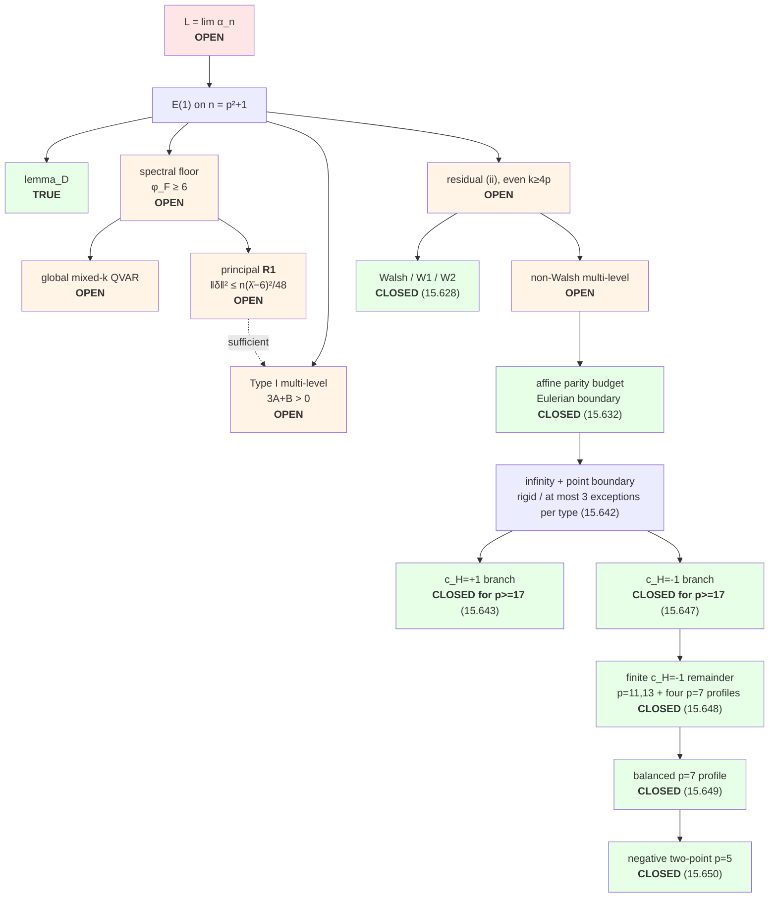

# Min-max quadratic form of ±1 coefficients

MathOverflow [413935](https://mathoverflow.net/questions/413935) /
[X challenge](https://x.com/PI010101/status/2081070728422752329):

```
m_n = min_{a_ij = ±1}  max_{x_j = ±1}  | Σ_{1≤i<j≤n} a_ij · x_i · x_j |

α_n = m_n / n^(3/2)
```

## About

Machine-assisted attack on a 2022 MathOverflow problem: the limiting constant
of the min-max ±1 quadratic form. The limit **L is OPEN**. This repo is a
fully-audited proof ledger — every claim is a Python predicate that returns
`True`/`False`, ~600 propositions, no prose-only results, and soft-closing is
banned by test (`tests/test_main_chain_docs.py`).

## Status

**Goal:** settle the limit (see **`LONG_HORIZON_GOAL.md`**). Not done until L is proved or disproved.

**Main claim:** L = lim_n α_n is **OPEN** (2026-08-25).

Sandwich and Paley ρ=1 are proved. E(1) on n=p²+1 is **not**. The live
`four_e1_units_closed()` ledger is:

| GOAL unit | live predicate | status |
|---|---|---|
| spectral floor | `phi_F_ge_6` | **OPEN** — needs global QVAR and principal R1 |
| residual (ii), even `k≥4p` | `residual_ii_k_ge_4p` | **OPEN** — Walsh slice closed; 15.632 kills Eulerian boundary; 15.643 kills the positive-product infinity-plus-point branch for `p>=17`, but other non-Walsh profiles remain |
| Type I, multi-level Max− | `type_I_multilevel` | **OPEN** — `3A+B>0` remains unproved in general |
| Lemma D | `lemma_D` | **TRUE** — construction and two-plane amplitudes checked |

Thus three top-level predicates are false, but the unfinished mathematics is
organized into two fronts: the spectral/QVAR–R1 front and the non-Walsh
multi-level Max− front. Soft-close is forbidden. The acceptance package is
**`evidence/share/denseness_path_package.md`**.

**Proved (sandwich):**
```
1/π  ≤  liminf_n α_n  ≤  limsup_n α_n  ≤  1/2
```

**Also proved:** ρ=1 for Paley conference matrices of order n=p²+1.

See **`STATUS.md`**, `HANDOFF.md`, denseness package, `solution.md`.

---

## Discovery map — what has moved

The problem reduces to **E(1) on Paley conference matrices of order n = p²+1**.
The map below records the current dependency structure. Prop. 15.628 closed
Walsh, W1, and W2; Prop. 15.632 then imposed an exact type-split integer-slack
budget and eliminated the Eulerian boundary, but did not close the remaining
non-Walsh multi-level cases. Props. 15.633--15.634 classify and diagonalize
the complete second R1 dual shell; it is negative definite for `p>=11`, so
first-shell positivity alone cannot close R1. Props. 15.635--15.636 prove
and completely classify the third dual shell for every `p>=11`; its
point-pair operator is again negative. Props. 15.637--15.638 then exclude
every common-sum branch at the first post-third even energy, proving that
the entire candidate shell `2p||u||^2=2(p+3)` is empty. Proposition 15.639
classifies the complete first nonminimal odd shell `2p||u||^2=3p-6` as
negative signed triples together with incident point--square-circle vectors.
Proposition 15.640 diagonalizes its complete degree-four operator: one
circle-kernel eigenvalue is negative and two square-circle-image eigenvalues
are positive, so the shell is a quartic saddle rather than a 4-design.
Proposition 15.641 then gives an exact p=11 modular nullspace certificate:
all justified shell/cusp rows, including the complete second shell, leave the
half-cusp R1 target free. Thus those linear modular data cannot close R1;
additional shells, cusp data, or nonlinear theta positivity are required.
On the non-Walsh front, Proposition 15.642 combines an exact stabilizer
moment certificate with the degree-two polynomial-distance lemma on slices.
For boundary `D={infinity,v}`, the positive edge-product branch is pointwise
rigid, while the negative branch has at most three exceptional directions
per quadratic type, uniformly in `p>=5`.
Proposition 15.643 converts the positive-product rigidity into a complete
branch exclusion for every odd `p>=17` using parallel-count divisibility and
an exact inter-fibre `l1` budget. Its four smaller positive-product cases
remain.
For the negative-product branch, Proposition 15.644 uses the asymptotic
slice-distance theorem to force one exceptional direction of each type and
reduces every sufficiently large prime to a unique arithmetic profile.
Proposition 15.645 further proves exact baseline fibre rigidity. Proposition
15.646 then sums the inter-fibre identities: every baseline transverse signed
sum must be zero, while the exceptional split forces a signed sum `+4` or
`-4` in one baseline type. Thus the complete negative-product branch is
excluded for all sufficiently large primes. Proposition 15.647 removes the
asymptotic input: same-type signed means force exactly one exception per type
for every `p>=7`, and baseline divisibility excludes the branch for every
odd `p>=17`. Proposition 15.648 then closes `p=11,13` and four unbalanced
`p=7` profiles. Proposition 15.649 classifies all 1764 possible exceptional
quadratic lifts at balanced `p=7`, reduces the 18424 infinity stars to 3038
orbits for each exceptional-pair orbit, and finitely certifies every orbit
infeasible. Thus every `p=7` negative two-point profile is closed, leaving
only `p=5` in that branch. Proposition 15.650 finishes it: exact lift
quantization leaves two type profiles and 24 arithmetic candidates, whose
33 square-semilinear placement orbits are all finitely certified infeasible.
The negative-product infinity-plus-point branch is therefore closed for
every odd prime `p>=5`.
The principal R1 inequality remains open, and the current floor wiring
requires the separate global-QVAR estimate:



The older “two roots, R1 and R2” shorthand now needs two qualifications.
First, the live spectral-floor predicate is `global QVAR ∧ principal R1`, not
R1 alone. Second, only the Walsh component of R2 is closed. A proof of the
strong `n/12` R1 bound would also imply the weaker Type-I `3A+B` estimate,
but no such bound has been proved.

### The R1 collapse (props 15.590–15.597)

A chain of exact identities, each verified as rationals, not numerics:

| step | identity | status |
|---|---|---|
| ν on the ‖κ‖=3 locus | `Σ_S ν(S)² = ½‖m₄⁺‖² − n(n−2)/16` | exact |
| Es4 | `Es4 = 4n² + tr(Φ²)`, Φ = the 15.589 Gram operator | exact |
| design floor | `Es4 ≥ 12n² + 16n + 128n/(n−6)`, equality iff Φ scalar | **proved** |
| particular part | **`Φ_part = λ̄·I`** — the explicit half is spectrally flat | **proved ∀p** |
| residual | `V := ‖Φ − λ̄I‖²_F = 24‖δ‖²` | exact |

so the principal spectral floor and the Type-I sufficient estimate are
bounds on the same scalar `δ`, the master-equation residual tracked since
15.217:

| implication | needs ‖δ‖² ≤ | limit |
|---|---|---|
| principal part of the spectral floor | n(λ̄−6)²/48 | **n/12** ← binding |
| Type-I `3A+B>0` sufficient bound | c₃(p)·n/24 | ~2.9n |
| residual-(i) | `delta_room_for_R` (15.217) | ~n²/8 |

This hierarchy does **not** prove global QVAR, and it does not import any
of the three false GOAL predicates.

### Measured vs. required

`‖δ‖²/n` against the binding threshold ≈ 0.083 — fails at the two census
primes, clears at p=11 with 4.3× margin:

```
p= 5  ██████████████████████████████████████████████  0.9089   (census)
p= 7  ██████████▌                                     0.2085   (census)
p=11  █                                               0.0194   ✓ 4.3× margin
      └─ threshold ≈ 0.083
```

A rigorous **data-free lower bound** on the same scalar, over ten primes, is
flat and converging — no computable quantity threatens the requirement:

| p | 5 | 7 | 11 | 13 | 17 | 19 | 23 | 29 | 37 | 47 |
|---|---|---|---|---|---|---|---|---|---|---|
| LB·p⁴/p | 10.00 | 8.91 | 8.34 | 8.24 | 8.14 | 8.11 | 8.08 | 8.05 | 8.03 | **8.02** |

### The Φ spectrum (what leftover 1 actually asks)

`Φ_part = λ̄I` is proved, so **all** spectral deviation comes from δ:

| p | λ_min(Φ) | λ̄ = 8(n−2)/(n−6) | target | margin |
|---|---|---|---|---|
| 5 | 6.1538 | 9.600 | 6 | +0.15 |
| 7 | 7.5110 | 8.727 | 6 | +1.51 |
| 11 | 8.0544 | 8.276 | 6 | +2.05 |

Unconditionally proved: `0 ≤ λ_min(Φ) ≤ λ̄` (lower since Φ is a Gram operator,
upper since `tr Φ_δ = 0`). **The entire open content of leftover 1 is the
window [0, 6)** — no argument short of a genuine δ bound reaches it.

### R2 close (leftover 2 Walsh slice, props 15.598–15.628)

Independent root. Square-direction affine lines cut Max−, so `U` is the
xor-hyperplane of `affine_span(Max−)`; `rank(S) = n/2` is now a **theorem for
every odd prime** (15.600).  Prop. 15.628 proves that edge-eligible
nonsquare GQR circles span the target code and constructs every such circle
as an actual `U`-difference using arbitrary affine halfspaces.  Therefore
**Walsh spanning, W1, and W2 are proved for every odd prime**.  The p=11
37,457,112-point scan remains an independent holdout; the explicit p=19
affine witness supersedes the earlier generic-solver timeout.

### Exact Paley-lattice structure (props 15.629–15.641)

The post-Walsh attack exposed a precise lattice behind R1. Let
`L = ker_Z(C−pI)`, let `P=(I+C/p)/2`, and let `A` be generated by the
square-direction affine-circle words.

| proposition | proved result | boundary |
|---|---|---|
| 15.629 | the profile glue gives `[L:A]=p^((m−1)(m−2)/2)`, `det(L)=2p^(m²)`, `L*=P Z^n`, discriminant `Z/2 ⊕ (Z/p)^(m²)`, and level `4p` | identifies the exact lattice; no R1 bound |
| 15.630 | `min(L*)=1/2`; the complete minimum shell is `{±Pe_i}` with kissing number `2(p²+1)`; every other nonzero dual vector has norm at least `(p−1)/p` | ordinary dual shell, not the odd Max+ coset shell |
| 15.631 | the Max+ coset phase is radial: `<u,y₀> ≡ 2p‖u‖² (mod 2)`; the first transformed degree-four harmonic shell has a positive exact coefficient | higher dual-shell harmonic sums remain uncontrolled |
| 15.633 | for `p>=5`, the complete second dual shell is the disjoint union of projected signed point-pairs and square-circle complements; its signed count is `p(p+1)(p²+1)` (`30` at `p=3`) | classifies one shell, not the tail |
| 15.634 | the square-circle two-secant graph and projected-tensor Gram operator have closed spectra; the complete second harmonic shadow shell has three explicit eigenvalues and is negative definite for every `p>=11` | disproves a first-shell-only positivity route; later shells remain uncontrolled |
| 15.635 | for every `p>=11`, the third dual norm is `(p+1)/p` and every new odd-phase vector has scaled norm at least `3p-6`; the `p=11` third shell is exactly the signed point-pair orbit, with a negative scalar harmonic operator | complete shell only at `p=11`; later shells remain uncontrolled |
| 15.636 | a Hasse-derivative coefficient-gap argument excludes the sole remaining equality profile, so the complete third shell is the signed point-pair orbit for every `p>=11` | fourth and later shells remain uncontrolled |
| 15.637 | at the first post-third even energy `p+3`, square-root and low-degree moment recurrences exclude every zero-common-sum profile | the nonzero sums are handled by 15.638 |
| 15.638 | balancing, binary moment recurrences, Newton identities, and a genus-one Hasse bound exclude `|t|=2,p-1,p+1`; the complete scaled shell `2(p+3)` is empty | this is the first post-third even candidate; the next nonempty shell and full theta tail remain unknown |
| 15.639 | the complete shell at the first nonminimal odd scaled norm `3p-6` is the disjoint union of negative signed triples and point--square-circle vectors; its signed count is `p²(p−1)(p+7)(p²+1)/6` | it is the fourth shell only at `p=11,13`; intervening even candidates remain for `p>=17`; its operator is supplied by 15.640 |
| 15.640 | circles through a point form an exact tight frame; the complete `3p-6` harmonic shell has one negative circle-kernel eigenvalue and two positive circle-image eigenvalues for every `p>=11` | the parity twist reverses these signs, but intervening and later shells remain uncontrolled |
| 15.641 | at `p=11`, the justified modular shell/cusp constraints have rank 30 in the 66-dimensional Kohnen space; an exact 21-coordinate witness kills every known row and the second shell while giving target coefficient one | closes coefficient determination from the current linear modular data, not R1 or theta-positivity routes |
| 15.642 | a nonzero nonnegative integer-valued quadratic lift has an exact stabilizer mass floor and slice-distance support floor; for `D={infinity,v}`, `c_H=+1` is pointwise baseline and `c_H=-1` has at most three exceptional directions per type | sharp rigidity/sparsity reduction, not exclusion of the boundary or residual (ii) |
| 15.643 | additive inter-fibre matrices force parallel counts in multiples of `(p-1)/2`; their exact `l1` budget excludes `D={infinity,v}`, `c_H=+1` for every odd `p>=17` | positive-product cases `p=5,7,11,13` and other boundary profiles remain |
| 15.644 | for all sufficiently large `p`, the negative-product infinity-plus-point branch has `2p-1` infinity edges, two parallel finite edges in every baseline direction, and exceptional counts `1,3` | asymptotic normal form; excluded by 15.646, but the threshold remains qualitative |
| 15.645 | in each baseline direction of 15.644, the infinity-neighbor fibre profile is ideal or one-transfer; every larger integral deviation exceeds the transverse-edge `l1` budget | simultaneous two-line classification remains open but is bypassed by 15.646 |
| 15.646 | summing the exact inter-fibre matrix forces every baseline transverse signed sum to vanish, but exceptional counts `(3,1)` or `(1,3)` force `+4` or `-4` in one baseline type | asymptotic exclusion; superseded by the all-prime `p>=17` result 15.647 |
| 15.647 | same-type signed means quantize every lift excess in units of `p+1`, forcing one exception per type for all `p>=7`; baseline divisibility then excludes `c_H=-1`, `D={infinity,v}` for every odd `p>=17` | leaves `p=5,7,11,13` and other boundary profiles |
| 15.648 | an exact `l1` bound closes both `p=13` profiles; symmetry-complete CP-SAT certificates close `p=11` and four unbalanced `p=7` profiles | leaves negative-product `p=5` and balanced `p=7 (x,y)=(3,3)` |
| 15.649 | the exceptional mass-ten quadratic lifts on `J(7,4)` have exactly 1764 labelled vectors; an `l1` filter, square-semilinear orbit reduction, and exact fixed-star certificates exclude all 6076 balanced-profile orbit representatives | closes every negative-product two-point profile at `p=7`; leaves `p=5` and other boundary profiles |
| 15.650 | mod-six lift quantization leaves two `p=5` type profiles and 24 arithmetic candidates; square-semilinear symmetry reduces them to 33 placement orbits, all exactly CP-SAT infeasible | closes the negative-product infinity-plus-point branch for every odd prime `p>=5`; positive-product finite cases and other boundaries remain |

These are general theorems for odd primes (with the stated `p=3` second-shell
exception), including the standard Paley `(25,50)` adjacent-ETF case. They
convert R1 into a level-`4p` norm-parity-twisted harmonic theta problem with
its first three complete dual shells for `p>=11`, a proved empty candidate
shell, and the complete first possible nonminimal odd shell with its exact
quartic spectrum. The second shell cancels the first in every channel, the
complete third shell is another negative channel, and the first later odd
shell is an exact saddle. These are a
substantial structural advance, but they do not prove R1, global QVAR,
E(1), or the limit.

### Non-Walsh affine slack budget (prop 15.632)

For an odd candidate separator `H`, each of the `p+1` affine directions
produces a nonnegative integer quadratic slack on the middle Johnson slice.
If `a_d=2p E[A_d]`, then the budget splits exactly by quadratic direction
type:

```
sum_{eps_d=+1} a_d = sum_{eps_d=-1} a_d
                    = (p+1)(|H|-3p)/2.
```

The odd-degree boundary of `H` fixes the slack parity on every slice.
Symmetrizing by its odd fibres reduces the sharp degree-two lower bound to an
exact three-variable hypergeometric LP, giving
`a_d ≥ 2 ceil(p M(p,b_d,eta_d))`. At residual size `|H|=4p+1`, each
quadratic-type half has only `(p+1)²/2` budget. This excludes every Eulerian
boundary for all odd primes, with contradiction gap `(p²−1)/2`.

The reduction is not a close: a corrected `p=5` affine model has a genuine
integral solution with directional means `(12,4,0,6,10,4)` and boundary equal
to infinity plus an affine line. Remaining nonempty boundary profiles and the
full non-affine shell are open.

Proposition 15.642 sharpens one minimal nonempty profile. If
`D={infinity,v}`, then `c_H=+1` forces `A_d=x_{s_d(v)}` pointwise in every
direction. If `c_H=-1`, the exact degree-two slice-distance bound implies
that each quadratic type has at most three nonbaseline directions, uniformly
for every `p>=5` (two at `p=7`). The repeated all-direction identities are
still to be converted into a contradiction or a classified survivor.
For the positive edge-product branch, Proposition 15.643 completes that
conversion for every odd `p>=17`: no populated parallel direction can meet
the exact `l1` budget, and the all-infinity endpoint has the wrong boundary.

### Route kills — do not re-tread

Recorded with counterexamples so they are not reopened:

| killed | why |
|---|---|
| level-4 moment/SDP relaxation | feasible points beat both thresholds (p=5, 7) |
| Delsarte 2-design + min distance | LP min far below the target |
| degree escalation of the contraction kernel | K₄ grows; degree 6 adds nothing at p=7 |
| any `(12+ε)n²` majorant for Es4 | structurally insufficient — 12 is forced |
| uniform `M ≤ C/p⁴` | **falsified** at p=17: true scaling is `M ≳ 8/p³` |
| L² δ-bound for leftover 2 | error/signal ≈ p/11 → ∞, crosses 1 at p=11 |
| linear 4-point and 6-point LPs | feasible-but-negative while true pairing is positive |
| Γ_δ quantization | p=5 integrality was a single-orbit artifact; dies at p=7 |
| first-dual-shell positivity by itself | the complete second harmonic shell is negative definite for every `p>=11` (15.634) |
| current modular shell/cusp coefficients determine R1 | **falsified exactly** at `p=11`: a 36-dimensional kernel remains and a normalized nullspace witness has second-shell coefficient 0 but target coefficient 1 (15.641) |

The older class-function plan
(`evidence/PLAN_2026-08-22_class_function_route.md`) remains a detailed
record of the PSL/Hecke compression and its killed shortcuts. The current
R1 structure is sharper: Props. 15.629–15.641 identify the integral glue,
the first three complete dual shells, the radial Poisson phase, and their
exact harmonic operators, prove that the first possible shell after them is
empty, and show that the current linear modular data do not determine the
target. The missing step is now explicitly a certified tail or multi-scale
theta inequality, additional exact modular data, or nonlinear positivity
specific to the theta series—not an unidentified glue-class phase or any
classified low shell.

### What is left

1. **Spectral floor:** prove global mixed-`k` QVAR and the principal R1
   bound `‖δ‖² ≤ n(λ̄−6)²/48` (the simpler `n/12` bound is sufficient).
   The lattice/shadow theorems identify the exact theta object but do not
   control its higher dual shells.
2. **Non-Walsh multi-level Max−:** close residual (ii) for even `k≥4p`.
   Walsh/W1/W2 and the Eulerian-boundary branch are done; the remaining
   nonempty affine-boundary profiles and full 5+-level branch are not. The
   related Type-I `3A+B>0` gate also remains false, although strong R1 would
   imply it.

Lemma D is complete and is no longer on the work list.

---

## Files

| Path | Role |
|------|------|
| `HANDOFF.md` | Research handoff / resume entry point |
| `evidence/HISTORY_AND_REFERENCES.md` | MO/X/Paata education and pre-internet sources (not a close) |
| `solution.md` | Full mathematical writeup |
| `src/e1_gmin_m4_prop15167.py` … `prop15171.py` | Bi-tight + E(1) residual ND modules |
| `src/e1_gmin_m4_prop15590.py` … `prop15597.py` | R1 collapse: ν → Es4 → Φ → δ; principal/Type-I bound hierarchy |
| `src/e1_gmin_m4_prop15598.py` … `prop15601.py` | R2: square-direction lines, rank(S)=n/2, Walsh |
| `src/e1_gmin_m4_prop15628.py`, `scripts/w2_affine_circle_close.py` | R2 close: eligible GQR circle span + explicit affine completions |
| `src/e1_gmin_m4_prop15629.py` | Profile-glued integral Paley eigenspace lattice |
| `src/e1_gmin_m4_prop15630.py` | Exact dual minimum shell and kissing number |
| `src/e1_gmin_m4_prop15631.py` | Radial dual-shadow transform of the Max+ odd coset |
| `src/e1_gmin_m4_prop15632.py` | Type-split affine slack/parity budget; Eulerian residual boundary excluded |
| `src/e1_gmin_m4_prop15633.py` | Complete second Paley-dual shell classification and signed count |
| `src/e1_gmin_m4_prop15634.py` | Square-circle operator spectrum and complete second harmonic shell |
| `src/e1_gmin_m4_prop15635.py` | Third dual norm for `p>=11`; exact `p=11` third shell and harmonic scalar |
| `src/e1_gmin_m4_prop15636.py` | Hasse-derivative obstruction and complete third shell for every `p>=11` |
| `src/e1_gmin_m4_prop15637.py` | Excludes every zero-common-sum profile at energy `p+3`; leaves only three nonzero common sums there |
| `src/e1_gmin_m4_prop15638.py` | Excludes the three remaining common sums and proves the scaled shell `2(p+3)` is empty |
| `src/e1_gmin_m4_prop15639.py` | Complete first nonminimal odd shell `3p-6`, two-family classification, and signed count |
| `src/e1_gmin_m4_prop15640.py` | Through-point square-circle frame and complete `3p-6` harmonic saddle spectrum |
| `src/e1_gmin_m4_prop15641.py` | Exact p=11 modular nullspace witness showing the known shell/cusp data do not determine R1 |
| `src/e1_gmin_m4_prop15642.py` | Exact quadratic-lift mass/support floor and infinity-plus-point boundary rigidity/sparsity |
| `src/e1_gmin_m4_prop15643.py` | Additive inter-fibre arithmetic excluding the positive-product infinity-plus-point boundary for `p>=17` |
| `src/e1_gmin_m4_prop15644.py` | Asymptotic normal form of the negative-product infinity-plus-point boundary |
| `src/e1_gmin_m4_prop15645.py` | Exact `l1` classification of baseline infinity-neighbor fibre profiles |
| `src/e1_gmin_m4_prop15646.py` | Signed transverse-sum exclusion of the negative-product normal form |
| `src/e1_gmin_m4_prop15647.py` | Exact all-prime negative-product infinity-point exclusion for `p>=17` |
| `src/e1_gmin_m4_prop15648.py` | Exact/finitely certified negative two-point exclusions at `p=7,11,13` |
| `src/e1_gmin_m4_prop15649.py` | Complete exceptional-lift classification and finite exclusion of balanced `p=7` negative two-point profile |
| `src/e1_gmin_m4_prop15650.py` | Complete `p=5` finite exclusion and all-prime closure of the negative-product infinity-plus-point branch |
| `evidence/NOTE_2026-08-24_r1_profile_glue_lattice.md` | Proof note for the lattice quotient, determinant, dual, and level |
| `evidence/NOTE_2026-08-25_dual_minimum_shell.md` | MDS/Newton proof of the exact dual shell |
| `evidence/NOTE_2026-08-25_radial_dual_shadow.md` | Poisson phase, dual gap, and first harmonic shell |
| `evidence/NOTE_2026-08-25_affine_slack_parity_budget.md` | Exact directional budgets, parity-majorant LP, branch kill, and p=5 obstruction |
| `evidence/NOTE_2026-08-25_dual_second_shell.md` | Exact second-shell classification, count, and harmonic decomposition |
| `evidence/NOTE_2026-08-25_square_circle_operator.md` | Circle graph/Gram spectra and exact negative second-shell eigenvalues |
| `evidence/NOTE_2026-08-25_third_dual_norm.md` | Odd-phase gap, third norm, and exact `p=11` shell count |
| `evidence/NOTE_2026-08-25_complete_third_dual_shell.md` | Uniform coefficient-gap proof excluding the last third-shell profile |
| `evidence/NOTE_2026-08-25_one_profile_next_energy_gap.md` | Square-root ODE descent and moment-recurrence proof of the zero-common-sum gap after the third shell |
| `evidence/NOTE_2026-08-25_empty_post_third_even_candidate_shell.md` | Complete proof that the first post-third even candidate shell is empty |
| `evidence/NOTE_2026-08-25_first_nonminimal_odd_scaled_shell.md` | Complete proof and exact NUKA audit of the `3p-6` shell |
| `evidence/NOTE_2026-08-25_scaled_norm_3p_minus_6_harmonic_saddle.md` | Exact fourth-moment decomposition, spectrum, and parity-twisted signs |
| `evidence/NOTE_2026-08-25_p11_modular_independence.md` | Exact rank/nullspace certificate closing the current modular coefficient-determination route |
| `evidence/NOTE_2026-08-25_quadratic_lift_mass.md` | Stabilizer moment certificate, exact slice-distance reinforcement, and uniform three-exception reduction |
| `evidence/NOTE_2026-08-25_positive_product_boundary_exclusion.md` | Parallel-count divisibility and exact `l1` proof of the `p>=17` branch exclusion |
| `evidence/NOTE_2026-08-25_negative_product_asymptotic_normal_form.md` | Slice-distance, mean, divisibility, and boundary proof of the unique large-prime negative profile |
| `evidence/NOTE_2026-08-25_baseline_fibre_profiles.md` | Integral `l1` proof that every baseline fibre profile is ideal or one-transfer |
| `evidence/NOTE_2026-08-25_pbss_cross_audit.md` | Perry--Beurling cross-audit and the viable multi-Gaussian R1 transplant |
| `evidence/PLAN_2026-08-22_class_function_route.md` | PSL/Hecke route ledger and killed shortcuts |
| `scripts/residual_affine_johnson_milp.py` | Corrected exact affine/full-shell residual feasibility model |
| `scripts/r1_dual_shell_count.py`, `scripts/r1_dual_shell_export.py` | Reproducible exact PARI short-vector counts and shell archives |
| `scripts/r1_sparse_dual_norm_gpu.py` | CUDA sparse dual-norm reconnaissance with collision bound |
| `scripts/frame_line_system.py` | Data-free frame-line solver (any p, no Max± ensemble) |
| `src/minmax_quadratic.py` | Exact `m_n`, Paley, Φ, bounds, ρ=1 evec |
| `tests/test_prop15167.py` … `test_prop15171.py` | Load-bearing E(1)/L tests |
| `x-cards/` | X summary + key-lemmas JPEGs |
| `evidence/share/` | Paper PDF/TeX + share assets |
| `evidence/` | Verification JSON and session notes |

## Quick check

```bash
python3 -m pytest tests/test_minmax.py -v
python3 -m pytest tests/test_prop15628.py tests/test_prop15629.py tests/test_prop15630.py tests/test_prop15631.py tests/test_prop15632.py tests/test_prop15633.py tests/test_prop15634.py tests/test_prop15635.py -q
python3 -c "from src.minmax_quadratic import exact_m; print([exact_m(n) for n in range(2,9)])"
```

## Exact small values

| n | m_n | α_n (approx) |
|---|-----|--------------|
| 2 | 1 | 0.354 |
| 3 | 3 | 0.577 |
| 4 | 4 | 0.500 |
| 5 | 4 | 0.358 |
| 6 | 5 | 0.340 |
| 7 | 9 | 0.486 |
| 8 | 10 | 0.442 |
| 9 | 12 | 0.444 |
| 10 | 13 | 0.411 |

At n=10, Paley (order p²+1, p=3) has Φ=15 > m_10: conference is not exactly optimal.
Exact optima first appear at Hamming distance 5 from Paley, and the only 5-edge undercutters are 144 perfect matchings — see `evidence/N10_STRUCTURE.md`. Those 144 form one PΓL(2,9)-orbit (maximizer-drop criterion) — see `evidence/N10_MATCHING_CLASSIFY.md`.
