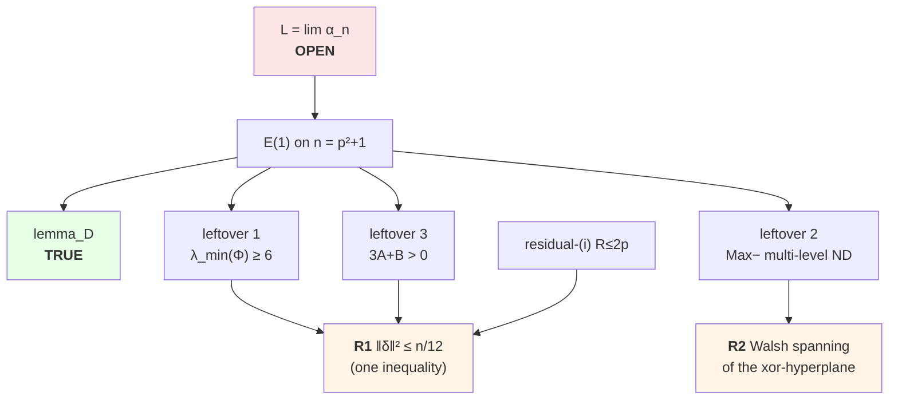

# Min-max quadratic form of ±1 coefficients

MathOverflow [413935](https://mathoverflow.net/questions/413935) /
[X challenge](https://x.com/PI010101/status/2081070728422752329):

\[
m_n
=
\min_{a_{ij}=\pm1}
\max_{x_j=\pm1}
\Bigl|\sum_{1\le i<j\le n}a_{ij}x_i x_j\Bigr|,
\qquad
\alpha_n=\frac{m_n}{n^{3/2}}.
\]

## About

Machine-assisted attack on a 2022 MathOverflow problem: the limiting constant
of the min-max ±1 quadratic form. The limit **L is OPEN**. This repo is a
fully-audited proof ledger — every claim is a Python predicate that returns
`True`/`False`, ~600 propositions, no prose-only results, and soft-closing is
banned by test (`tests/test_main_chain_docs.py`).

## Status

**Goal:** settle the limit (see **`LONG_HORIZON_GOAL.md`**). Not done until \(L\) is proved or disproved.

**Main claim:** \(\displaystyle L=\lim_n\alpha_n\) is **OPEN** (2026-08-16).

Sandwich and Paley \(\rho=1\) are proved. E(1) on \(n=p^2+1\) is **not**.
Four leftovers (`GOAL.md`): \(\lambda_{\min}(\Phi)\ge6\); residual (ii) for
even \(k\ge4p\); Type I when Max− is multi-level; Lemma D (writeup exists,
hostile check still due). Residual (ii) is closed only for the affine branch
and even \(k\le4p-2\) (15.179/236/237), not for the statement E(1) needs.
Soft-close forbidden. Package: **`evidence/share/denseness_path_package.md`**.

As of 2026-08-22 the three open leftovers reduce to **two independent roots** —
see the **Discovery map** below.

**Proved (sandwich):**
\[
\frac1\pi
\;\le\;
\liminf_n\alpha_n
\;\le\;
\limsup_n\alpha_n
\;\le\;
\tfrac12.
\]

**Also proved:** \(\rho=1\) for Paley conference matrices of order \(n=p^2+1\).

See **`STATUS.md`**, `HANDOFF.md`, denseness package, `solution.md`.

---

## Discovery map — what has moved

The problem reduces to **E(1) on Paley conference matrices of order n = p²+1**,
gated on four units. One is proved; three are open. As of 2026-08-22 the three
open ones are no longer independent:



**Two open roots, not three** — `R1` closes leftovers 1 *and* 3 (and
residual-(i) with room to spare); `R2` is provably independent of it.

### The R1 collapse (props 15.590–15.597)

A chain of exact identities, each verified as rationals, not numerics:

| step | identity | status |
|---|---|---|
| ν on the ‖κ‖=3 locus | `Σ_S ν(S)² = ½‖m₄⁺‖² − n(n−2)/16` | exact |
| Es4 | `Es4 = 4n² + tr(Φ²)`, Φ = the 15.589 Gram operator | exact |
| design floor | `Es4 ≥ 12n² + 16n + 128n/(n−6)`, equality iff Φ scalar | **proved** |
| particular part | **`Φ_part = λ̄·I`** — the explicit half is spectrally flat | **proved ∀p** |
| residual | `V := ‖Φ − λ̄I‖²_F = 24‖δ‖²` | exact |

so **leftovers 1 and 3 are the same bound on the same scalar** `δ`, the
master-equation residual that the repo has tracked since 15.217:

| unit | needs ‖δ‖² ≤ | limit |
|---|---|---|
| leftover 1 | n(λ̄−6)²/48 | **n/12** ← binding |
| leftover 3 | c₃(p)·n/24 | ~2.9n |
| residual-(i) | `delta_room_for_R` (15.217) | ~n²/8 |

### Measured vs. required

`‖δ‖²/n` against the binding threshold ≈ 0.083 — fails at the two census
primes, clears at p=11 with 4.3× margin:

```
p= 5  ██████████████████████████████████████████████  0.9089   (census)
p= 7  ██████████▌                                     0.2085   (census)
p=11  █                                               0.0194   ✓ 4.3× margin
      └─ threshold ≈ 0.083
```

A rigorous **data-free lower bound** on the same scalar, over ten primes, is
flat and converging — no computable quantity threatens the requirement:

| p | 5 | 7 | 11 | 13 | 17 | 19 | 23 | 29 | 37 | 47 |
|---|---|---|---|---|---|---|---|---|---|---|
| LB·p⁴/p | 10.00 | 8.91 | 8.34 | 8.24 | 8.14 | 8.11 | 8.08 | 8.05 | 8.03 | **8.02** |

### The Φ spectrum (what leftover 1 actually asks)

`Φ_part = λ̄I` is proved, so **all** spectral deviation comes from δ:

| p | λ_min(Φ) | λ̄ = 8(n−2)/(n−6) | target | margin |
|---|---|---|---|---|
| 5 | 6.1538 | 9.600 | 6 | +0.15 |
| 7 | 7.5110 | 8.727 | 6 | +1.51 |
| 11 | 8.0544 | 8.276 | 6 | +2.05 |

Unconditionally proved: `0 ≤ λ_min(Φ) ≤ λ̄` (lower since Φ is a Gram operator,
upper since `tr Φ_δ = 0`). **The entire open content of leftover 1 is the
window [0, 6)** — no argument short of a genuine δ bound reaches it.

### R2 progress (leftover 2, props 15.598–15.601)

Independent root. Square-direction affine lines cut Max−, so `U` is the
xor-hyperplane of `affine_span(Max−)`; `rank(S) = n/2` is now a **theorem for
every odd prime** (15.600). Walsh containment is certified at p = 3, 5, 7, 11
(the p=11 case exact over all 37,457,112 points). **Walsh spanning of that
slice stays open.**

### Route kills — do not re-tread

Recorded with counterexamples so they are not reopened:

| killed | why |
|---|---|
| level-4 moment/SDP relaxation | feasible points beat both thresholds (p=5, 7) |
| Delsarte 2-design + min distance | LP min far below the target |
| degree escalation of the contraction kernel | K₄ grows; degree 6 adds nothing at p=7 |
| any `(12+ε)n²` majorant for Es4 | structurally insufficient — 12 is forced |
| uniform `M ≤ C/p⁴` | **falsified** at p=17: true scaling is `M ≳ 8/p³` |
| L² δ-bound for leftover 2 | error/signal ≈ p/11 → ∞, crosses 1 at p=11 |
| linear 4-point and 6-point LPs | feasible-but-negative while true pairing is positive |
| Γ_δ quantization | p=5 integrality was a single-orbit artifact; dies at p=7 |

Every one is a *moment relaxation* — it replaces Max+ by a moment sequence.
The live route (`evidence/PLAN_2026-08-22_class_function_route.md`) instead
uses the group action: `Γ(g) = tr(Φ·π(g))` makes the eigenvalues λ_c exactly
the Fourier coefficients of a **class function**, compressing ~n⁴ four-set
moments to ~15 numbers paired against the explicit PSL(2,q) character table.

### What is left

1. **R1** — `‖P_{E₄ₚ} m₄⁺‖² ≤ n/12`, given only the master equation and
   `|m₄⁺| ≤ 1`. Equivalently `κ₄(y·z) = O(n)`, or Γ_δ's Fourier coefficients
   bounded below. Closes leftovers 1 and 3 together.
2. **R2** — Walsh spanning of the xor-hyperplane for all p (certified p ≤ 11).
3. **lemma_D** — writeup exists; hostile check still due.

---

## Files

| Path | Role |
|------|------|
| `HANDOFF.md` | Research handoff / resume entry point |
| `evidence/HISTORY_AND_REFERENCES.md` | MO/X/Paata education and pre-internet sources (not a close) |
| `solution.md` | Full mathematical writeup |
| `src/e1_gmin_m4_prop15167.py` … `prop15171.py` | Bi-tight + E(1) residual ND modules |
| `src/e1_gmin_m4_prop15590.py` … `prop15597.py` | R1 collapse: ν → Es4 → Φ → δ (leftovers 1 & 3 unified) |
| `src/e1_gmin_m4_prop15598.py` … `prop15601.py` | R2: square-direction lines, rank(S)=n/2, Walsh |
| `evidence/PLAN_2026-08-22_class_function_route.md` | Live route: Γ as a class function on PSL(2,q) |
| `scripts/frame_line_system.py` | Data-free frame-line solver (any p, no Max± ensemble) |
| `src/minmax_quadratic.py` | Exact `m_n`, Paley, \(\Phi\), bounds, \(\rho=1\) evec |
| `tests/test_prop15167.py` … `test_prop15171.py` | Load-bearing E(1)/L tests |
| `x-cards/` | X summary + key-lemmas JPEGs |
| `evidence/share/` | Paper PDF/TeX + share assets |
| `evidence/` | Verification JSON and session notes |

## Quick check

```bash
python3 -m pytest tests/test_minmax.py -v
python3 -c "from src.minmax_quadratic import exact_m; print([exact_m(n) for n in range(2,9)])"
```

## Exact small values

| n | m_n | α_n (approx) |
|---|-----|--------------|
| 2 | 1 | 0.354 |
| 3 | 3 | 0.577 |
| 4 | 4 | 0.500 |
| 5 | 4 | 0.358 |
| 6 | 5 | 0.340 |
| 7 | 9 | 0.486 |
| 8 | 10 | 0.442 |
| 9 | 12 | 0.444 |
| 10 | 13 | 0.411 |

At \(n=10\), Paley (order \(p^2+1\), \(p=3\)) has \(\Phi=15>m_{10}\): conference is not exactly optimal.
Exact optima first appear at Hamming distance 5 from Paley, and the only 5-edge undercutters are 144 perfect matchings — see `evidence/N10_STRUCTURE.md`. Those 144 form one PΓL(2,9)-orbit (maximizer-drop criterion) — see `evidence/N10_MATCHING_CLASSIFY.md`.